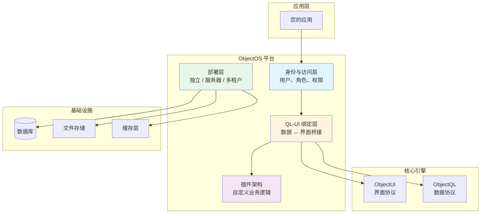

# ObjectOS:运行时编排平台

ObjectOS 是将 ObjectQL(数据)和 ObjectUI(界面)绑定成统一应用环境的**运行时平台**。它提供核心平台服务:身份管理、访问控制、插件架构和灵活的部署模式。

## 规范概览

ObjectOS **不是应用服务器**——它是一个**平台规范**,包含参考实现。该平台定义:

1. **QL-UI 绑定协议**:ObjectQL 和 ObjectUI 如何通信
2. **身份与访问系统**:用户管理、RBAC、字段级安全
3. **插件架构**:业务逻辑的扩展契约
4. **部署模式**:独立模式、服务器模式和多租户配置

### 核心设计原则

**本地优先设计**:ObjectOS 应用**默认离线运行**。独立模式(.oos 文件)完全在本地设备上运行,无需任何网络依赖。

**数据库无关**:ObjectOS 从不假设特定数据库。配置决定数据是存储在 SQLite(本地)、PostgreSQL(云端)还是 Oracle(企业)中。

**机制而非策略**:ObjectOS 提供身份和权限**机制**(RBAC 接口),而非**策略**(硬编码的用户系统)。应用定义自己的用户模型。
---

## 平台架构



### 平台职责

1. **身份与访问**:在协议层管理用户、角色和权限
2. **QL-UI 绑定**:自动连接 ObjectQL 数据源到 ObjectUI 组件
3. **插件系统**:为自定义业务逻辑(触发器、验证器、工作流)提供钩子
4. **部署**:处理应用打包和运行时配置

---

## 核心平台组件

### 1. QL-UI 绑定协议

ObjectOS 自动连接 ObjectQL 数据源到 ObjectUI 组件:

```typescript
interface BindingConfiguration {
  dataSource: ObjectQLConfig        // ObjectQL 连接
  uiSource: ObjectUIConfig          // UI 协议定义
  autoSync?: boolean                // 数据变化时自动刷新
  caching?: CacheStrategy           // 客户端缓存
}

interface ObjectQLConfig {
  driver: DatabaseDriver
  url: string
  schema: SchemaRegistry
}

interface ObjectUIConfig {
  pages: Record<string, PageProtocol>
  components: Record<string, ComponentProtocol>
  theme?: ThemeConfig
}
```

**绑定示例**:
```typescript
import { ObjectOS } from '@objectstack/os'

const app = new ObjectOS({
  // 数据层
  data: {
    driver: 'sqlite',
    url: './myapp.db',
    schema: {
      objects: {
        customers: {
          fields: {
            name: { type: 'text', required: true },
            email: { type: 'email', unique: true },
            status: { type: 'select', options: ['active', 'inactive'] }
          }
        }
      }
    }
  },
  
  // UI 层
  ui: {
    pages: {
      customers: {
        type: 'page',
        title: 'Customer Management',
        body: {
          type: 'table',
          object: 'customers',  // 自动绑定到 ObjectQL 对象
          columns: [
            { field: 'name', sortable: true },
            { field: 'email' },
            { field: 'status', type: 'badge' }
          ]
        }
      }
    }
  }
})

await app.start()
```

ObjectOS 处理:
- ✅ UI 组件挂载时获取数据
- ✅ 数据操作前进行权限检查(RBAC)
- ✅ 变更前进行验证
- ✅ 错误处理和用户反馈
- ✅ 缓存管理

### 2. 身份与访问管理

ObjectOS 提供**协议级身份系统**,包含 RBAC 和字段级安全:

```typescript
interface IdentitySystem {
  objects: {
    _users: SystemObject            // 内置用户对象
    _roles: SystemObject            // 内置角色对象
    _permissions: SystemObject      // 内置权限对象
  }
  
  authentication: AuthConfig        // 认证提供者
  authorization: AuthzConfig        // 权限规则
}

interface SystemObject {
  _users: {
    fields: {
      username: { type: 'text', unique: true }
      email: { type: 'email', unique: true }
      password_hash: { type: 'text' }  // 永不通过 API 暴露
      role: { type: 'lookup', reference_to: '_roles' }
      is_active: { type: 'boolean', defaultValue: true }
      created_at: { type: 'datetime', auto: 'onCreate' }
    }
  }
  
  _roles: {
    fields: {
      name: { type: 'text', unique: true }
      description: { type: 'text' }
      permissions: { type: 'master_detail', reference_to: '_permissions' }
    }
  }
  
  _permissions: {
    fields: {
      object: { type: 'text' }       // 目标对象名称
      allow_read: { type: 'boolean' }
      allow_create: { type: 'boolean' }
      allow_edit: { type: 'boolean' }
      allow_delete: { type: 'boolean' }
      field_level_security: { type: 'json' }  // 字段级规则
    }
  }
}
```

**示例:权限配置**:
```typescript
const app = new ObjectOS({
  // ... 数据和 UI 配置 ...
  
  identity: {
    authentication: {
      providers: ['email', 'oauth'],
      jwt: {
        secret: process.env.JWT_SECRET,
        expiresIn: '7d'
      }
    },
    
    authorization: {
      defaultRole: 'user',
      roles: {
        admin: {
          permissions: {
            customers: { read: true, create: true, edit: true, delete: true },
            orders: { read: true, create: true, edit: true, delete: true }
          }
        },
        user: {
          permissions: {
            customers: { 
              read: true, 
              create: false, 
              edit: false, 
              delete: false 
            },
            orders: { 
              read: 'owner eq $user.id',  // 基于公式的权限
              create: true, 
              edit: 'owner eq $user.id', 
              delete: false 
            }
          }
        },
        guest: {
          permissions: {
            customers: { read: false, create: false, edit: false, delete: false },
            orders: { read: false, create: false, edit: false, delete: false }
          }
        }
      }
    }
  }
})
```

### 3. 字段级安全(FLS)

字段级别的细粒度访问控制:

```typescript
interface FieldLevelSecurity {
  object: string
  field: string
  read?: boolean | Expression      // 可以读取字段吗?
  edit?: boolean | Expression      // 可以修改字段吗?
}
```

**示例:FLS 配置**:
```json
{
  "objects": {
    "employees": {
      "fields": {
        "name": { "type": "text" },
        "email": { "type": "email" },
        "salary": { 
          "type": "currency",
          "field_level_security": {
            "read": "$user.role === 'hr' || $user.role === 'admin'",
            "edit": "$user.role === 'hr'"
          }
        },
        "ssn": { 
          "type": "text",
          "field_level_security": {
            "read": "$user.role === 'admin'",
            "edit": false
          }
        }
      }
    }
  }
}
```

当普通用户查询员工时:
```json
// 查询
{ "object": "employees" }

// 响应(salary 和 ssn 字段自动过滤)
[
  { "name": "John Doe", "email": "john@company.com" }
]
```

### 4. 插件架构

使用自定义业务逻辑扩展 ObjectOS:

```typescript
interface ObjectOSPlugin {
  name: string
  version: string
  
  // 生命周期钩子
  onInstall?(): Promise<void>
  onUninstall?(): Promise<void>
  onStart?(app: ObjectOSApp): Promise<void>
  onStop?(): Promise<void>
  
  // 数据钩子
  beforeQuery?(query: QueryProtocol): Promise<QueryProtocol>
  afterQuery?(result: QueryResult): Promise<QueryResult>
  beforeMutation?(mutation: MutationProtocol): Promise<MutationProtocol>
  afterMutation?(result: MutationResult): Promise<MutationResult>
  
  // UI 钩子
  beforeRender?(protocol: ComponentProtocol): Promise<ComponentProtocol>
  
  // 自定义路由
  routes?: RouteDefinition[]
  
  // 自定义组件
  components?: Record<string, ComponentDefinition>
}
```

**示例:审计日志插件**:
```typescript
const auditLogPlugin: ObjectOSPlugin = {
  name: 'audit-log',
  version: '1.0.0',
  
  async afterMutation(result: MutationResult) {
    // 记录所有数据变更
    await this.db.insert({
      object: '_audit_logs',
      action: 'insert',
      data: {
        user_id: this.context.user.id,
        object: result.object,
        action: result.action,
        record_id: result.id,
        timestamp: new Date(),
        changes: result.changes
      }
    })
    
    return result
  }
}

// 安装插件
app.use(auditLogPlugin)
```

**示例:邮件通知插件**:
```typescript
const emailPlugin: ObjectOSPlugin = {
  name: 'email-notifications',
  version: '1.0.0',
  
  async afterMutation(result: MutationResult) {
    if (result.object === 'orders' && result.action === 'insert') {
      // 发送订单确认邮件
      await this.sendEmail({
        to: result.data.customer_email,
        subject: 'Order Confirmation',
        template: 'order-confirmation',
        data: result.data
      })
    }
    
    return result
  },
  
  routes: [
    {
      path: '/api/emails/preview/:template',
      method: 'GET',
      handler: async (req, res) => {
        const template = await this.renderTemplate(req.params.template)
        res.send(template)
      }
    }
  ]
}
```

---

## 部署模式

ObjectOS 支持三种部署策略:

### 1. 独立模式(本地优先)

**使用场景**:个人应用、离线优先工具、边缘计算

**配置**:
```typescript
const app = new ObjectOS({
  mode: 'standalone',
  storage: './myapp.oos',  // 单文件 SQLite 数据库
  ui: {
    pages: { ... }
  }
})

await app.start()
```

**特性**:
- ✅ 无需服务器基础设施
- ✅ 完全离线能力
- ✅ 数据存储在本地 .oos 文件(SQLite)
- ✅ 可作为单个可执行文件分发
- ✅ 无需网络连接

**分发**:
```bash
# 打包为独立可执行文件
objectstack build --mode standalone --output myapp.oos

# 可在任何地方运行
./myapp.oos
# 或
objectstack run myapp.oos
```

### 2. 服务器模式(云/企业)

**使用场景**:团队协作、Web 应用、云部署

**配置**:
```typescript
const app = new ObjectOS({
  mode: 'server',
  port: 3000,
  data: {
    driver: 'postgres',
    url: process.env.DATABASE_URL
  },
  identity: {
    authentication: {
      providers: ['email', 'oauth'],
      oauth: {
        google: {
          clientId: process.env.GOOGLE_CLIENT_ID,
          clientSecret: process.env.GOOGLE_CLIENT_SECRET
        }
      }
    }
  },
  ui: {
    pages: { ... }
  }
})

await app.listen()
```

**特性**:
- ✅ 支持多用户认证
- ✅ 自动生成 RESTful API
- ✅ 适用于任何数据库(MySQL、PostgreSQL、Oracle)
- ✅ 通过负载均衡器水平扩展
- ✅ 可与现有系统集成

**部署**:
```dockerfile
# Dockerfile
FROM node:18
WORKDIR /app
COPY package.json ./
RUN npm install
COPY . .
EXPOSE 3000
CMD ["npm", "start"]
```

```bash
# 部署到云端
docker build -t myapp .
docker push myapp:latest
kubectl apply -f deployment.yaml
```

### 3. 多租户 SaaS 模式

**使用场景**:SaaS 平台、多租户应用

**配置**:
```typescript
const app = new ObjectOS({
  mode: 'multi-tenant',
  tenantStrategy: 'virtualCity',  // 或 'schema' 或 'database'
  data: {
    driver: 'postgres',
    url: process.env.DATABASE_URL
  },
  multiTenant: {
    identification: {
      strategy: 'subdomain',  // customer1.myapp.com, customer2.myapp.com
      // 或: 'header'         // X-Tenant-ID header
      // 或: 'jwt'            // 从 JWT token 提取
    },
    isolation: {
      strategy: 'virtualCity',    // 所有租户在一个数据库中,通过上下文过滤
      // 或: 'schema'              // 每个租户获得一个 PostgreSQL schema
      // 或: 'database'            // 每个租户获得单独数据库
    },
    provisioning: {
      autoCreate: true,            // 注册时自动创建租户
      defaultPlan: 'trial'
    }
  }
})

// 中间件提取租户上下文
app.use((req, res, next) => {
  const tenantId = req.hostname.split('.')[0]  // 从子域名提取
  req.tenant = app.getTenant(tenantId)
  next()
})

// 所有查询自动限定到租户范围
app.get('/api/customers', async (req, res) => {
  const customers = await req.tenant.query('customers', {})
  res.json(customers)  // 仅返回该租户的客户
})
```

**租户隔离策略**:

| 策略 | 描述 | 优点 | 缺点 | 使用场景 |
|----------|-------------|------|------|----------|
| **虚拟城市** | 所有租户共享数据库,通过上下文过滤 | ✅ 资源利用率高<br/>✅ 管理简单 | ❌ 需要仔细过滤<br/>❌ 单点故障 | 多租户、中等数据量 |
| **Schema 隔离** | 每个租户获得 PostgreSQL schema | ✅ 数据隔离<br/>✅ 备份简单 | ❌ Schema 限制(PostgreSQL:约100个)<br/>❌ 迁移复杂 | 数百个租户 |
| **Database 隔离** | 每个租户获得独立数据库 | ✅ 完全隔离<br/>✅ 独立扩展<br/>✅ 迁移简单 | ❌ 资源使用高<br/>❌ 管理开销大 | 企业客户、高价值租户 |

---

## 高级特性

### 1. 混合同步(本地优先 + 云端)

结合独立模式与可选云同步:

```typescript
const app = new ObjectOS({
  mode: 'standalone',
  storage: './myapp.oos',
  
  sync: {
    enabled: true,
    remote: 'https://sync.myapp.com',
    strategy: 'manual',  // 或 'automatic', 'scheduled'
    conflict: 'last-write-wins',  // 或 'manual-resolution'
    encryption: {
      enabled: true,
      algorithm: 'AES-256-GCM',
      key: process.env.ENCRYPTION_KEY
    }
  }
})

// 手动触发同步
await app.sync.push()  // 上传本地变更
await app.sync.pull()  // 下载远程变更
await app.sync.bidirectional()  // 双向同步并解决冲突
```

### 2. 工作流引擎

内置工作流自动化:

```typescript
const app = new ObjectOS({
  // ... 配置 ...
  
  workflows: {
    order_approval: {
      trigger: { 
        object: 'orders', 
        action: 'insert',
        condition: 'total_amount > 10000'
      },
      steps: [
        {
          action: 'update',
          object: 'orders',
          data: { status: 'pending_approval' }
        },
        {
          action: 'notification',
          type: 'email',
          to: '{{approver.email}}',
          template: 'order-approval-request'
        }
      ]
    },
    
    lead_nurturing: {
      trigger: {
        object: 'leads',
        action: 'insert'
      },
      steps: [
        { action: 'wait', duration: '1 day' },
        {
          action: 'notification',
          type: 'email',
          template: 'welcome-email'
        },
        { action: 'wait', duration: '3 days' },
        {
          action: 'notification',
          type: 'email',
          template: 'follow-up-email',
          condition: 'status == "new"'
        }
      ]
    }
  }
})
```

### 3. API 生成

ObjectOS 从 ObjectQL schemas 自动生成 RESTful API:

```typescript
// Schema 定义
{
  objects: {
    products: {
      fields: {
        name: { type: 'text', required: true },
        price: { type: 'currency' },
        category: { type: 'select', options: ['electronics', 'clothing'] }
      }
    }
  }
}

// 自动生成的 REST API:
// GET    /api/products           - 列出所有产品
// GET    /api/products/:id       - 获取单个产品
// POST   /api/products           - 创建产品
// PATCH  /api/products/:id       - 更新产品
// DELETE /api/products/:id       - 删除产品
// GET    /api/products/count     - 统计产品数量
// POST   /api/products/aggregate - 聚合产品数据
```

通过插件自定义 API 端点:

```typescript
const customAPIPlugin: ObjectOSPlugin = {
  name: 'custom-api',
  routes: [
    {
      path: '/api/products/featured',
      method: 'GET',
      handler: async (req, res) => {
        const products = await req.db.query({
          object: 'products',
          filters: [{ field: 'featured', operator: 'eq', value: true }],
          top: 10
        })
        res.json(products)
      }
    }
  ]
}
```

### 4. 实时更新

支持实时数据的 WebSocket:

```typescript
const app = new ObjectOS({
  // ... 配置 ...
  
  realtime: {
    enabled: true,
    transport: 'websocket',
    port: 3001
  }
})

// 客户端(通过 ObjectUI 自动)
{
  type: 'table',
  object: 'orders',
  realtime: true  // 数据变化时表格自动更新
}
```

---

## 使用场景

### 1. 个人生产力工具

**场景**:笔记应用、本地 CRM、项目管理

**配置**:
```typescript
const app = new ObjectOS({
  mode: 'standalone',
  storage: '~/.mynotes/data.oos'
})
```

**优势**:
- 零配置——下载即可运行
- 完全隐私——数据永不离开设备
- 天然离线工作
- 可选择性同步到云端

### 2. 企业系统集成

**场景**:跨多个遗留数据库的统一仪表板

**配置**:
```typescript
// 连接多个数据源
const erpDB = new ObjectQL({ driver: 'oracle', url: 'oracle://...' })
const crmDB = new ObjectQL({ driver: 'sqlserver', url: 'sqlserver://...' })

const app = new ObjectOS({
  mode: 'server',
  dataSources: {
    erp: erpDB,
    crm: crmDB
  },
  ui: {
    pages: {
      dashboard: {
        type: 'grid',
        items: [
          { type: 'table', object: 'erp.customers' },
          { type: 'table', object: 'crm.leads' }
        ]
      }
    }
  }
})
```

**优势**:
- 多系统统一 UI
- 一致的查询语言
- 无需自定义集成代码
- 易于维护和扩展

### 3. 多租户 SaaS 平台

**场景**:项目管理 SaaS

**配置**:
```typescript
const app = new ObjectOS({
  mode: 'multi-tenant',
  tenantStrategy: 'schema',
  data: {
    driver: 'postgres',
    url: process.env.DATABASE_URL
  },
  identity: {
    authentication: {
      providers: ['email', 'oauth']
    }
  }
})
```

**优势**:
- 完全租户隔离
- 开箱即用的 RBAC
- 可扩展架构
- 可在策略间迁移租户

---

## 学习内容

本规范文档涵盖:

- ✅ **[平台架构](/cn/docs/objectos/architecture)** - QL-UI 绑定、身份系统、插件架构
- ✅ **[身份与访问](/cn/docs/objectos/identity-access)** - 用户管理、RBAC、字段级安全
- ✅ **[插件开发](/cn/docs/objectos/plugins)** - 创建自定义业务逻辑扩展
- ✅ **[部署指南](/cn/docs/objectos/deployment)** - 独立、服务器和多租户模式
- ✅ **[API 参考](/cn/docs/objectos/api-reference)** - 完整的 ObjectOS SDK 文档
- ✅ **[最佳实践](/cn/docs/objectos/best-practices)** - 安全、性能和可扩展性模式

---

## 快速开始示例

这是一个完整的端到端示例:

```typescript
import { ObjectOS } from '@objectstack/os'

// 1. 初始化 ObjectOS
const app = new ObjectOS({
  mode: 'server',
  port: 3000,
  
  // 数据层(ObjectQL)
  data: {
    driver: 'sqlite',
    url: './myapp.db',
    schema: {
      objects: {
        tasks: {
          fields: {
            title: { type: 'text', required: true },
            status: { type: 'select', options: ['todo', 'in_progress', 'done'] },
            owner: { type: 'lookup', reference_to: '_users' }
          },
          permission_set: {
            user: {
              allowRead: true,
              allowCreate: true,
              allowEdit: 'owner eq $user.id',
              allowDelete: 'owner eq $user.id'
            }
          }
        }
      }
    }
  },
  
  // UI 层(ObjectUI)
  ui: {
    pages: {
      home: {
        type: 'page',
        title: 'My Tasks',
        body: {
          type: 'table',
          object: 'tasks',
          filters: [{ field: 'status', operator: 'ne', value: 'done' }],
          columns: [
            { field: 'title', sortable: true },
            { field: 'status', type: 'badge' }
          ],
          actions: [
            {
              label: 'Complete',
              type: 'api_request',
              api: '/api/tasks/{{row.id}}',
              method: 'PATCH',
              data: { status: 'done' }
            }
          ]
        }
      }
    }
  },
  
  // 身份层
  identity: {
    authentication: {
      providers: ['email']
    },
    authorization: {
      defaultRole: 'user'
    }
  }
})

// 2. 启动应用
await app.listen()
console.log('ObjectOS running at http://localhost:3000')
```

这创建了一个完整的任务管理应用,包含:
- SQLite 数据库
- 用户认证
- 权限控制的任务 CRUD
- 自动 REST API
- Web 界面
- 仅用约 50 行代码

---

## 设计原理

### 为什么需要 QL-UI 绑定?

**手动 API 开发很繁琐**。自动绑定提供:

- **零样板代码**:无需编写 REST 控制器
- **类型安全**:ObjectQL schema 强制数据契约
- **权限强制执行**:自动应用 RBAC
- **一致性**:所有组件遵循相同模式

### 为什么内置身份系统?

**大多数应用都需要用户管理**。内置系统提供:

- **标准对象**:`_users`、`_roles`、`_permissions` 对象
- **开箱即用的 RBAC**:无需自定义权限代码
- **字段级安全**:细粒度访问控制
- **集成就绪**:可插拔的认证提供者(OAuth、LDAP、SAML)

### 为什么需要插件架构?

**每个应用都有独特需求**。插件系统提供:

- **可扩展性**:无需分叉即可添加自定义业务逻辑
- **可组合性**:组合插件实现复杂工作流
- **可维护性**:插件与核心平台隔离
- **社区**:跨项目共享和重用插件

---

## 规范合规性

ObjectOS 实现必须通过 **ObjectOS 合规性测试套件**:

- ✅ 具有自动数据获取的 QL-UI 绑定
- ✅ 用户认证和会话管理
- ✅ RBAC 权限强制执行
- ✅ 字段级安全过滤
- ✅ 具有生命周期钩子的插件系统
- ✅ 独立模式(.oos 文件执行)
- ✅ 服务器模式(HTTP API 服务器)
- ✅ 多租户模式(虚拟城市隔离)

参考实现:
- **Node.js**: [@objectstack/os](https://github.com/objectstack-ai/objectos) (JavaScript/TypeScript)
- **Python**: [objectos-py](https://github.com/objectstack-ai/objectos-py) (计划中)
- **Go**: [objectos-go](https://github.com/objectstack-ai/objectos-go) (计划中)

---

## 下一步

1. **理解平台架构**:阅读[架构](/cn/docs/objectos/architecture)以了解 ObjectOS 如何编排 QL 和 UI
2. **设置身份系统**:查看[身份与访问](/cn/docs/objectos/identity-access)了解用户管理和 RBAC
3. **部署应用**:遵循[部署指南](/cn/docs/objectos/deployment)了解独立、服务器或多租户模式
4. **使用插件扩展**:学习[插件开发](/cn/docs/objectos/plugins)以添加自定义业务逻辑

关于哲学背景,请参阅:
- **[宣言](/cn/docs/framework/manifesto)** - 为什么 ObjectOS 是本地优先和基于插件的
- **[架构](/cn/docs/framework/architecture)** - ObjectOS 如何完善 ObjectStack 生态系统
