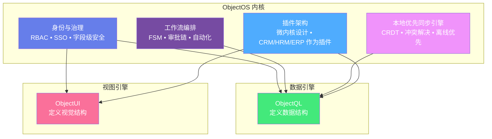
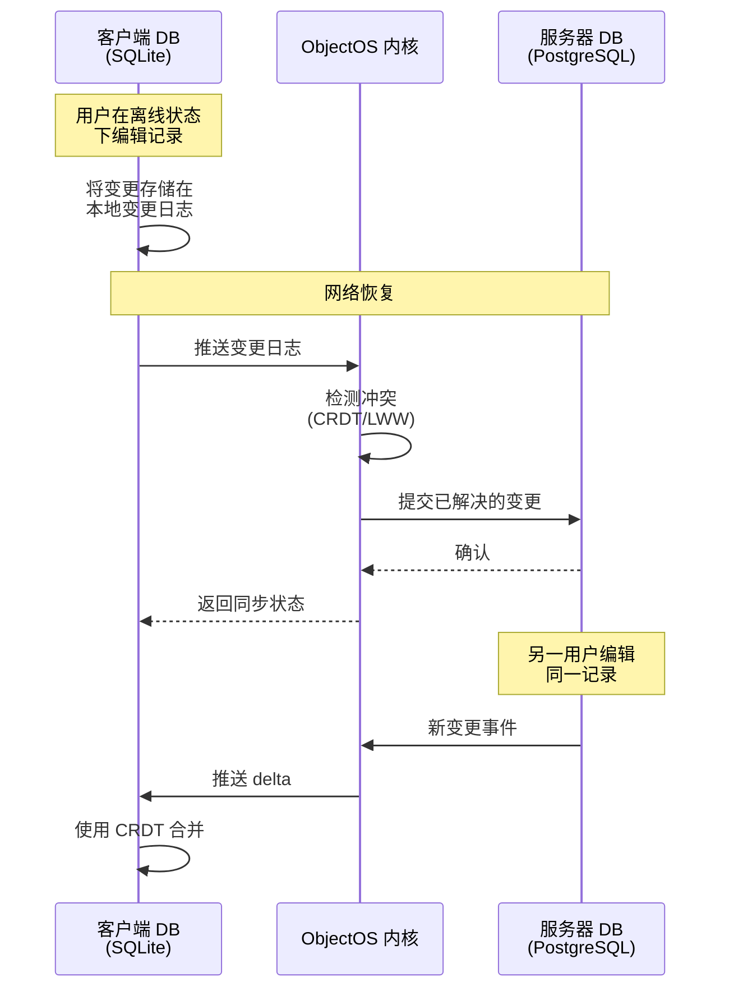
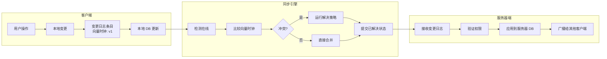
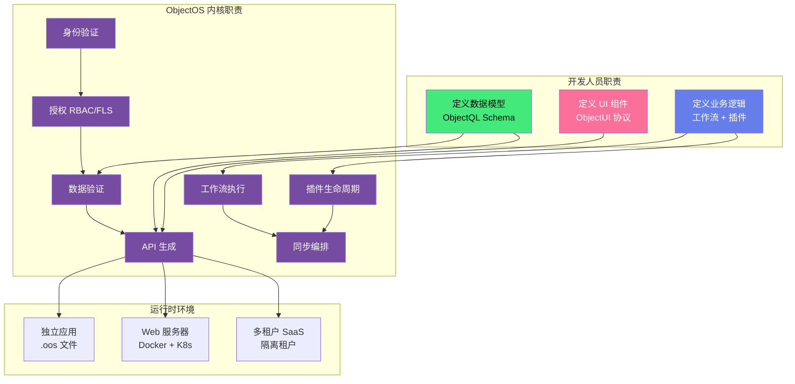

# ObjectOS:业务操作系统

**你不会通过自己编写进程调度器和文件系统来构建应用。你会使用操作系统(Linux/Windows)。那么,为什么要为每个业务应用重复编写身份验证、工作流引擎和同步逻辑呢?**

ObjectOS 是**企业级内核**。它在统一的运行时中编排身份、数据同步和业务流程——消除微服务蔓延和意大利面式单体架构。

---

## 指挥中心:ObjectOS 架构

ObjectOS 充当 ObjectStack 生态系统的中央 **CPU**,将 ObjectQL(内存/数据)和 ObjectUI(显示/IO)连接成一个统一的生产级系统。



**ObjectQL** 定义**数据结构**。**ObjectUI** 定义**视觉结构**。**ObjectOS** 为它们注入生命。

---

## 内核的四大支柱

ObjectOS 提供四项基础能力,无需编写自定义基础设施代码:

### 1. 身份与治理

**不仅仅是登录库,而是治理引擎。**

ObjectOS 提供内置的**基于角色的访问控制(RBAC)**、通过 OIDC/SAML 实现的**单点登录(SSO)**,以及在协议层(而非应用层)运行的**字段级安全(FLS)**。

**核心能力:**
- **多租户身份**:具有租户级治理的隔离用户空间
- **基于属性的访问控制(ABAC)**:使用表达式定义权限(`$user.department === 'sales'`)
- **审计日志**:记录每个数据变更的用户上下文和时间戳
- **零信任架构**:无隐式信任;每个请求都根据权限集进行验证

**示例:字段级安全**
```typescript
interface Employee {
  name: string          // 所有人可读
  email: string         // 所有人可读
  salary: number        // 仅 HR 或管理员可读
  ssn: string           // 仅管理员可读
}

// FLS 配置
{
  "fields": {
    "salary": {
      "read": "$user.role === 'hr' || $user.role === 'admin'",
      "edit": "$user.role === 'hr'"
    },
    "ssn": {
      "read": "$user.role === 'admin'",
      "edit": false
    }
  }
}
```

当普通用户查询员工数据时,`salary` 和 `ssn` 字段会被内核**自动过滤**——无需应用层过滤。

---

### 2. 工作流编排

**有限状态机(FSM)即代码。不再有嵌套的 if/else 语句。**

ObjectOS 提供**声明式工作流引擎**,审批链、自动化规则和业务流程在 **YAML 或 TypeScript** 中定义,而不是命令式的意大利面代码。

**核心能力:**
- **状态机定义**:声明式定义状态、转换和守卫
- **审批链**:带升级规则的多步骤审批
- **事件驱动触发器**:数据变更或计划触发自动执行
- **并行执行**:并发运行多个工作流步骤
- **补偿逻辑**:失败时自动回滚(Saga 模式)

**示例:采购订单审批工作流**
```yaml
workflow:
  name: purchase_order_approval
  trigger:
    object: purchase_orders
    event: insert
    condition: amount > 10000
  
  states:
    - name: pending_manager_approval
      on_enter:
        - action: notify
          recipients: ["{{record.manager.email}}"]
          template: manager_approval_request
      
      transitions:
        - event: manager_approved
          target: pending_finance_approval
          guard: "$user.id === record.manager.id"
        - event: manager_rejected
          target: rejected
    
    - name: pending_finance_approval
      on_enter:
        - action: notify
          recipients: ["finance@company.com"]
          template: finance_approval_request
      
      transitions:
        - event: finance_approved
          target: approved
          guard: "$user.department === 'finance'"
        - event: finance_rejected
          target: rejected
    
    - name: approved
      on_enter:
        - action: update
          object: purchase_orders
          data:
            status: approved
            approved_at: "{{now()}}"
        - action: notify
          recipients: ["{{record.created_by.email}}"]
          template: purchase_order_approved
    
    - name: rejected
      on_enter:
        - action: notify
          recipients: ["{{record.created_by.email}}"]
          template: purchase_order_rejected
```

**结果**:业务逻辑是**配置,而非代码**。内核处理执行、状态持久化和错误恢复。

---

### 3. 本地优先同步引擎

**杀手级功能:离线优先应用与自动冲突解决。**

构建离线优先应用非常困难。ObjectOS 充当**复制主控**,使用**无冲突复制数据类型(CRDT)**和**最后写入获胜(LWW)**策略管理服务器数据库(PostgreSQL/MySQL)和客户端数据库(SQLite/RxDB)之间的差异。

**核心能力:**
- **自动同步协议**:带 delta 压缩的双向复制
- **冲突解决**:基于 CRDT 的合并或可自定义的解决策略
- **离线队列**:变更在本地排队,连接恢复时重放
- **选择性同步**:仅同步与用户上下文相关的数据(RBAC 感知)
- **静态加密**:敏感数据的客户端加密

**同步架构:**



**示例:冲突解决配置**
```typescript
{
  sync: {
    enabled: true,
    remote: 'https://api.example.com',
    strategy: 'crdt',  // 或 'last-write-wins', 'manual'
    
    conflictResolution: {
      // 字段级解决策略
      fields: {
        title: 'last-write-wins',
        description: 'crdt-text',  // 文本的操作转换
        priority: 'max',            // 取最高值
        assignee: 'manual'          // 需要用户干预
      }
    },
    
    // 仅同步用户有权查看的数据
    filter: '$user.accessible_records',
    
    // 传输前加密
    encryption: {
      enabled: true,
      algorithm: 'AES-256-GCM'
    }
  }
}
```

**结果**:您的应用**默认离线工作**。同步是实现细节,而非功能。

---

### 4. 插件架构

**微内核设计:一切皆插件。**

ObjectOS 遵循**微内核架构**,核心仅提供原始操作(认证、数据访问、工作流执行)。所有业务逻辑——CRM、HRM、ERP——都通过**清单**作为**插件**加载。

**核心能力:**
- **声明式清单**:定义插件依赖、权限和生命周期钩子
- **沙盒执行**:插件在具有显式权限的隔离上下文中运行
- **热重载**:无需重启内核即可更新插件
- **版本管理**:具有语义版本控制的并行插件版本
- **市场就绪**:将插件分发为 npm 包或 Docker 镜像

**示例:CRM 插件清单**
```typescript
// crm-plugin.manifest.ts
export const CRMPlugin: PluginManifest = {
  name: '@company/crm',
  version: '2.1.0',
  
  // 依赖项
  requires: {
    objectos: '^3.0.0',
    plugins: {
      '@company/email-service': '^1.0.0'
    }
  },
  
  // 所需权限
  permissions: {
    objects: ['contacts', 'companies', 'opportunities'],
    actions: ['read', 'create', 'update', 'delete'],
    apis: ['/api/crm/*']
  },
  
  // Schema 扩展
  schema: {
    objects: {
      contacts: {
        fields: {
          name: { type: 'text', required: true },
          email: { type: 'email', unique: true },
          company: { type: 'lookup', reference_to: 'companies' },
          lead_score: { type: 'number', formula: 'calculate_lead_score()' }
        }
      },
      companies: {
        fields: {
          name: { type: 'text', required: true },
          industry: { type: 'select', options: ['tech', 'finance', 'retail'] },
          annual_revenue: { type: 'currency' }
        }
      }
    }
  },
  
  // 工作流定义
  workflows: {
    lead_nurturing: {
      trigger: { object: 'contacts', event: 'insert' },
      steps: [
        { action: 'wait', duration: '1 day' },
        { action: 'send_email', template: 'welcome' },
        { action: 'wait', duration: '3 days' },
        { action: 'send_email', template: 'follow_up', condition: 'lead_score < 50' }
      ]
    }
  },
  
  // UI 扩展
  ui: {
    pages: {
      contacts: { type: 'list', object: 'contacts' },
      contact_detail: { type: 'detail', object: 'contacts' }
    },
    dashboard_widgets: [
      { type: 'chart', title: 'Leads by Source', query: 'aggregate_leads_by_source()' }
    ]
  },
  
  // 生命周期钩子
  lifecycle: {
    async onInstall() {
      // 种子初始数据
      await this.seed('data/initial_industries.json')
    },
    async onStart() {
      // 注册自定义路由
      this.router.post('/api/crm/import', importContactsHandler)
    }
  }
}
```

**结果**:业务逻辑是**声明式配置**。内核处理实例化、依赖注入和生命周期管理。

---

## 复制协议:本地优先深度解析

**问题**:构建离线优先应用需要管理复杂的状态同步、冲突解决和网络分区处理。大多数团队低估了这种复杂性,最终得到脆弱、容易出错的实现。

**解决方案**:ObjectOS 提供**复制协议**,处理整个同步生命周期——从离线变更到冲突检测再到合并策略。

### 工作原理

ObjectOS 实现**日志结构复制**系统:

1. **每个变更都会创建一个变更日志条目**(客户端和服务器)
2. **同步比较向量时钟**以检测分歧
3. **使用可配置策略解决冲突**(CRDT、LWW、手动)
4. **已解决的状态被提交**到客户端和服务器



### 冲突解决策略

ObjectOS 支持每个字段的多种解决策略:

| 策略 | 描述 | 使用场景 | 示例 |
|----------|-------------|----------|---------|
| **最后写入获胜(LWW)** | 最新时间戳获胜 | 简单字段(状态、类别) | `priority: 'last-write-wins'` |
| **CRDT(操作转换)** | 合并并发编辑 | 协作文本编辑 | `description: 'crdt-text'` |
| **Max/Min** | 取最高/最低值 | 计数器、评分 | `view_count: 'max'` |
| **Union** | 组合所有值 | 标签、多选 | `tags: 'union'` |
| **手动** | 需要用户解决 | 关键字段 | `assignee: 'manual'` |

### 复制主控架构

```typescript
// ObjectOS 充当复制主控
interface ReplicationMaster {
  // 跟踪客户端状态
  clients: Map<ClientID, VectorClock>
  
  // 变更日志存储
  serverLog: ChangelogEntry[]
  
  // 冲突检测器
  detectConflicts(
    clientLog: ChangelogEntry[],
    serverLog: ChangelogEntry[]
  ): Conflict[]
  
  // 解析器
  resolveConflicts(
    conflicts: Conflict[],
    strategy: ResolutionStrategy
  ): ResolvedState
  
  // 广播器
  broadcastToClients(
    changes: ChangelogEntry[],
    excludeClient?: ClientID
  ): void
}
```

**示例:配置同步行为**
```typescript
const app = new ObjectOS({
  mode: 'hybrid',  // 本地优先 + 可选同步
  
  storage: {
    local: './app.db',  // SQLite
    remote: 'postgres://server/db'
  },
  
  sync: {
    enabled: true,
    
    // 同步间隔(0 = 仅手动)
    interval: 60000,  // 60 秒
    
    // 每个对象的冲突解决
    objects: {
      tasks: {
        title: 'last-write-wins',
        description: 'crdt-text',     // 操作转换
        assignee: 'manual',            // 用户必须解决
        completed_at: 'last-write-wins'
      },
      
      analytics: {
        view_count: 'max',             // 取最高值
        tags: 'union'                  // 合并所有标签
      }
    },
    
    // 选择性同步(RBAC 感知)
    filter: {
      tasks: '$user.team.id === record.team_id',
      analytics: 'record.public === true'
    },
    
    // 加密
    encryption: {
      enabled: true,
      algorithm: 'AES-256-GCM',
      key: process.env.SYNC_ENCRYPTION_KEY
    },
    
    // 性能批处理
    batch: {
      maxSize: 100,        // 每次同步最多 100 个变更
      maxWait: 5000        // 强制同步前最多等待 5 秒
    }
  }
})
```

### 离线队列管理

离线时,ObjectOS 在本地对变更排队:

```typescript
// 用户离线时编辑
await db.update('tasks', taskId, { status: 'completed' })

// 变更在本地排队
// Queue: [
//   { 
//     object: 'tasks', 
//     action: 'update', 
//     id: taskId, 
//     changes: { status: 'completed' },
//     timestamp: '2024-01-17T10:30:00Z',
//     vectorClock: { client: 'abc123', version: 42 }
//   }
// ]

// 在线时,队列自动重放
// ObjectOS 处理:
// ✅ 权限重新验证(以防 RBAC 发生变化)
// ✅ 冲突检测
// ✅ 合并策略
// ✅ 错误恢复(指数退避重试)
```

**结果**:开发人员定义**要同步什么**和**如何解决冲突**。ObjectOS 处理**何时**和**在哪里**。

---

## 生态系统集成:三位一体

ObjectOS 通过将**数据结构**(ObjectQL)和**视觉结构**(ObjectUI)绑定到**活系统**中,完成了 ObjectStack 三位一体。



### 职责划分

| 组件 | 定义 | 输出 | 示例 |
|-----------|---------|--------|---------|
| **ObjectQL** | 数据结构 | JSON Schema + 验证规则 | `{ object: 'users', fields: { email: { type: 'email', unique: true } } }` |
| **ObjectUI** | 视觉结构 | 组件协议 | `{ type: 'form', object: 'users', fields: ['name', 'email'] }` |
| **ObjectOS** | 运行时行为 | 可执行应用 | 身份验证 + 同步 + 工作流 |

### 示例:端到端集成

**步骤 1:定义数据(ObjectQL)**
```typescript
const schema = {
  objects: {
    invoices: {
      fields: {
        invoice_number: { type: 'autonumber', prefix: 'INV-' },
        customer: { type: 'lookup', reference_to: 'customers' },
        total: { type: 'currency', formula: 'SUM(line_items.amount)' },
        status: { 
          type: 'select', 
          options: ['draft', 'sent', 'paid', 'overdue'],
          default: 'draft'
        },
        due_date: { type: 'date' }
      }
    }
  }
}
```

**步骤 2:定义 UI(ObjectUI)**
```typescript
const pages = {
  invoices: {
    type: 'list',
    object: 'invoices',
    filters: [{ field: 'status', operator: 'ne', value: 'paid' }],
    columns: ['invoice_number', 'customer', 'total', 'status', 'due_date'],
    actions: [
      {
        label: 'Send Invoice',
        trigger: 'workflow:send_invoice',
        condition: 'status === "draft"'
      }
    ]
  }
}
```

**步骤 3:定义工作流(ObjectOS)**
```yaml
workflows:
  send_invoice:
    trigger:
      manual: true
      object: invoices
      condition: status === 'draft'
    
    steps:
      - action: update
        object: invoices
        data:
          status: sent
          sent_at: "{{now()}}"
      
      - action: send_email
        to: "{{record.customer.email}}"
        subject: "Invoice {{record.invoice_number}}"
        template: invoice_email
        attachments:
          - type: pdf
            template: invoice_pdf
      
      - action: schedule
        delay: "{{record.due_date}}"
        workflow: check_overdue
```

**步骤 4:ObjectOS 编排一切**
```typescript
const app = new ObjectOS({
  schema,      // 来自 ObjectQL
  pages,       // 来自 ObjectUI
  workflows,   // 业务逻辑
  
  // ObjectOS 处理:
  identity: { authentication: { providers: ['email'] } },
  sync: { enabled: true, strategy: 'crdt' },
  deployment: { mode: 'server', port: 3000 }
})

await app.start()
// ✅ RESTful API 自动生成
// ✅ Web UI 自动渲染
// ✅ 身份验证已启用
// ✅ 工作流已激活
// ✅ 同步已配置
```

**结果**:您定义**什么**(数据、UI、逻辑)。ObjectOS 处理**如何**(认证、同步、部署)。

---

## ObjectOS 的重要性

### 对于 CTO 和企业架构师

**您正在解决的问题:**
- **微服务蔓延**:47 个服务都在做认证,每个都略有不同
- **意大利面式单体**:业务逻辑埋藏在控制器中,无法测试
- **供应商锁定**:与 Firebase/Supabase/AWS Amplify 紧密耦合
- **合规噩梦**:没有审计跟踪,不一致的 RBAC

**ObjectOS 提供:**
- **统一控制平面**:所有应用的一个治理模型
- **声明式一切**:逻辑作为配置,而非代码
- **数据库无关**:今天 MySQL,明天 PostgreSQL,遗留系统用 Oracle
- **合规就绪**:内置审计日志、RBAC、FLS

### 对于后端负责人

**您正在解决的问题:**
- **样板地狱**:每个微服务中相同的认证代码
- **同步复杂性**:CRDT 很难;您做错了 LWW
- **测试困难**:业务逻辑与框架代码混合

**ObjectOS 提供:**
- **协议驱动**:将工作流作为 YAML 测试,而非运行时行为
- **经过验证的同步**:经过实战检验的 CRDT 实现
- **热重载**:无需部署即可更改工作流

---

## 下一步

探索 ObjectOS 平台能力:

1. **[平台架构](/cn/docs/objectos/platform-architecture)** - 深入了解 QL-UI 绑定和运行时
2. **[身份与访问](/cn/docs/objectos/identity-access)** - RBAC、SSO、字段级安全
3. **[部署](/cn/docs/objectos/deployment)** - 独立、服务器和多租户模式

实现示例:
- **[插件开发指南](/cn/docs/objectos/plugins)** - 构建您的第一个插件
- **[工作流模式](/cn/docs/objectos/workflows)** - 常见自动化场景
- **[同步配置](/cn/docs/objectos/sync)** - 配置本地优先复制

---

## 设计哲学

ObjectOS 遵循三个核心原则:

1. **机制,而非策略**:我们提供 RBAC 接口,而非硬编码的用户系统。您定义策略。
2. **默认本地优先**:应用离线运行。同步是可选的,而非必需的。
3. **协议驱动**:业务逻辑存在于数据(JSON/YAML)中,而非代码(if/else)中。

**ObjectOS 不是框架。它是业务应用的操作系统。**
