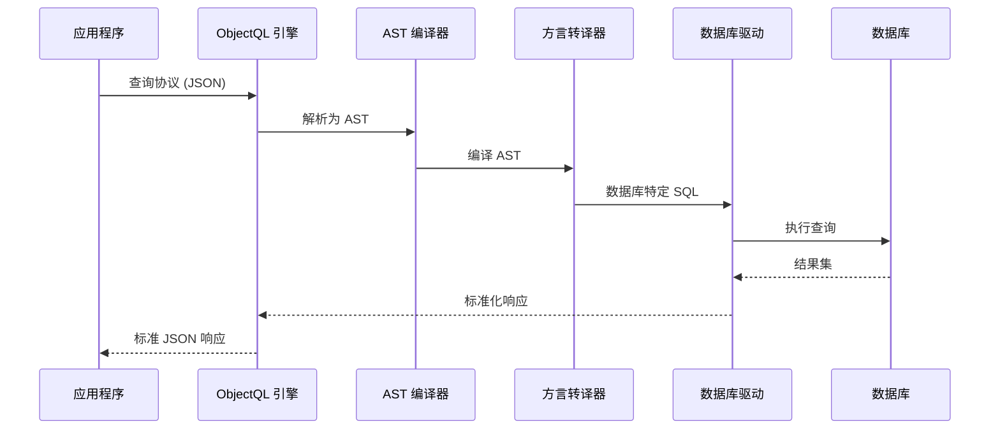

# ObjectQL：数据协议引擎

ObjectQL 是 ObjectStack 核心的**数据库无关查询引擎**。它定义了一种基于 JSON 的通用协议，用于模式定义、数据查询和变更，可编译为任何支持数据库的原生 SQL。

## 规范概述

ObjectQL **不是数据库**——它是一个**协议规范**及其参考实现。该协议定义：

1. **模式定义语言**：基于 JSON 的数据模型声明
2. **查询 DSL（领域特定语言）**：CRUD 操作的统一语法
3. **AST 编译**：数据库无关查询的抽象语法树
4. **驱动接口**：数据库引擎的标准适配器契约

### 核心设计原则

**协议中立性**：ObjectQL 规范与实现无关。同一协议可由以下引擎执行：
- JavaScript 引擎（Node.js）
- Python 引擎（计划中）
- Java 引擎（计划中）
- Go 引擎（计划中）

**数据库无关**：协议从不假定特定数据库。像"JSONB"（PostgreSQL）或"ROWNUM"（Oracle）这样的概念不存在于协议层——它们由特定方言的转译器处理。

**机制，而非策略**：ObjectQL 定义*如何描述数据操作*，而非*如何实现*它们。用户认证、验证逻辑和业务规则属于 ObjectOS。

---

## 协议架构



### 协议流程

1. **协议输入**：应用程序发送 JSON 查询协议
2. **AST 解析**：引擎将协议解析为抽象语法树
3. **方言编译**：AST 编译为特定数据库的 SQL
4. **驱动执行**：驱动执行原生 SQL
5. **响应标准化**：结果标准化为协议格式
6. **协议输出**：应用程序接收一致的 JSON 响应

这种架构确保**完全的数据库独立性**——从 MySQL 切换到 PostgreSQL 无需更改任何应用代码。

---

## 核心协议组件

### 1. 模式定义协议

将数据结构定义为声明式 JSON 规范：

```typescript
interface ObjectSchema {
  name: string                    // 对象标识符
  label?: string                  // 人类可读名称
  fields: Record<string, Field>   // 字段定义
  indexes?: Index[]               // 性能索引
  triggers?: Trigger[]            // 生命周期钩子
  permission_set?: PermissionSet  // 访问控制规则
}

interface Field {
  type: FieldType                 // 数据类型
  label?: string                  // 显示名称
  required?: boolean              // 验证规则
  unique?: boolean                // 唯一性约束
  defaultValue?: any              // 默认值
  reference_to?: string           // 关系目标（用于查找/主从关系）
  formula?: string                // 计算字段表达式
}

type FieldType = 
  | 'text' | 'textarea' | 'number' | 'currency' | 'percent'
  | 'date' | 'datetime' | 'time' 
  | 'boolean' | 'select' | 'multiselect'
  | 'lookup' | 'master_detail'
  | 'url' | 'email' | 'phone'
  | 'autonumber' | 'formula'
```

**示例模式**：
```json
{
  "objects": {
    "orders": {
      "label": "销售订单",
      "fields": {
        "order_number": { 
          "type": "autonumber", 
          "format": "ORD-{0000}" 
        },
        "customer": { 
          "type": "lookup", 
          "reference_to": "customers",
          "required": true
        },
        "order_date": { 
          "type": "date", 
          "defaultValue": "{{$now}}" 
        },
        "total_amount": { 
          "type": "currency", 
          "precision": 2 
        },
        "status": { 
          "type": "select", 
          "options": ["draft", "confirmed", "shipped", "delivered"]
        }
      },
      "indexes": [
        { "fields": ["customer", "order_date"] },
        { "fields": ["status", "order_date"] }
      ]
    }
  }
}
```

此模式是**数据库无关的**。ObjectQL 将生成：
- **MySQL**：带有 `INT AUTO_INCREMENT`、`VARCHAR`、`DECIMAL`、`ENUM` 的 `CREATE TABLE`
- **PostgreSQL**：带有 `SERIAL`、`VARCHAR`、`NUMERIC`、`TEXT`（带检查约束）的 `CREATE TABLE`
- **Oracle**：带有 `NUMBER` 序列触发器、`VARCHAR2`、`NUMBER`、`VARCHAR2`（带检查约束）的 `CREATE TABLE`
- **SQLite**：带有 `INTEGER PRIMARY KEY`、`TEXT`、`REAL`、`TEXT`（带检查约束）的 `CREATE TABLE`

### 2. 查询协议（DSL）

所有数据操作的统一 JSON 语法：

```typescript
interface QueryProtocol {
  object: string                  // 目标对象名称
  fields?: string[]               // 要返回的字段（默认：全部）
  filters?: FilterExpression      // WHERE 子句
  sort?: string | SortExpression  // ORDER BY 子句
  top?: number                    // LIMIT 子句
  skip?: number                   // OFFSET 子句
  related?: RelatedQuery[]        // JOIN/子查询展开
}

type FilterExpression = Filter | CompoundFilter

interface Filter {
  field: string
  operator: Operator
  value: any
}

type Operator = 
  | 'eq' | 'ne' | 'lt' | 'lte' | 'gt' | 'gte'
  | 'startswith' | 'endswith' | 'contains' | 'notcontains'
  | 'in' | 'notin' | 'between'
  | 'isnull' | 'isnotnull'

interface CompoundFilter {
  and?: FilterExpression[]
  or?: FilterExpression[]
}
```

**示例查询**：

```json
// 简单查询
{
  "object": "orders",
  "fields": ["order_number", "customer", "total_amount"],
  "filters": {
    "and": [
      { "field": "status", "operator": "eq", "value": "confirmed" },
      { "field": "order_date", "operator": "gte", "value": "2024-01-01" }
    ]
  },
  "sort": "order_date desc",
  "top": 50
}

// 带关系的查询
{
  "object": "orders",
  "fields": ["order_number", "total_amount"],
  "filters": {
    "field": "customer.country", 
    "operator": "eq", 
    "value": "USA"
  },
  "related": [
    {
      "object": "order_items",
      "foreign_key": "order_id",
      "fields": ["product", "quantity", "unit_price"]
    }
  ]
}
```

### 3. 变更协议

数据修改的标准化操作：

```typescript
interface MutationProtocol {
  object: string
  action: 'insert' | 'update' | 'delete'
  data?: Record<string, any>      // 用于 insert/update
  filters?: FilterExpression      // 用于 update/delete
}
```

**示例变更**：

```json
// 插入
{
  "object": "orders",
  "action": "insert",
  "data": {
    "customer": "CUST-001",
    "order_date": "2024-03-15",
    "total_amount": 1250.00,
    "status": "confirmed"
  }
}

// 批量更新
{
  "object": "orders",
  "action": "update",
  "filters": {
    "and": [
      { "field": "status", "operator": "eq", "value": "confirmed" },
      { "field": "order_date", "operator": "lt", "value": "2024-01-01" }
    ]
  },
  "data": {
    "status": "archived"
  }
}

// 条件删除
{
  "object": "orders",
  "action": "delete",
  "filters": {
    "field": "status",
    "operator": "eq",
    "value": "cancelled"
  }
}
```

---

## 数据库驱动接口

ObjectQL 定义了所有数据库适配器必须实现的**标准化驱动契约**：

```typescript
interface ObjectQLDriver {
  // 连接管理
  connect(config: ConnectionConfig): Promise<Connection>
  disconnect(): Promise<void>
  
  // 模式操作
  createTable(schema: ObjectSchema): Promise<void>
  alterTable(schema: ObjectSchema, changes: SchemaChange[]): Promise<void>
  dropTable(objectName: string): Promise<void>
  
  // 查询操作
  query(protocol: QueryProtocol): Promise<QueryResult>
  
  // 变更操作
  insert(protocol: MutationProtocol): Promise<MutationResult>
  update(protocol: MutationProtocol): Promise<MutationResult>
  delete(protocol: MutationProtocol): Promise<MutationResult>
  
  // 事务管理
  beginTransaction(): Promise<Transaction>
  commit(transaction: Transaction): Promise<void>
  rollback(transaction: Transaction): Promise<void>
  
  // 方言特定编译
  compileAST(ast: ASTNode): string  // 返回原生 SQL
}
```

### 支持的驱动

官方参考实现：

| 驱动 | 状态 | 用例 |
|------|------|------|
| **@objectql/driver-sqlite** | ✅ 稳定 | 本地优先应用、开发、边缘计算 |
| **@objectql/driver-mysql** | ✅ 稳定 | Web 应用、云部署 |
| **@objectql/driver-postgres** | ✅ 稳定 | 企业系统、分析工作负载 |
| **@objectql/driver-oracle** | 🚧 测试版 | 遗留系统集成 |
| **@objectql/driver-sqlserver** | 🚧 测试版 | Microsoft 技术栈集成 |

欢迎社区驱动——实现 `ObjectQLDriver` 接口并作为 npm 包发布。

---

## 高级功能

### 虚拟城市（多租户）

ObjectQL 通过虚拟城市机制提供**协议级多租户**：

```typescript
// 每个租户获得隔离的数据上下文
const tenant1DB = engine.virtualCity('tenant_001')
const tenant2DB = engine.virtualCity('tenant_002')

// 相同的查询，隔离的数据
await tenant1DB.query('customers', {})  // 返回 tenant_001 的客户
await tenant2DB.query('customers', {})  // 返回 tenant_002 的客户
```

**实现**：虚拟城市是驱动级功能。MySQL/PostgreSQL 实现使用模式分离，SQLite 使用单独的数据库文件。

### 虚拟列索引（性能）

对于缺少原生 JSON 索引的数据库（例如 SQLite），ObjectQL 提供虚拟列索引：

```json
{
  "objects": {
    "products": {
      "fields": {
        "metadata": { "type": "text" }  // 存储 JSON
      },
      "virtual_indexes": [
        { 
          "name": "idx_price",
          "expression": "JSON_EXTRACT(metadata, '$.price')",
          "type": "number"
        }
      ]
    }
  }
}
```

ObjectQL 自动创建索引虚拟列以实现高性能查询。

### 公式字段

在模式中定义的计算字段：

```json
{
  "fields": {
    "quantity": { "type": "number" },
    "unit_price": { "type": "currency" },
    "line_total": { 
      "type": "formula",
      "formula": "quantity * unit_price",
      "return_type": "currency"
    }
  }
}
```

公式字段是**数据库无关的表达式**，编译为 SQL `GENERATED` 列（PostgreSQL/MySQL）或在内存中计算（SQLite）。

### 聚合协议

带分组的统计查询：

```json
{
  "object": "orders",
  "aggregations": [
    { "field": "total_amount", "function": "sum", "alias": "revenue" },
    { "field": "order_number", "function": "count", "alias": "order_count" }
  ],
  "groupBy": ["customer", "status"],
  "filters": {
    "field": "order_date",
    "operator": "gte",
    "value": "2024-01-01"
  }
}
```

编译为跨所有数据库的 `GROUP BY` 查询和适当的聚合函数。

---

## 使用场景

### 1. 本地优先应用

**场景**：个人生产力工具（笔记、CRM、项目管理）

**配置**：
```typescript
import { ObjectQL } from '@objectql/core'
import { SQLiteDriver } from '@objectql/driver-sqlite'

const engine = new ObjectQL({
  driver: new SQLiteDriver({
    database: './myapp.db'
  })
})
```

**优势**：
- 零服务器基础设施
- 完全离线能力
- 数据存储在本地 .db 文件中
- 以后可升级到云数据库而无需更改代码

### 2. 企业系统集成

**场景**：异构遗留数据库上的统一 API

**配置**：
```typescript
// 连接到现有的 Oracle ERP 数据库
const erpDB = new ObjectQL({
  driver: new OracleDriver({
    host: 'oracle.company.com',
    database: 'ERP_PROD'
  })
})

// 连接到 SQL Server CRM 数据库
const crmDB = new ObjectQL({
  driver: new SQLServerDriver({
    host: 'sqlserver.company.com',
    database: 'CRM_PROD'
  })
})

// 两者统一的 ObjectQL API
const erpCustomers = await erpDB.query('customers', {})
const crmLeads = await crmDB.query('leads', {})
```

**优势**：
- 所有系统的单一查询语言
- 每个数据库无需自定义集成代码
- 一致的错误处理和验证
- 更易于维护和测试

### 3. 多租户 SaaS 平台

**场景**：具有租户隔离的 SaaS 应用

**配置**：
```typescript
const engine = new ObjectQL({
  driver: new PostgreSQLDriver({
    host: 'postgres.cloud.com',
    database: 'saas_platform'
  }),
  multiTenant: true
})

// 每个租户获得隔离的上下文
app.use(async (req, res, next) => {
  const tenantId = req.headers['x-tenant-id']
  req.db = engine.virtualCity(tenantId)
  next()
})

// 自动数据隔离
router.get('/api/orders', async (req, res) => {
  const orders = await req.db.query('orders', {})
  res.json(orders)  // 仅返回租户的订单
})
```

**优势**：
- 协议级租户隔离
- 数据隔离无需业务逻辑
- 可扩展到每租户模式或每租户数据库
- ObjectQL 自动处理路由

---

## 您将学到什么

本规范文档涵盖：

- ✅ **[核心概念](/docs/objectql/core-concepts)** - 模式、虚拟城市、数据类型、关系
- ✅ **[协议规范](/docs/objectql/protocol-spec)** - 查询、变更、聚合的完整 JSON 模式参考
- ✅ **[驱动开发](/docs/objectql/driver-dev)** - 实现自定义数据库适配器
- ✅ **[服务端 SDK](/docs/objectql/server-sdk)** - 参考实现 API（JavaScript/Node.js）
- ✅ **[性能指南](/docs/objectql/performance)** - 优化策略、索引、查询分析

---

## 快速开始示例

这是一个完整的端到端示例：

```typescript
import { ObjectQL } from '@objectql/core'
import { SQLiteDriver } from '@objectql/driver-sqlite'

// 1. 初始化引擎
const engine = new ObjectQL({
  driver: new SQLiteDriver({ database: './todo.db' })
})

// 2. 注册模式
await engine.registerSchema({
  objects: {
    tasks: {
      fields: {
        title: { type: 'text', required: true },
        completed: { type: 'boolean', defaultValue: false },
        priority: { type: 'select', options: ['high', 'medium', 'low'] },
        due_date: { type: 'date' }
      }
    }
  }
})

// 3. 插入数据
await engine.insert({
  object: 'tasks',
  action: 'insert',
  data: { 
    title: '学习 ObjectQL', 
    priority: 'high',
    due_date: '2024-12-31'
  }
})

// 4. 查询数据
const urgentTasks = await engine.query({
  object: 'tasks',
  filters: {
    and: [
      { field: 'completed', operator: 'eq', value: false },
      { field: 'priority', operator: 'eq', value: 'high' }
    ]
  },
  sort: 'due_date asc'
})

console.log(urgentTasks)
// [{ title: '学习 ObjectQL', priority: 'high', completed: false, due_date: '2024-12-31' }]

// 5. 切换到 PostgreSQL（零代码更改）
const prodEngine = new ObjectQL({
  driver: new PostgreSQLDriver({ 
    url: 'postgresql://localhost/production' 
  })
})

// 相同的模式，相同的查询，不同的数据库
await prodEngine.registerSchema(schema)
const sameTasks = await prodEngine.query(queryProtocol)
```

---

## 设计理由

### 为什么使用 JSON 协议？

**TypeScript/JavaScript SDK 是实现细节**。真正的 API 是 JSON 协议：

- **语言无关**：Python、Java、Go 都可以实现 ObjectQL
- **网络透明**：协议可通过 HTTP、WebSockets、gRPC 发送
- **可版本化**：协议是结构化数据，可进行差异比较和版本控制
- **AI 友好**：LLM 可以轻松生成和修改 JSON 协议

### 为什么使用 AST 编译？

**直接 SQL 模板化既脆弱又不安全**。AST 编译提供：

- **SQL 注入保护**：AST 级别的参数化查询
- **方言抽象**：单一 AST 编译为任何 SQL 方言
- **查询优化**：AST 可在执行前进行分析和优化
- **一致的语义**：跨所有数据库的相同查询行为

### 为什么使用驱动抽象？

**数据库 API 不一致**。驱动接口提供：

- **统一错误处理**：跨数据库的一致错误类型
- **连接池**：无论驱动如何，标准的池管理
- **事务语义**：一致 API 的 ACID 保证
- **测试**：无需数据库的单元测试 mock 驱动

---

## 规范合规性

ObjectQL 实现必须通过 **ObjectQL 合规性测试套件**：

- ✅ 模式定义解析和验证
- ✅ 所有运算符的查询协议执行
- ✅ insert/update/delete 的变更协议
- ✅ 关系查询（查找、主从关系）
- ✅ 带分组的聚合查询
- ✅ 事务管理（ACID）
- ✅ 虚拟城市多租户隔离
- ✅ 错误处理和响应格式

参考实现：
- **JavaScript**：[@objectql/core](https://github.com/objectstack-ai/objectql)（Node.js）
- **Python**：[objectql-py](https://github.com/objectstack-ai/objectql-py)（计划中）
- **Go**：[objectql-go](https://github.com/objectstack-ai/objectql-go)（计划中）

---

## 下一步

1. **理解核心概念**：阅读[核心概念](/docs/objectql/core-concepts)了解模式、关系和虚拟城市
2. **学习协议**：查看[协议规范](/docs/objectql/protocol-spec)获取完整的 JSON 模式参考
3. **使用 SDK 构建**：使用[服务端 SDK](/docs/objectql/server-sdk)在应用中集成 ObjectQL
4. **优化性能**：探索[性能指南](/docs/objectql/performance)获取生产最佳实践

有关哲学背景，请参见：
- **[宣言](/docs/framework/manifesto)** - 为什么 ObjectQL 是协议驱动和数据库无关的
- **[架构](/docs/framework/architecture)** - ObjectQL 如何融入 ObjectStack 生态系统
