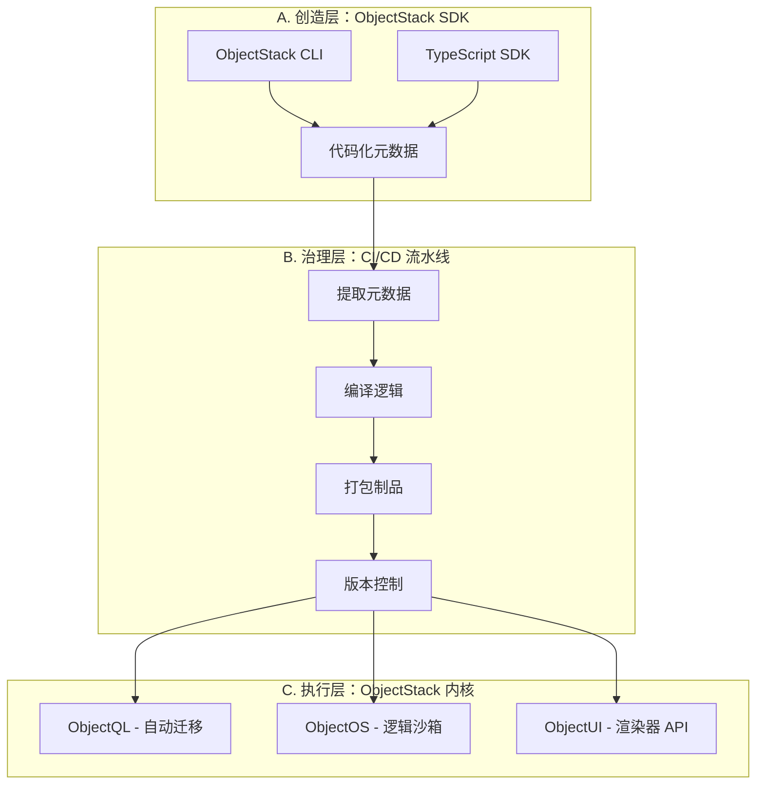
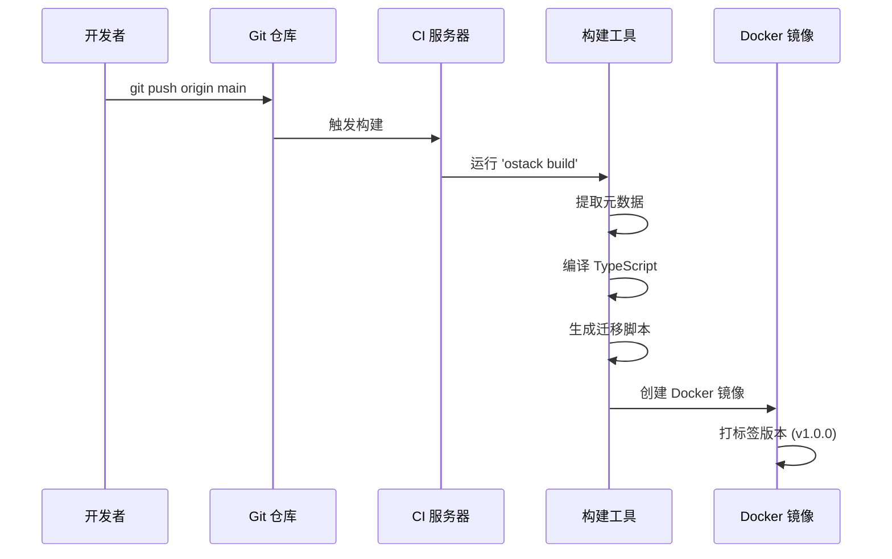
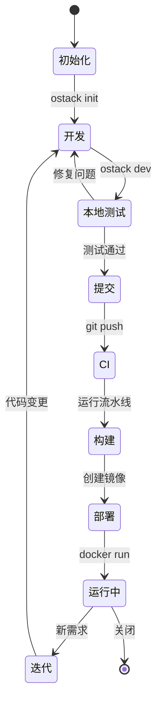

# ObjectStack 企业框架

**"定义即应用"**

## 概述

ObjectStack 企业框架代表了企业应用开发的新方法——**"面向专业开发者的元数据引擎"**。在第一阶段，我们专注于赋能开发者通过基于代码的元数据定义构建企业级应用，消除了对可视化配置界面的需求，同时保持 ObjectStack 协议生态系统的强大功能和灵活性。

### 核心理念

在第一阶段，我们将 ObjectStack 定义为**"面向专业开发者的企业级应用元框架"**。

* **没有黑盒**: 所有的业务定义都在本地代码中，基于 TypeScript，清晰透明。
* **Git 为中心**: 使用 Git 仓库作为唯一真理来源 (Single Source of Truth)。
* **自带基建**: 开发者只负责写"业务描述"，框架负责"数据库迁移、API 生成、界面渲染"。

---

## 架构全景图

企业框架围绕三个不同的层次构建，这些层次共同将基于代码的定义转换为运行中的应用程序。



### A. 创造层：ObjectStack SDK

**"在 IDE 中定义世界"**

开发者不再需要登录网页后台配置，而是直接在 VS Code 或他们喜欢的 IDE 中工作。

#### ObjectStack CLI

命令行工具，用于快速生成代码模板和项目脚手架：

* `ostack init`: 初始化标准项目结构
* `ostack g resource contract`: 生成"合同"模块的标准目录
* `ostack build`: 编译元数据和业务逻辑
* `ostack dev`: 启动本地开发服务器，支持热重载

#### 基于代码的元数据

我们利用 **TypeScript** 的静态类型能力来定义元数据：

* **Schema**: 使用类似 Zod 或 TypeORM 的语法定义数据结构
* **Logic**: 直接编写 TS 函数作为 Trigger
* **UI**: 使用 JSON 或 TS 对象描述界面布局（通过我们提供的类型提示）

**代码示例：**

```typescript
// src/objects/contract.ts
import { defineObject, Field } from '@objectstack/sdk';

export const Contract = defineObject({
  name: 'contract',
  label: '销售合同',
  fields: {
    title: Field.String({ 
      label: '标题', 
      required: true,
      maxLength: 200
    }),
    amount: Field.Currency({ 
      label: '金额',
      precision: 18,
      scale: 2
    }),
    status: Field.Select({ 
      options: ['draft', 'signed', 'cancelled'],
      defaultValue: 'draft'
    }),
    signedAt: Field.DateTime({
      label: '签署日期',
      nullable: true
    })
  },
  
  // 触发器逻辑直接写在这里
  triggers: {
    beforeInsert: async ({ doc }) => {
      if (doc.amount < 0) {
        throw new Error("金额不能为负");
      }
    },
    
    afterUpdate: async ({ doc, oldDoc }) => {
      if (doc.status === 'signed' && oldDoc.status !== 'signed') {
        doc.signedAt = new Date();
      }
    }
  },
  
  // 访问控制
  permissions: {
    create: ['sales', 'admin'],
    read: ['sales', 'admin', 'viewer'],
    update: ['sales', 'admin'],
    delete: ['admin']
  }
});
```

### B. 治理层：CI/CD 流水线

**"Git 仓库即控制台"**

没有 Hub，**Git Repository** 就是 Hub。

#### 构建时编排

当代码提交时，ObjectStack 的构建工具（基于 Vite 或 Rollup）会扫描所有 `.ts` 文件：

1. **Extract**: 提取其中的元数据定义（Schema/UI）
2. **Compile**: 将后端逻辑编译为优化的 JS 包
3. **Bundle**: 将这些打包成一个不可变的 **Artifact（制品）**



#### 版本管理

* 利用 **Git Tag** 管理版本（v1.0, v1.1）
* 利用 **Pull Request** 进行变更审批
* 利用 **Git Branches** 进行功能开发和热修复

### C. 执行层：ObjectStack 内核

**"自带动力的单体引擎"**

这是交付给客户的核心——一个标准的 **Docker 镜像** 或 **NPM 包**，客户将其部署在自己的服务器上。

这个 Kernel 包含了统一的"三位一体"引擎：

#### 1. ObjectQL（自动迁移）

应用启动时，Kernel 读取打包好的 Metadata：

* **自动同步 DB**: 发现 `Contract` 对象多了 `amount` 字段 → 自动对 Postgres 执行 `ALTER TABLE`
* **自动生成 API**: 自动挂载 GraphQL/REST 端点 `/api/data/contract`

#### 2. ObjectOS（逻辑沙箱）

* 负责加载并执行开发者编写的 `triggers` 函数
* 管理身份验证和授权（RBAC/ACL）
* 处理工作流状态机
* 编排本地优先同步

#### 3. ObjectUI（渲染器 API）

* 向前端（React/Vue 客户端）提供 `schema.json`
* **Amis 集成**: 如果使用 Amis，这里直接输出 Amis 标准的 JSON 配置，前端直接渲染
* 支持复杂 UI 的自定义 React 组件

---

## 落地工作流

这是客户采用该方案时的标准作业流程（SOP）：

| 步骤 | 角色 | 动作 | 产物 |
|------|------|------|------|
| **1. 初始化** | 架构师 | `npm create objectstack-app my-erp` | 包含核心依赖的 Git 仓库 |
| **2. 开发** | 开发者 | 编写 `.ts` 文件定义对象、逻辑和界面 | 源代码 (Source Code) |
| **3. 提交** | 开发者 | `git push origin main` | 触发 CI 构建 |
| **4. 构建** | CI Server | 运行 `ostack build` | **Docker Image** (包含 Kernel + 业务代码) |
| **5. 部署** | 运维 | `docker run -d my-erp:latest` | 运行中的企业应用 |
| **6. 迭代** | 全员 | 修改代码 → Push → 自动热更新 | 持续交付 |

### 详细工作流示例



---

## 商业模式与交付物

在 Phase 1，你交付给客户的是一套 **"开发底座"**。

### 核心交付物清单

1. **`@objectstack/cli`**: 命令行工具 (NPM)
2. **`@objectstack/core`**: 核心运行时依赖 (包含 ObjectQL/OS/UI 的逻辑)
3. **Standard Template**: 标准的企业级项目脚手架
4. **Documentation**: 详细的 API 文档和最佳实践指南

### 卖点话术

* **"不被厂商绑定"**: 代码在你们自己手里，Git 仓库在你们自己服务器上
* **"零技术债务"**: 你们只写业务逻辑，底层脏活累活（数据库连接、API 封装、权限校验）全部由框架处理
* **"类型安全"**: 全链路 TypeScript 支持，重构不再火葬场

---

## 项目结构

典型的 ObjectStack 企业应用遵循以下结构：

```
my-erp/
├── src/
│   ├── objects/              # 业务对象定义
│   │   ├── contract.ts
│   │   ├── customer.ts
│   │   └── order.ts
│   ├── workflows/            # 状态机和流程
│   │   └── order-approval.ts
│   ├── permissions/          # 访问控制定义
│   │   └── roles.ts
│   ├── ui/                   # UI 布局和组件
│   │   └── contract-form.json
│   └── triggers/             # 业务逻辑钩子
│       └── calculate-tax.ts
├── migrations/               # 生成的数据库迁移
├── tests/                    # 单元和集成测试
├── objectstack.config.ts     # 框架配置
├── package.json
└── tsconfig.json
```

---

## 与现有 ObjectStack 概念的集成

企业框架建立在核心 ObjectStack 理念之上：

* **协议驱动**: TypeScript 代码编译为标准 ObjectStack JSON 协议
* **本地优先**: 生成的应用默认支持本地优先架构
* **数据库无关**: ObjectQL 编译目标支持多种数据库后端

但是，它增加了关键的开发者体验层：

* **代码优先的 DX**: 开发者在熟悉的 IDE 中工作，拥有完整的 IntelliSense
* **类型安全**: 在编译时捕获错误，而不是运行时
* **Git 工作流**: 利用现有的基于 Git 的开发实践

---

## 下一步

* **[SDK 参考](../specifications/sdk)**: `@objectstack/sdk` 的详细 API 文档
* **[CLI 指南](../specifications/cli)**: 命令参考和使用示例
* **[部署模式](../specifications/deployment)**: Docker、Kubernetes 和云部署策略

:::tip 企业级准备
ObjectStack 企业框架专为重视代码质量、版本控制和可维护性的团队而设计。它将低代码的力量带入专业开发工作流程。
:::

---

**ObjectStack Enterprise Framework**  
*Code it locally. Run it globally.*
