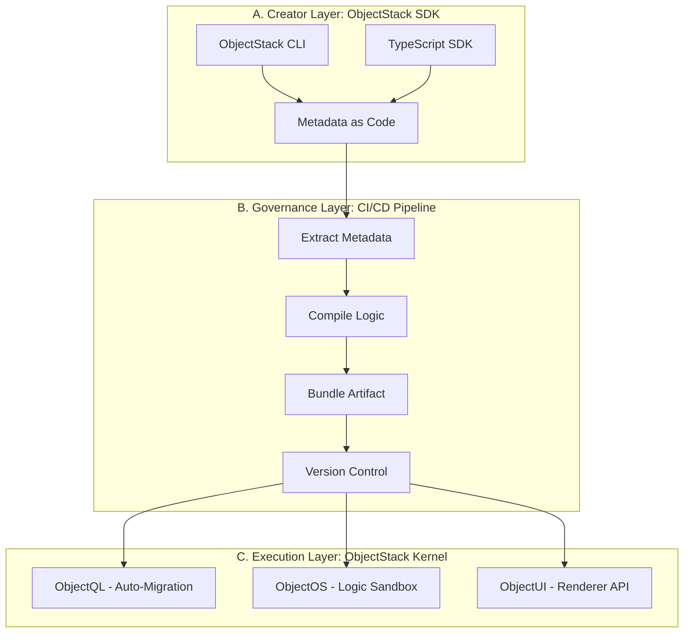
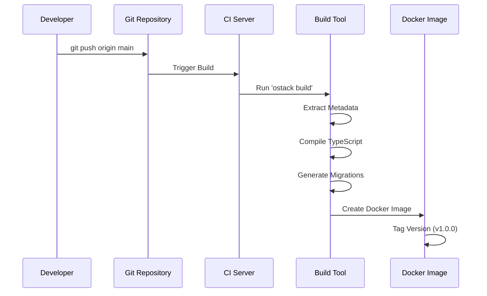
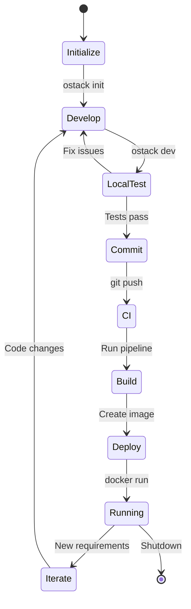

# ObjectStack Enterprise Framework

**"Definition is Application" (定义即应用)**

## Overview

ObjectStack Enterprise Framework represents a new approach to enterprise application development—**"A Metadata Engine for Professional Developers"**. In Phase 1, we focus on empowering developers to build enterprise-grade applications through code-based metadata definitions, eliminating the need for visual configuration interfaces while maintaining the power and flexibility of the ObjectStack protocol ecosystem.

### Core Philosophy

In this first phase, ObjectStack is defined as an **"Enterprise Application Meta-Framework for Professional Developers"**.

* **No Black Boxes**: All business definitions exist in local code, based on TypeScript, clear and transparent.
* **Git as the Center**: Use Git repositories as the Single Source of Truth.
* **Built-in Infrastructure**: Developers only write "business descriptions"; the framework handles "database migrations, API generation, and UI rendering".

---

## The Architecture Landscape

The Enterprise Framework is structured around three distinct layers that work together to transform code-based definitions into running applications.



### A. Creator Layer: ObjectStack SDK

**"Define the World in Your IDE"**

Developers no longer need to log into web-based admin consoles for configuration. Instead, they work directly in VS Code or their preferred IDE.

#### ObjectStack CLI

The command-line tool for rapid code generation and project scaffolding:

* `ostack init`: Initialize a standard project structure
* `ostack g resource contract`: Generate a "Contract" module with standard directory layout
* `ostack build`: Compile metadata and business logic
* `ostack dev`: Start local development server with hot reload

#### Metadata as Code

We leverage **TypeScript's** static typing capabilities to define metadata:

* **Schema**: Define data structures using Zod-like or TypeORM-like syntax
* **Logic**: Write TS functions directly as Triggers
* **UI**: Describe interface layouts using JSON or TS objects (with full type hints)

**Code Example:**

```typescript
// src/objects/contract.ts
import { defineObject, Field } from '@objectstack/sdk';

export const Contract = defineObject({
  name: 'contract',
  label: 'Sales Contract',
  fields: {
    title: Field.String({ 
      label: 'Title', 
      required: true,
      maxLength: 200
    }),
    amount: Field.Currency({ 
      label: 'Amount',
      required: false,
      precision: 18,
      scale: 2
    }),
    status: Field.Select({ 
      options: ['draft', 'signed', 'cancelled'],
      defaultValue: 'draft'
    }),
    signedAt: Field.DateTime({
      label: 'Signed Date',
      nullable: true
    })
  },
  
  // Trigger logic written directly here
  triggers: {
    beforeInsert: async ({ doc }) => {
      if (doc.amount < 0) {
        throw new Error("Amount cannot be negative");
      }
    },
    
    afterUpdate: async ({ doc, oldDoc }) => {
      if (doc.status === 'signed' && oldDoc.status !== 'signed') {
        doc.signedAt = new Date();
      }
    }
  },
  
  // Access control
  permissions: {
    create: ['sales', 'admin'],
    read: ['sales', 'admin', 'viewer'],
    update: ['sales', 'admin'],
    delete: ['admin']
  }
});
```

### B. Governance Layer: CI/CD Pipeline

**"Git Repository as Console"**

There is no separate "Hub"—**Your Git Repository IS the Hub**.

#### Build-Time Composition

When code is committed, ObjectStack's build tooling (based on Vite or Rollup) scans all `.ts` files:

1. **Extract**: Pull out metadata definitions (Schema/UI)
2. **Compile**: Compile backend logic into optimized JS bundles
3. **Bundle**: Package everything into an immutable **Artifact**



#### Version Management

* Use **Git Tags** to manage versions (v1.0, v1.1)
* Use **Pull Requests** for change approval and review
* Leverage **Git Branches** for feature development and hotfixes

### C. Execution Layer: ObjectStack Kernel

**"Self-Powered Monolithic Engine"**

This is the core delivered to customers—a standard **Docker Image** or **NPM Package** that they deploy on their own infrastructure.

The Kernel contains the unified "Trinity" engine:

#### 1. ObjectQL (Auto-Migration)

When the application starts, the Kernel reads the packaged metadata:

* **Auto-Sync Database**: Discovers the `Contract` object has a new `amount` field → Automatically executes `ALTER TABLE` on PostgreSQL
* **Auto-Generate API**: Automatically mounts GraphQL/REST endpoints at `/api/data/contract`

#### 2. ObjectOS (Logic Sandbox)

* Loads and executes developer-written `triggers` functions
* Manages authentication and authorization (RBAC/ACL)
* Handles workflow state machines
* Orchestrates local-first synchronization

#### 3. ObjectUI (Renderer API)

* Provides `schema.json` to the frontend (React/Vue client)
* **Amis Integration**: If using Amis, directly outputs Amis-standard JSON configuration for immediate rendering
* Supports custom React components for complex UIs

---

## Implementation Workflow

This is the Standard Operating Procedure (SOP) for customers adopting this solution:

| Step | Role | Action | Output |
|------|------|--------|--------|
| **1. Initialize** | Architect | `npm create objectstack-app my-erp` | Git repository with core dependencies |
| **2. Develop** | Developer | Write `.ts` files defining objects, logic, and UI | Source Code |
| **3. Commit** | Developer | `git push origin main` | Trigger CI build |
| **4. Build** | CI Server | Run `ostack build` | **Docker Image** (Kernel + Business Code) |
| **5. Deploy** | DevOps | `docker run -d my-erp:latest` | Running enterprise application |
| **6. Iterate** | Team | Modify code → Push → Auto hot-reload | Continuous Delivery |

### Detailed Workflow Example



---

## Commercial Model & Deliverables

In Phase 1, you deliver a **"Development Foundation"** to customers.

### Core Deliverables

1. **`@objectstack/cli`**: Command-line tooling (NPM package)
2. **`@objectstack/core`**: Core runtime dependencies (includes ObjectQL/OS/UI logic)
3. **Standard Template**: Enterprise-grade project scaffolding
4. **Documentation**: Comprehensive API docs and best practices guide

### Value Propositions

* **"No Vendor Lock-in"**: Code lives in your repository, Git lives on your servers
* **"Zero Technical Debt"**: You write business logic; the framework handles infrastructure (database connections, API wrappers, permission checks)
* **"Type Safety"**: Full-stack TypeScript support; refactoring becomes safe and predictable

---

## Project Structure

A typical ObjectStack Enterprise application follows this structure:

```
my-erp/
├── src/
│   ├── objects/              # Business object definitions
│   │   ├── contract.ts
│   │   ├── customer.ts
│   │   └── order.ts
│   ├── workflows/            # State machines and processes
│   │   └── order-approval.ts
│   ├── permissions/          # Access control definitions
│   │   └── roles.ts
│   ├── ui/                   # UI layouts and components
│   │   └── contract-form.json
│   └── triggers/             # Business logic hooks
│       └── calculate-tax.ts
├── migrations/               # Generated database migrations
├── tests/                    # Unit and integration tests
├── objectstack.config.ts     # Framework configuration
├── package.json
└── tsconfig.json
```

---

## Integration with Existing ObjectStack Concepts

The Enterprise Framework builds upon the core ObjectStack philosophy:

* **Protocol-Driven**: The TypeScript code compiles down to standard ObjectStack JSON protocols
* **Local-First**: The generated applications support local-first architecture by default
* **Database-Agnostic**: ObjectQL compilation targets multiple database backends

However, it adds a critical developer experience layer:

* **Code-First DX**: Developers work in their familiar IDE with full IntelliSense
* **Type Safety**: Catch errors at compile-time, not runtime
* **Git Workflow**: Leverage existing Git-based development practices

---

## Next Steps

* **[Creator Layer](../creator-layer)**: Learn about the SDK and CLI tools for development
* **[Governance Layer](../governance-layer)**: Understand the CI/CD pipeline and deployment
* **[Execution Layer](../execution-layer)**: Explore the ObjectQL, ObjectOS, and ObjectUI engines

:::tip Enterprise-Ready
The ObjectStack Enterprise Framework is designed for teams that value code quality, version control, and maintainability. It brings the power of low-code to professional development workflows.
:::

---

**ObjectStack Enterprise Framework**  
*Code it locally. Run it globally.*
