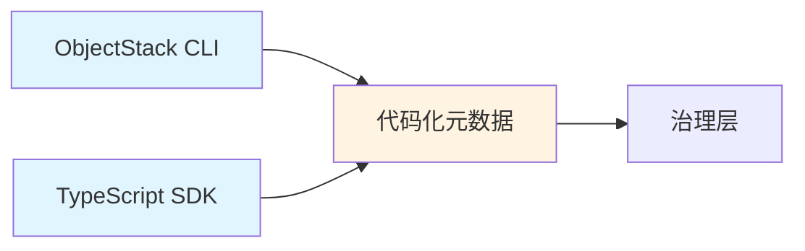

# 创造层：ObjectStack SDK

**"在 IDE 中定义世界"**

创造层是开发者工作的地方——编写代码、定义元数据、构建业务逻辑,而无需离开他们熟悉的 IDE 环境。这一层通过将所有配置和开发带入 TypeScript 代码,消除了对网页后台的需求。

## 概述

在 ObjectStack 企业框架中,创造层代表开发者的主要工作空间。开发者不再需要点击配置界面,而是使用:

* **ObjectStack CLI**: 用于快速脚手架和项目管理的命令行工具
* **TypeScript SDK**: 用于定义对象、逻辑和界面的类型安全 API
* **代码化元数据**: 从 Schema 到 UI 布局的一切都作为版本控制的代码存在

## 核心理念

> "没有黑盒。所有业务定义都在本地代码中,基于 TypeScript,清晰透明。"

这一层体现了**透明性**原则:
* 所有元数据都是可读的 TypeScript 代码
* 所有变更都在 Git 中跟踪
* 所有业务逻辑都可以使用标准 IDE 工具进行测试和重构

## 开发者体验

### 1. 项目初始化

```bash
ostack init my-enterprise-app
cd my-enterprise-app
```

这将生成一个标准项目结构,包含:
- 预配置的 TypeScript 设置
- ObjectStack SDK 依赖
- 示例对象和工作流
- 测试基础设施

### 2. 对象定义

使用 SDK 定义业务实体:

```typescript
import { defineObject, Field } from '@objectstack/sdk';

export const Contract = defineObject({
  name: 'contract',
  label: '销售合同',
  fields: {
    title: Field.String({ 
      label: '标题', 
      required: true 
    }),
    amount: Field.Currency({ 
      label: '金额',
      precision: 18,
      scale: 2
    }),
    status: Field.Select({ 
      options: ['draft', 'signed', 'cancelled'],
      defaultValue: 'draft'
    })
  }
});
```

### 3. 逻辑与触发器

将业务逻辑编写为 TypeScript 函数:

```typescript
export const Contract = defineObject({
  // ... 字段 ...
  
  triggers: {
    beforeInsert: async ({ doc }) => {
      if (doc.amount < 0) {
        throw new Error("金额不能为负");
      }
    },
    
    afterUpdate: async ({ doc, oldDoc }) => {
      if (doc.status === 'signed' && oldDoc.status !== 'signed') {
        doc.signedAt = new Date();
      }
    }
  }
});
```

### 4. 本地开发

```bash
ostack dev
```

这将启动一个热重载开发服务器,你可以:
* 即时测试更改
* 使用 Chrome DevTools 调试
* 无需部署即可快速迭代

## 架构集成

创造层输出**代码化元数据**,流入**治理层**(CI/CD 流水线)进行编译和部署。



## 价值主张

### 类型安全
* VS Code 中的完整 IntelliSense 支持
* 编译时错误检测
* 自信地重构

### Git 原生工作流
* 所有更改都是提交
* 通过 Pull Request 进行代码审查
* 回滚只需 `git revert`

### 无厂商锁定
* 你的代码存在于你的仓库中
* 无需特殊工具即可读取和修改
* 可跨环境移植

## 此层中的工具

* **[SDK 参考](./sdk)**: `@objectstack/sdk` 的详细 API 文档
* **[CLI 指南](./cli)**: 命令参考和使用示例

---

**下一步:** **[治理层](../governance-layer)** - 了解你的代码如何构建和部署
