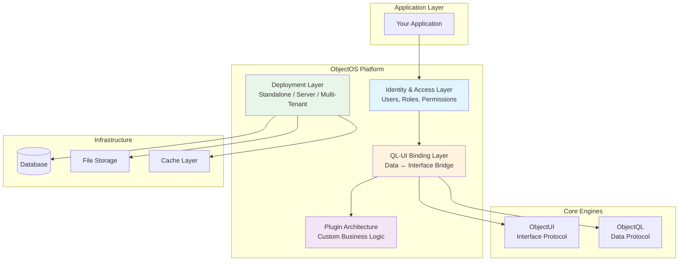

# ObjectOS: The Runtime Orchestration Platform

ObjectOS is the **runtime platform** that binds ObjectQL (data) and ObjectUI (interface) into a cohesive application environment. It provides essential platform services: identity management, access control, plugin architecture, and flexible deployment modes.

## Specification Overview

ObjectOS is **not an application server**—it is a **platform specification** with reference implementations. The platform defines:

1. **QL-UI Binding Protocol**: How ObjectQL and ObjectUI communicate
2. **Identity & Access System**: User management, RBAC, field-level security
3. **Plugin Architecture**: Extensibility contracts for business logic
4. **Deployment Modes**: Standalone, server, and multi-tenant configurations

### Core Design Principles

**Local-First by Design**: ObjectOS applications run **offline by default**. Standalone mode (.oos files) operates entirely on local devices with zero network dependency.

**Database Agnostic**: ObjectOS never assumes a specific database. Configuration determines whether data lives in SQLite (local), PostgreSQL (cloud), or Oracle (enterprise).

**Mechanism over Policy**: ObjectOS provides identity and permission **mechanisms** (RBAC interfaces), not **policies** (hardcoded user systems). Applications define their own user models.
---

## Platform Architecture



### Platform Responsibilities

1. **Identity & Access**: Manages users, roles, and permissions at protocol level
2. **QL-UI Binding**: Automatically connects ObjectQL data sources to ObjectUI components
3. **Plugin System**: Provides hooks for custom business logic (triggers, validators, workflows)
4. **Deployment**: Handles application packaging and runtime configuration

---

## Core Platform Components

### 1. QL-UI Binding Protocol

ObjectOS automatically wires ObjectQL data sources to ObjectUI components:

```typescript
interface BindingConfiguration {
  dataSource: ObjectQLConfig        // ObjectQL connection
  uiSource: ObjectUIConfig          // UI protocol definitions
  autoSync?: boolean                // Auto-refresh on data changes
  caching?: CacheStrategy           // Client-side caching
}

interface ObjectQLConfig {
  driver: DatabaseDriver
  url: string
  schema: SchemaRegistry
}

interface ObjectUIConfig {
  pages: Record<string, PageProtocol>
  components: Record<string, ComponentProtocol>
  theme?: ThemeConfig
}
```

**Example Binding**:
```typescript
import { ObjectOS } from '@objectstack/os'

const app = new ObjectOS({
  // Data Layer
  data: {
    driver: 'sqlite',
    url: './myapp.db',
    schema: {
      objects: {
        customers: {
          fields: {
            name: { type: 'text', required: true },
            email: { type: 'email', unique: true },
            status: { type: 'select', options: ['active', 'inactive'] }
          }
        }
      }
    }
  },
  
  // UI Layer
  ui: {
    pages: {
      customers: {
        type: 'page',
        title: 'Customer Management',
        body: {
          type: 'table',
          object: 'customers',  // Auto-binds to ObjectQL object
          columns: [
            { field: 'name', sortable: true },
            { field: 'email' },
            { field: 'status', type: 'badge' }
          ]
        }
      }
    }
  }
})

await app.start()
```

ObjectOS handles:
- ✅ Data fetching when UI component mounts
- ✅ Permission checks (RBAC) before data operations
- ✅ Validation before mutations
- ✅ Error handling and user feedback
- ✅ Cache management

### 2. Identity & Access Management

ObjectOS provides **protocol-level identity system** with RBAC and field-level security:

```typescript
interface IdentitySystem {
  objects: {
    _users: SystemObject            // Built-in user object
    _roles: SystemObject            // Built-in role object
    _permissions: SystemObject      // Built-in permission object
  }
  
  authentication: AuthConfig        // Auth providers
  authorization: AuthzConfig        // Permission rules
}

interface SystemObject {
  _users: {
    fields: {
      username: { type: 'text', unique: true }
      email: { type: 'email', unique: true }
      password_hash: { type: 'text' }  // Never exposed via API
      role: { type: 'lookup', reference_to: '_roles' }
      is_active: { type: 'boolean', defaultValue: true }
      created_at: { type: 'datetime', auto: 'onCreate' }
    }
  }
  
  _roles: {
    fields: {
      name: { type: 'text', unique: true }
      description: { type: 'text' }
      permissions: { type: 'master_detail', reference_to: '_permissions' }
    }
  }
  
  _permissions: {
    fields: {
      object: { type: 'text' }       // Target object name
      allow_read: { type: 'boolean' }
      allow_create: { type: 'boolean' }
      allow_edit: { type: 'boolean' }
      allow_delete: { type: 'boolean' }
      field_level_security: { type: 'json' }  // Field-level rules
    }
  }
}
```

**Example: Permission Configuration**:
```typescript
const app = new ObjectOS({
  // ... data and UI config ...
  
  identity: {
    authentication: {
      providers: ['email', 'oauth'],
      jwt: {
        secret: process.env.JWT_SECRET,
        expiresIn: '7d'
      }
    },
    
    authorization: {
      defaultRole: 'user',
      roles: {
        admin: {
          permissions: {
            customers: { read: true, create: true, edit: true, delete: true },
            orders: { read: true, create: true, edit: true, delete: true }
          }
        },
        user: {
          permissions: {
            customers: { 
              read: true, 
              create: false, 
              edit: false, 
              delete: false 
            },
            orders: { 
              read: 'owner eq $user.id',  // Formula-based permission
              create: true, 
              edit: 'owner eq $user.id', 
              delete: false 
            }
          }
        },
        guest: {
          permissions: {
            customers: { read: false, create: false, edit: false, delete: false },
            orders: { read: false, create: false, edit: false, delete: false }
          }
        }
      }
    }
  }
})
```

### 3. Field-Level Security (FLS)

Fine-grained access control at the field level:

```typescript
interface FieldLevelSecurity {
  object: string
  field: string
  read?: boolean | Expression      // Can read field?
  edit?: boolean | Expression      // Can modify field?
}
```

**Example: FLS Configuration**:
```json
{
  "objects": {
    "employees": {
      "fields": {
        "name": { "type": "text" },
        "email": { "type": "email" },
        "salary": { 
          "type": "currency",
          "field_level_security": {
            "read": "$user.role === 'hr' || $user.role === 'admin'",
            "edit": "$user.role === 'hr'"
          }
        },
        "ssn": { 
          "type": "text",
          "field_level_security": {
            "read": "$user.role === 'admin'",
            "edit": false
          }
        }
      }
    }
  }
}
```

When a regular user queries employees:
```json
// Query
{ "object": "employees" }

// Response (salary and ssn fields automatically filtered)
[
  { "name": "John Doe", "email": "john@company.com" }
]
```

### 4. Plugin Architecture

Extend ObjectOS with custom business logic:

```typescript
interface ObjectOSPlugin {
  name: string
  version: string
  
  // Lifecycle hooks
  onInstall?(): Promise<void>
  onUninstall?(): Promise<void>
  onStart?(app: ObjectOSApp): Promise<void>
  onStop?(): Promise<void>
  
  // Data hooks
  beforeQuery?(query: QueryProtocol): Promise<QueryProtocol>
  afterQuery?(result: QueryResult): Promise<QueryResult>
  beforeMutation?(mutation: MutationProtocol): Promise<MutationProtocol>
  afterMutation?(result: MutationResult): Promise<MutationResult>
  
  // UI hooks
  beforeRender?(protocol: ComponentProtocol): Promise<ComponentProtocol>
  
  // Custom routes
  routes?: RouteDefinition[]
  
  // Custom components
  components?: Record<string, ComponentDefinition>
}
```

**Example: Audit Log Plugin**:
```typescript
const auditLogPlugin: ObjectOSPlugin = {
  name: 'audit-log',
  version: '1.0.0',
  
  async afterMutation(result: MutationResult) {
    // Log all data changes
    await this.db.insert({
      object: '_audit_logs',
      action: 'insert',
      data: {
        user_id: this.context.user.id,
        object: result.object,
        action: result.action,
        record_id: result.id,
        timestamp: new Date(),
        changes: result.changes
      }
    })
    
    return result
  }
}

// Install plugin
app.use(auditLogPlugin)
```

**Example: Email Notification Plugin**:
```typescript
const emailPlugin: ObjectOSPlugin = {
  name: 'email-notifications',
  version: '1.0.0',
  
  async afterMutation(result: MutationResult) {
    if (result.object === 'orders' && result.action === 'insert') {
      // Send order confirmation email
      await this.sendEmail({
        to: result.data.customer_email,
        subject: 'Order Confirmation',
        template: 'order-confirmation',
        data: result.data
      })
    }
    
    return result
  },
  
  routes: [
    {
      path: '/api/emails/preview/:template',
      method: 'GET',
      handler: async (req, res) => {
        const template = await this.renderTemplate(req.params.template)
        res.send(template)
      }
    }
  ]
}
```

---

## Deployment Modes

ObjectOS supports three deployment strategies:

### 1. Standalone Mode (Local-First)

**Use Case**: Personal applications, offline-first tools, edge computing

**Configuration**:
```typescript
const app = new ObjectOS({
  mode: 'standalone',
  storage: './myapp.oos',  // Single-file SQLite database
  ui: {
    pages: { ... }
  }
})

await app.start()
```

**Characteristics**:
- ✅ Zero server infrastructure required
- ✅ Complete offline capability
- ✅ Data stored in local .oos file (SQLite)
- ✅ Can be distributed as single executable
- ✅ No network connectivity needed

**Distribution**:
```bash
# Package as standalone executable
objectstack build --mode standalone --output myapp.oos

# Run anywhere
./myapp.oos
# or
objectstack run myapp.oos
```

### 2. Server Mode (Cloud/Enterprise)

**Use Case**: Team collaboration, web applications, cloud deployments

**Configuration**:
```typescript
const app = new ObjectOS({
  mode: 'server',
  port: 3000,
  data: {
    driver: 'postgres',
    url: process.env.DATABASE_URL
  },
  identity: {
    authentication: {
      providers: ['email', 'oauth'],
      oauth: {
        google: {
          clientId: process.env.GOOGLE_CLIENT_ID,
          clientSecret: process.env.GOOGLE_CLIENT_SECRET
        }
      }
    }
  },
  ui: {
    pages: { ... }
  }
})

await app.listen()
```

**Characteristics**:
- ✅ Multi-user support with authentication
- ✅ RESTful API automatically generated
- ✅ Works with any database (MySQL, PostgreSQL, Oracle)
- ✅ Horizontal scalability with load balancers
- ✅ Can integrate with existing systems

**Deployment**:
```dockerfile
# Dockerfile
FROM node:18
WORKDIR /app
COPY package.json ./
RUN npm install
COPY . .
EXPOSE 3000
CMD ["npm", "start"]
```

```bash
# Deploy to cloud
docker build -t myapp .
docker push myapp:latest
kubectl apply -f deployment.yaml
```

### 3. Multi-Tenant SaaS Mode

**Use Case**: SaaS platforms, multi-tenant applications

**Configuration**:
```typescript
const app = new ObjectOS({
  mode: 'multi-tenant',
  tenantStrategy: 'virtualCity',  // or 'schema' or 'database'
  data: {
    driver: 'postgres',
    url: process.env.DATABASE_URL
  },
  multiTenant: {
    identification: {
      strategy: 'subdomain',  // customer1.myapp.com, customer2.myapp.com
      // or: 'header'         // X-Tenant-ID header
      // or: 'jwt'            // Extract from JWT token
    },
    isolation: {
      strategy: 'virtualCity',    // All tenants in one database, filtered by context
      // or: 'schema'              // Each tenant gets a PostgreSQL schema
      // or: 'database'            // Each tenant gets separate database
    },
    provisioning: {
      autoCreate: true,            // Auto-create tenant on signup
      defaultPlan: 'trial'
    }
  }
})

// Middleware extracts tenant context
app.use((req, res, next) => {
  const tenantId = req.hostname.split('.')[0]  // From subdomain
  req.tenant = app.getTenant(tenantId)
  next()
})

// All queries automatically scoped to tenant
app.get('/api/customers', async (req, res) => {
  const customers = await req.tenant.query('customers', {})
  res.json(customers)  // Only returns tenant's customers
})
```

**Tenant Isolation Strategies**:

| Strategy | Description | Pros | Cons | Use Case |
|----------|-------------|------|------|----------|
| **Virtual City** | All tenants share database, filtered by context | ✅ High resource efficiency<br/>✅ Easy management | ❌ Requires careful filtering<br/>❌ Single point of failure | Many tenants, moderate data volume |
| **Schema-per-Tenant** | Each tenant gets PostgreSQL schema | ✅ Data isolation<br/>✅ Easy backups | ❌ Schema limits (PostgreSQL: ~100s)<br/>❌ Migration complexity | Hundreds of tenants |
| **Database-per-Tenant** | Each tenant gets own database | ✅ Complete isolation<br/>✅ Independent scaling<br/>✅ Easy migration | ❌ High resource usage<br/>❌ Management overhead | Enterprise customers, high-value tenants |

---

## Advanced Features

### 1. Hybrid Sync (Local-First + Cloud)

Combine standalone mode with optional cloud sync:

```typescript
const app = new ObjectOS({
  mode: 'standalone',
  storage: './myapp.oos',
  
  sync: {
    enabled: true,
    remote: 'https://sync.myapp.com',
    strategy: 'manual',  // or 'automatic', 'scheduled'
    conflict: 'last-write-wins',  // or 'manual-resolution'
    encryption: {
      enabled: true,
      algorithm: 'AES-256-GCM',
      key: process.env.ENCRYPTION_KEY
    }
  }
})

// Trigger sync manually
await app.sync.push()  // Upload local changes
await app.sync.pull()  // Download remote changes
await app.sync.bidirectional()  // Both directions with conflict resolution
```

### 2. Workflow Engine

Built-in workflow automation:

```typescript
const app = new ObjectOS({
  // ... config ...
  
  workflows: {
    order_approval: {
      trigger: { 
        object: 'orders', 
        action: 'insert',
        condition: 'total_amount > 10000'
      },
      steps: [
        {
          action: 'update',
          object: 'orders',
          data: { status: 'pending_approval' }
        },
        {
          action: 'notification',
          type: 'email',
          to: '{{approver.email}}',
          template: 'order-approval-request'
        }
      ]
    },
    
    lead_nurturing: {
      trigger: {
        object: 'leads',
        action: 'insert'
      },
      steps: [
        { action: 'wait', duration: '1 day' },
        {
          action: 'notification',
          type: 'email',
          template: 'welcome-email'
        },
        { action: 'wait', duration: '3 days' },
        {
          action: 'notification',
          type: 'email',
          template: 'follow-up-email',
          condition: 'status == "new"'
        }
      ]
    }
  }
})
```

### 3. API Generation

ObjectOS automatically generates RESTful APIs from ObjectQL schemas:

```typescript
// Schema definition
{
  objects: {
    products: {
      fields: {
        name: { type: 'text', required: true },
        price: { type: 'currency' },
        category: { type: 'select', options: ['electronics', 'clothing'] }
      }
    }
  }
}

// Auto-generated REST API:
// GET    /api/products           - List all products
// GET    /api/products/:id       - Get single product
// POST   /api/products           - Create product
// PATCH  /api/products/:id       - Update product
// DELETE /api/products/:id       - Delete product
// GET    /api/products/count     - Count products
// POST   /api/products/aggregate - Aggregate products
```

Custom API endpoints via plugins:

```typescript
const customAPIPlugin: ObjectOSPlugin = {
  name: 'custom-api',
  routes: [
    {
      path: '/api/products/featured',
      method: 'GET',
      handler: async (req, res) => {
        const products = await req.db.query({
          object: 'products',
          filters: [{ field: 'featured', operator: 'eq', value: true }],
          top: 10
        })
        res.json(products)
      }
    }
  ]
}
```

### 4. Real-Time Updates

WebSocket support for live data:

```typescript
const app = new ObjectOS({
  // ... config ...
  
  realtime: {
    enabled: true,
    transport: 'websocket',
    port: 3001
  }
})

// Client-side (automatic via ObjectUI)
{
  type: 'table',
  object: 'orders',
  realtime: true  // Table updates automatically when data changes
}
```

---

## Use Cases

### 1. Personal Productivity Tools

**Scenario**: Note-taking app, local CRM, project management

**Configuration**:
```typescript
const app = new ObjectOS({
  mode: 'standalone',
  storage: '~/.mynotes/data.oos'
})
```

**Benefits**:
- Zero setup—just download and run
- Complete privacy—data never leaves device
- Works offline by design
- Can sync to cloud optionally

### 2. Enterprise System Integration

**Scenario**: Unified dashboard over multiple legacy databases

**Configuration**:
```typescript
// Connect to multiple data sources
const erpDB = new ObjectQL({ driver: 'oracle', url: 'oracle://...' })
const crmDB = new ObjectQL({ driver: 'sqlserver', url: 'sqlserver://...' })

const app = new ObjectOS({
  mode: 'server',
  dataSources: {
    erp: erpDB,
    crm: crmDB
  },
  ui: {
    pages: {
      dashboard: {
        type: 'grid',
        items: [
          { type: 'table', object: 'erp.customers' },
          { type: 'table', object: 'crm.leads' }
        ]
      }
    }
  }
})
```

**Benefits**:
- Single UI for multiple systems
- Consistent query language
- No custom integration code
- Easy to maintain and extend

### 3. Multi-Tenant SaaS Platform

**Scenario**: Project management SaaS

**Configuration**:
```typescript
const app = new ObjectOS({
  mode: 'multi-tenant',
  tenantStrategy: 'schema',
  data: {
    driver: 'postgres',
    url: process.env.DATABASE_URL
  },
  identity: {
    authentication: {
      providers: ['email', 'oauth']
    }
  }
})
```

**Benefits**:
- Complete tenant isolation
- RBAC out of the box
- Scalable architecture
- Can migrate tenants between strategies

---

## What You'll Learn

This specification documentation covers:

- ✅ **[Platform Architecture](/docs/objectos/architecture)** - QL-UI binding, identity system, plugin architecture
- ✅ **[Identity & Access](/docs/objectos/identity-access)** - User management, RBAC, field-level security
- ✅ **[Plugin Development](/docs/objectos/plugins)** - Creating custom business logic extensions
- ✅ **[Deployment Guide](/docs/objectos/deployment)** - Standalone, server, and multi-tenant modes
- ✅ **[API Reference](/docs/objectos/api-reference)** - Complete ObjectOS SDK documentation
- ✅ **[Best Practices](/docs/objectos/best-practices)** - Security, performance, and scalability patterns

---

## Quick Start Example

Here's a complete end-to-end example:

```typescript
import { ObjectOS } from '@objectstack/os'

// 1. Initialize ObjectOS
const app = new ObjectOS({
  mode: 'server',
  port: 3000,
  
  // Data Layer (ObjectQL)
  data: {
    driver: 'sqlite',
    url: './myapp.db',
    schema: {
      objects: {
        tasks: {
          fields: {
            title: { type: 'text', required: true },
            status: { type: 'select', options: ['todo', 'in_progress', 'done'] },
            owner: { type: 'lookup', reference_to: '_users' }
          },
          permission_set: {
            user: {
              allowRead: true,
              allowCreate: true,
              allowEdit: 'owner eq $user.id',
              allowDelete: 'owner eq $user.id'
            }
          }
        }
      }
    }
  },
  
  // UI Layer (ObjectUI)
  ui: {
    pages: {
      home: {
        type: 'page',
        title: 'My Tasks',
        body: {
          type: 'table',
          object: 'tasks',
          filters: [{ field: 'status', operator: 'ne', value: 'done' }],
          columns: [
            { field: 'title', sortable: true },
            { field: 'status', type: 'badge' }
          ],
          actions: [
            {
              label: 'Complete',
              type: 'api_request',
              api: '/api/tasks/{{row.id}}',
              method: 'PATCH',
              data: { status: 'done' }
            }
          ]
        }
      }
    }
  },
  
  // Identity Layer
  identity: {
    authentication: {
      providers: ['email']
    },
    authorization: {
      defaultRole: 'user'
    }
  }
})

// 2. Start the application
await app.listen()
console.log('ObjectOS running at http://localhost:3000')
```

This creates a complete task management application with:
- SQLite database
- User authentication
- Permission-controlled task CRUD
- Automatic REST API
- Web interface
- All in ~50 lines of code

---

## Design Rationale

### Why QL-UI Binding?

**Manual API development is tedious**. Automatic binding provides:

- **Zero Boilerplate**: No need to write REST controllers
- **Type Safety**: ObjectQL schema enforces data contracts
- **Permission Enforcement**: RBAC applied automatically
- **Consistency**: All components follow same patterns

### Why Built-in Identity?

**Most applications need user management**. Built-in system provides:

- **Standard Objects**: `_users`, `_roles`, `_permissions` objects
- **RBAC Out of Box**: No custom permission code
- **Field-Level Security**: Fine-grained access control
- **Integration Ready**: Pluggable auth providers (OAuth, LDAP, SAML)

### Why Plugin Architecture?

**Every application has unique needs**. Plugin system provides:

- **Extensibility**: Add custom business logic without forking
- **Composability**: Combine plugins for complex workflows
- **Maintainability**: Plugins isolated from core platform
- **Community**: Share and reuse plugins across projects

---

## Specification Compliance

ObjectOS implementations must pass the **ObjectOS Compliance Test Suite**:

- ✅ QL-UI binding with automatic data fetching
- ✅ User authentication and session management
- ✅ RBAC permission enforcement
- ✅ Field-level security filtering
- ✅ Plugin system with lifecycle hooks
- ✅ Standalone mode (.oos file execution)
- ✅ Server mode (HTTP API server)
- ✅ Multi-tenant mode (Virtual City isolation)

Reference implementations:
- **Node.js**: [@objectstack/os](https://github.com/objectstack-ai/objectos) (JavaScript/TypeScript)
- **Python**: [objectos-py](https://github.com/objectstack-ai/objectos-py) (planned)
- **Go**: [objectos-go](https://github.com/objectstack-ai/objectos-go) (planned)

---

## Next Steps

1. **Understand Platform Architecture**: Read [Architecture](/docs/objectos/architecture) to learn how ObjectOS orchestrates QL and UI
2. **Setup Identity System**: Review [Identity & Access](/docs/objectos/identity-access) for user management and RBAC
3. **Deploy Your App**: Follow [Deployment Guide](/docs/objectos/deployment) for standalone, server, or multi-tenant modes
4. **Extend with Plugins**: Study [Plugin Development](/docs/objectos/plugins) to add custom business logic

For philosophical context, see:
- **[The Manifesto](/docs/framework/manifesto)** - Why ObjectOS is local-first and plugin-based
- **[Architecture](/docs/framework/architecture)** - How ObjectOS completes the ObjectStack ecosystem
