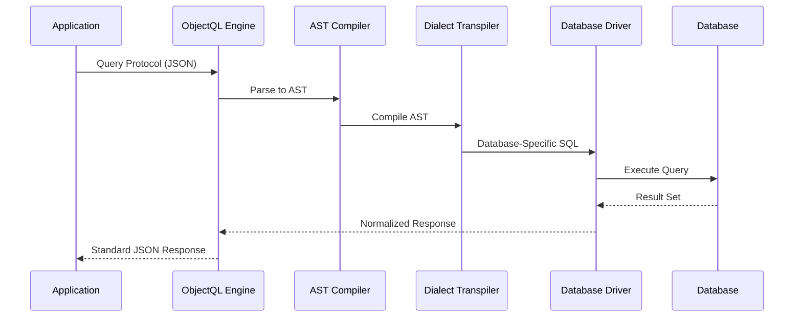

# ObjectQL: The Data Protocol Engine

ObjectQL is the **database-agnostic query engine** at the core of ObjectStack. It defines a universal JSON-based protocol for schema definition, data queries, and mutations that compiles to native SQL for any supported database.

## Specification Overview

ObjectQL is **not a database**—it is a **protocol specification** with reference implementations. The protocol defines:

1. **Schema Definition Language**: JSON-based data model declarations
2. **Query DSL (Domain-Specific Language)**: Unified syntax for CRUD operations
3. **AST Compilation**: Abstract Syntax Tree for database-agnostic queries
4. **Driver Interface**: Standardized adapter contract for database engines

### Core Design Principles

**Protocol Neutrality**: ObjectQL specifications are implementation-agnostic. The same protocol can be executed by:
- JavaScript engine (Node.js)
- Python engine (planned)
- Java engine (planned)
- Go engine (planned)

**Database Agnostic**: The protocol never assumes a specific database. Concepts like "JSONB" (PostgreSQL) or "ROWNUM" (Oracle) do not exist in the protocol layer—they are handled by dialect-specific transpilers.

**Mechanism, Not Policy**: ObjectQL defines *how to describe data operations*, not *how to implement* them. User authentication, validation logic, and business rules belong in ObjectOS.

---

## Protocol Architecture



### Protocol Flow

1. **Protocol Input**: Application sends JSON query protocol
2. **AST Parsing**: Engine parses protocol into Abstract Syntax Tree
3. **Dialect Compilation**: AST compiled to database-specific SQL
4. **Driver Execution**: Driver executes native SQL
5. **Response Normalization**: Results standardized to protocol format
6. **Protocol Output**: Application receives consistent JSON response

This architecture ensures **complete database independence**—changing from MySQL to PostgreSQL requires zero application code changes.

---

## Core Protocol Components

### 1. Schema Definition Protocol

Define data structures as declarative JSON specifications:

```typescript
interface ObjectSchema {
  name: string                    // Object identifier
  label?: string                  // Human-readable name
  fields: Record<string, Field>   // Field definitions
  indexes?: Index[]               // Performance indexes
  triggers?: Trigger[]            // Lifecycle hooks
  permission_set?: PermissionSet  // Access control rules
}

interface Field {
  type: FieldType                 // Data type
  label?: string                  // Display name
  required?: boolean              // Validation rule
  unique?: boolean                // Uniqueness constraint
  defaultValue?: any              // Default value
  reference_to?: string           // Relationship target (for lookup/master-detail)
  formula?: string                // Computed field expression
}

type FieldType = 
  | 'text' | 'textarea' | 'number' | 'currency' | 'percent'
  | 'date' | 'datetime' | 'time' 
  | 'boolean' | 'select' | 'multiselect'
  | 'lookup' | 'master_detail'
  | 'url' | 'email' | 'phone'
  | 'autonumber' | 'formula'
```

**Example Schema**:
```json
{
  "objects": {
    "orders": {
      "label": "Sales Orders",
      "fields": {
        "order_number": { 
          "type": "autonumber", 
          "format": "ORD-{0000}" 
        },
        "customer": { 
          "type": "lookup", 
          "reference_to": "customers",
          "required": true
        },
        "order_date": { 
          "type": "date", 
          "defaultValue": "{{$now}}" 
        },
        "total_amount": { 
          "type": "currency", 
          "precision": 2 
        },
        "status": { 
          "type": "select", 
          "options": ["draft", "confirmed", "shipped", "delivered"]
        }
      },
      "indexes": [
        { "fields": ["customer", "order_date"] },
        { "fields": ["status", "order_date"] }
      ]
    }
  }
}
```

This schema is **database-agnostic**. ObjectQL will generate:
- **MySQL**: `CREATE TABLE` with `INT AUTO_INCREMENT`, `VARCHAR`, `DECIMAL`, `ENUM`
- **PostgreSQL**: `CREATE TABLE` with `SERIAL`, `VARCHAR`, `NUMERIC`, `TEXT` (with check constraint)
- **Oracle**: `CREATE TABLE` with `NUMBER` sequence trigger, `VARCHAR2`, `NUMBER`, `VARCHAR2` (with check constraint)
- **SQLite**: `CREATE TABLE` with `INTEGER PRIMARY KEY`, `TEXT`, `REAL`, `TEXT` (with check constraint)

### 2. Query Protocol (DSL)

Unified JSON syntax for all data operations:

```typescript
interface QueryProtocol {
  object: string                  // Target object name
  fields?: string[]               // Fields to return (default: all)
  filters?: FilterExpression      // WHERE clause
  sort?: string | SortExpression  // ORDER BY clause
  top?: number                    // LIMIT clause
  skip?: number                   // OFFSET clause
  related?: RelatedQuery[]        // JOIN/subquery expansion
}

type FilterExpression = Filter | CompoundFilter

interface Filter {
  field: string
  operator: Operator
  value: any
}

type Operator = 
  | 'eq' | 'ne' | 'lt' | 'lte' | 'gt' | 'gte'
  | 'startswith' | 'endswith' | 'contains' | 'notcontains'
  | 'in' | 'notin' | 'between'
  | 'isnull' | 'isnotnull'

interface CompoundFilter {
  and?: FilterExpression[]
  or?: FilterExpression[]
}
```

**Example Queries**:

```json
// Simple query
{
  "object": "orders",
  "fields": ["order_number", "customer", "total_amount"],
  "filters": {
    "and": [
      { "field": "status", "operator": "eq", "value": "confirmed" },
      { "field": "order_date", "operator": "gte", "value": "2024-01-01" }
    ]
  },
  "sort": "order_date desc",
  "top": 50
}

// Query with relationships
{
  "object": "orders",
  "fields": ["order_number", "total_amount"],
  "filters": {
    "field": "customer.country", 
    "operator": "eq", 
    "value": "USA"
  },
  "related": [
    {
      "object": "order_items",
      "foreign_key": "order_id",
      "fields": ["product", "quantity", "unit_price"]
    }
  ]
}
```

### 3. Mutation Protocol

Standardized operations for data modification:

```typescript
interface MutationProtocol {
  object: string
  action: 'insert' | 'update' | 'delete'
  data?: Record<string, any>      // For insert/update
  filters?: FilterExpression      // For update/delete
}
```

**Example Mutations**:

```json
// Insert
{
  "object": "orders",
  "action": "insert",
  "data": {
    "customer": "CUST-001",
    "order_date": "2024-03-15",
    "total_amount": 1250.00,
    "status": "confirmed"
  }
}

// Bulk update
{
  "object": "orders",
  "action": "update",
  "filters": {
    "and": [
      { "field": "status", "operator": "eq", "value": "confirmed" },
      { "field": "order_date", "operator": "lt", "value": "2024-01-01" }
    ]
  },
  "data": {
    "status": "archived"
  }
}

// Conditional delete
{
  "object": "orders",
  "action": "delete",
  "filters": {
    "field": "status",
    "operator": "eq",
    "value": "cancelled"
  }
}
```

---

## Database Driver Interface

ObjectQL defines a **standardized driver contract** that all database adapters must implement:

```typescript
interface ObjectQLDriver {
  // Connection management
  connect(config: ConnectionConfig): Promise<Connection>
  disconnect(): Promise<void>
  
  // Schema operations
  createTable(schema: ObjectSchema): Promise<void>
  alterTable(schema: ObjectSchema, changes: SchemaChange[]): Promise<void>
  dropTable(objectName: string): Promise<void>
  
  // Query operations
  query(protocol: QueryProtocol): Promise<QueryResult>
  
  // Mutation operations
  insert(protocol: MutationProtocol): Promise<MutationResult>
  update(protocol: MutationProtocol): Promise<MutationResult>
  delete(protocol: MutationProtocol): Promise<MutationResult>
  
  // Transaction management
  beginTransaction(): Promise<Transaction>
  commit(transaction: Transaction): Promise<void>
  rollback(transaction: Transaction): Promise<void>
  
  // Dialect-specific compilation
  compileAST(ast: ASTNode): string  // Returns native SQL
}
```

### Supported Drivers

Official reference implementations:

| Driver | Status | Use Case |
|--------|--------|----------|
| **@objectql/driver-sqlite** | ✅ Stable | Local-first apps, development, edge computing |
| **@objectql/driver-mysql** | ✅ Stable | Web applications, cloud deployments |
| **@objectql/driver-postgres** | ✅ Stable | Enterprise systems, analytics workloads |
| **@objectql/driver-oracle** | 🚧 Beta | Legacy system integration |
| **@objectql/driver-sqlserver** | 🚧 Beta | Microsoft stack integration |

Community drivers welcome—implement the `ObjectQLDriver` interface and publish as npm package.

---

## Advanced Features

### Virtual City (Multi-Tenancy)

ObjectQL provides **protocol-level multi-tenancy** through the Virtual City mechanism:

```typescript
// Each tenant gets isolated data context
const tenant1DB = engine.virtualCity('tenant_001')
const tenant2DB = engine.virtualCity('tenant_002')

// Identical queries, isolated data
await tenant1DB.query('customers', {})  // Returns tenant_001's customers
await tenant2DB.query('customers', {})  // Returns tenant_002's customers
```

**Implementation**: Virtual City is a driver-level feature. MySQL/PostgreSQL implementations use schema separation, SQLite uses separate database files.

### Virtual Column Index (Performance)

For databases lacking native JSON indexing (e.g., SQLite), ObjectQL provides virtual column indexes:

```json
{
  "objects": {
    "products": {
      "fields": {
        "metadata": { "type": "text" }  // Stores JSON
      },
      "virtual_indexes": [
        { 
          "name": "idx_price",
          "expression": "JSON_EXTRACT(metadata, '$.price')",
          "type": "number"
        }
      ]
    }
  }
}
```

ObjectQL automatically creates indexed virtual columns for high-performance queries.

### Formula Fields

Computed fields defined in schema:

```json
{
  "fields": {
    "quantity": { "type": "number" },
    "unit_price": { "type": "currency" },
    "line_total": { 
      "type": "formula",
      "formula": "quantity * unit_price",
      "return_type": "currency"
    }
  }
}
```

Formula fields are **database-agnostic expressions** compiled to SQL `GENERATED` columns (PostgreSQL/MySQL) or computed in-memory (SQLite).

### Aggregation Protocol

Statistical queries with grouping:

```json
{
  "object": "orders",
  "aggregations": [
    { "field": "total_amount", "function": "sum", "alias": "revenue" },
    { "field": "order_number", "function": "count", "alias": "order_count" }
  ],
  "groupBy": ["customer", "status"],
  "filters": {
    "field": "order_date",
    "operator": "gte",
    "value": "2024-01-01"
  }
}
```

Compiles to `GROUP BY` queries with appropriate aggregate functions across all databases.

---

## Use Cases

### 1. Local-First Applications

**Scenario**: Personal productivity tools (notes, CRM, project management)

**Configuration**:
```typescript
import { ObjectQL } from '@objectql/core'
import { SQLiteDriver } from '@objectql/driver-sqlite'

const engine = new ObjectQL({
  driver: new SQLiteDriver({
    database: './myapp.db'
  })
})
```

**Benefits**:
- Zero server infrastructure
- Complete offline capability
- Data stored in local .db file
- Can upgrade to cloud database later without code changes

### 2. Enterprise System Integration

**Scenario**: Unified API over heterogeneous legacy databases

**Configuration**:
```typescript
// Connect to existing Oracle ERP database
const erpDB = new ObjectQL({
  driver: new OracleDriver({
    host: 'oracle.company.com',
    database: 'ERP_PROD'
  })
})

// Connect to SQL Server CRM database
const crmDB = new ObjectQL({
  driver: new SQLServerDriver({
    host: 'sqlserver.company.com',
    database: 'CRM_PROD'
  })
})

// Unified ObjectQL API for both
const erpCustomers = await erpDB.query('customers', {})
const crmLeads = await crmDB.query('leads', {})
```

**Benefits**:
- Single query language for all systems
- No custom integration code per database
- Consistent error handling and validation
- Easier to maintain and test

### 3. Multi-Tenant SaaS Platform

**Scenario**: SaaS application with tenant isolation

**Configuration**:
```typescript
const engine = new ObjectQL({
  driver: new PostgreSQLDriver({
    host: 'postgres.cloud.com',
    database: 'saas_platform'
  }),
  multiTenant: true
})

// Each tenant gets isolated context
app.use(async (req, res, next) => {
  const tenantId = req.headers['x-tenant-id']
  req.db = engine.virtualCity(tenantId)
  next()
})

// Automatic data isolation
router.get('/api/orders', async (req, res) => {
  const orders = await req.db.query('orders', {})
  res.json(orders)  // Only returns tenant's orders
})
```

**Benefits**:
- Protocol-level tenant isolation
- No business logic needed for data segregation
- Can scale to schema-per-tenant or database-per-tenant
- ObjectQL handles routing automatically

---

## What You'll Learn

This specification documentation covers:

- ✅ **[Core Concepts](/docs/objectql/core-concepts)** - Schema, Virtual City, data types, relationships
- ✅ **[Protocol Specification](/docs/objectql/protocol-spec)** - Complete JSON schema reference for queries, mutations, aggregations
- ✅ **[Driver Development](/docs/objectql/driver-dev)** - Implementing custom database adapters
- ✅ **[Server SDK](/docs/objectql/server-sdk)** - Reference implementation API (JavaScript/Node.js)
- ✅ **[Performance Guide](/docs/objectql/performance)** - Optimization strategies, indexing, query analysis

---

## Quick Start Example

Here's a complete end-to-end example:

```typescript
import { ObjectQL } from '@objectql/core'
import { SQLiteDriver } from '@objectql/driver-sqlite'

// 1. Initialize Engine
const engine = new ObjectQL({
  driver: new SQLiteDriver({ database: './todo.db' })
})

// 2. Register Schema
await engine.registerSchema({
  objects: {
    tasks: {
      fields: {
        title: { type: 'text', required: true },
        completed: { type: 'boolean', defaultValue: false },
        priority: { type: 'select', options: ['high', 'medium', 'low'] },
        due_date: { type: 'date' }
      }
    }
  }
})

// 3. Insert Data
await engine.insert({
  object: 'tasks',
  action: 'insert',
  data: { 
    title: 'Learn ObjectQL', 
    priority: 'high',
    due_date: '2024-12-31'
  }
})

// 4. Query Data
const urgentTasks = await engine.query({
  object: 'tasks',
  filters: {
    and: [
      { field: 'completed', operator: 'eq', value: false },
      { field: 'priority', operator: 'eq', value: 'high' }
    ]
  },
  sort: 'due_date asc'
})

console.log(urgentTasks)
// [{ title: 'Learn ObjectQL', priority: 'high', completed: false, due_date: '2024-12-31' }]

// 5. Switch to PostgreSQL (zero code changes)
const prodEngine = new ObjectQL({
  driver: new PostgreSQLDriver({ 
    url: 'postgresql://localhost/production' 
  })
})

// Same schema, same queries, different database
await prodEngine.registerSchema(schema)
const sameTasks = await prodEngine.query(queryProtocol)
```

---

## Design Rationale

### Why JSON Protocols?

**TypeScript/JavaScript SDKs are implementation details**. The real API is the JSON protocol:

- **Language Agnostic**: Python, Java, Go can all implement ObjectQL
- **Network Transparent**: Protocols can be sent over HTTP, WebSockets, gRPC
- **Versionable**: Protocols are structured data, can be diffed and versioned
- **AI-Friendly**: LLMs can generate and modify JSON protocols easily

### Why AST Compilation?

**Direct SQL templating is fragile and insecure**. AST compilation provides:

- **SQL Injection Protection**: Parameterized queries at AST level
- **Dialect Abstraction**: Single AST compiles to any SQL dialect
- **Query Optimization**: AST can be analyzed and optimized before execution
- **Consistent Semantics**: Same query behavior across all databases

### Why Driver Abstraction?

**Database APIs are inconsistent**. Driver interface provides:

- **Unified Error Handling**: Consistent error types across databases
- **Connection Pooling**: Standard pool management regardless of driver
- **Transaction Semantics**: ACID guarantees with consistent API
- **Testing**: Mock drivers for unit tests without database

---

## Specification Compliance

ObjectQL implementations must pass the **ObjectQL Compliance Test Suite**:

- ✅ Schema definition parsing and validation
- ✅ Query protocol execution for all operators
- ✅ Mutation protocol for insert/update/delete
- ✅ Relationship queries (lookup, master-detail)
- ✅ Aggregation queries with grouping
- ✅ Transaction management (ACID)
- ✅ Virtual City multi-tenant isolation
- ✅ Error handling and response formats

Reference implementations:
- **JavaScript**: [@objectql/core](https://github.com/objectstack-ai/objectql) (Node.js)
- **Python**: [objectql-py](https://github.com/objectstack-ai/objectql-py) (planned)
- **Go**: [objectql-go](https://github.com/objectstack-ai/objectql-go) (planned)

---

## Next Steps

1. **Understand Core Concepts**: Read [Core Concepts](/docs/objectql/core-concepts) to learn about schemas, relationships, and Virtual City
2. **Study the Protocol**: Review [Protocol Specification](/docs/objectql/protocol-spec) for complete JSON schema reference
3. **Build with SDK**: Use [Server SDK](/docs/objectql/server-sdk) to integrate ObjectQL in your application
4. **Optimize Performance**: Explore [Performance Guide](/docs/objectql/performance) for production best practices

For philosophical context, see:
- **[The Manifesto](/docs/framework/manifesto)** - Why ObjectQL is protocol-driven and database-agnostic
- **[Architecture](/docs/framework/architecture)** - How ObjectQL fits into the ObjectStack ecosystem
