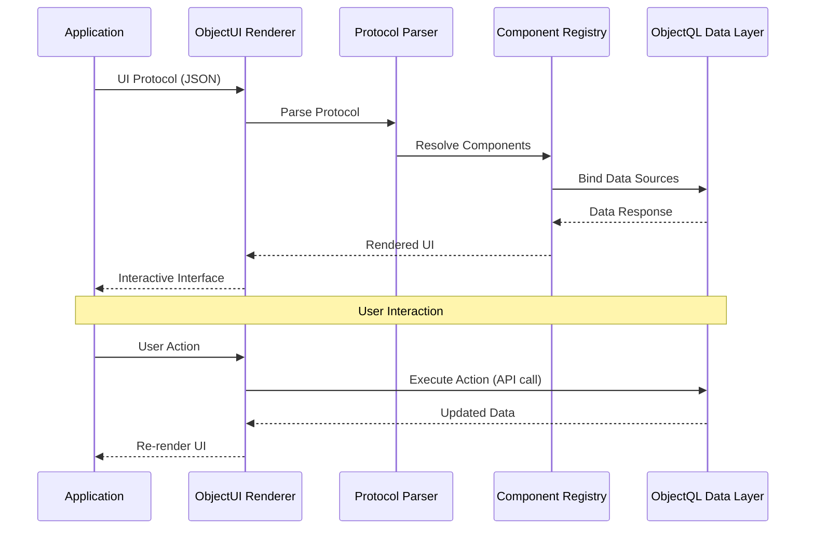

# ObjectUI: The Declarative Interface Engine

ObjectUI is the **presentation protocol** of ObjectStack. It defines a JSON-based specification for describing user interfaces declaratively, enabling UI as data rather than code.

## Specification Overview

ObjectUI is **not a component library**—it is a **protocol specification** with renderer implementations. The protocol defines:

1. **Component Protocol**: JSON schemas for UI elements (forms, tables, grids, pages)
2. **Action Protocol**: Declarative event handlers (API calls, navigation, dialogs)
3. **Data Binding Protocol**: Automatic synchronization with ObjectQL data layer
4. **Renderer Interface**: Standardized contract for framework implementations

### Core Design Principles

**Protocol Neutrality**: ObjectUI specifications are renderer-agnostic. The same protocol can be rendered by:
- React renderer (reference implementation)
- Vue renderer (planned)
- Flutter renderer (planned)
- Native mobile renderers (planned)

**Declarative, Not Imperative**: ObjectUI describes *what* to render, not *how* to render it. There are no `onClick` callbacks or `useState` hooks in the protocol—only data structures.

**Data-Driven**: UI components are bound to ObjectQL data sources. State management, validation, and updates are handled automatically by the renderer.

**Framework Agnostic**: The protocol never assumes React, Vue, or any specific framework. Renderers translate protocols to framework-specific implementations.
---

## Protocol Architecture



### Protocol Flow

1. **Protocol Input**: Application provides JSON UI protocol
2. **Protocol Parsing**: Renderer parses and validates protocol structure
3. **Component Resolution**: Maps protocol types to framework components
4. **Data Binding**: Connects components to ObjectQL data sources
5. **Rendering**: Framework-specific components rendered
6. **Action Handling**: User interactions trigger protocol-defined actions
7. **State Update**: Data changes trigger automatic re-rendering

This architecture ensures **complete framework independence**—changing from React to Vue requires zero protocol changes.

---

## Core Protocol Components

### 1. Component Protocol

Define UI elements as declarative JSON specifications:

```typescript
interface ComponentProtocol {
  type: ComponentType              // Component identifier
  id?: string                      // Unique component ID
  name?: string                    // Field name (for form inputs)
  label?: string                   // Display label
  visible?: boolean | Expression   // Conditional visibility
  disabled?: boolean | Expression  // Conditional disabled state
  style?: StyleProperties          // Custom styling
  children?: ComponentProtocol[]   // Nested components
}

type ComponentType =
  // Container Components
  | 'page' | 'card' | 'grid' | 'form' | 'table' | 'list'
  // Input Components
  | 'input' | 'textarea' | 'select' | 'multiselect' | 'checkbox' | 'switch'
  | 'datepicker' | 'timepicker' | 'datetimepicker'
  | 'number' | 'currency' | 'percent'
  // Display Components
  | 'text' | 'heading' | 'image' | 'icon' | 'badge' | 'avatar'
  // Action Components
  | 'button' | 'link' | 'dropdown'
```

**Example: Page Component**:
```json
{
  "type": "page",
  "title": "Customer Management",
  "description": "Manage customer records",
  "body": {
    "type": "grid",
    "columns": 2,
    "gap": 4,
    "items": [
      {
        "type": "card",
        "title": "Customer List",
        "body": {
          "type": "table",
          "object": "customers",
          "columns": [
            { "field": "name", "label": "Name", "sortable": true },
            { "field": "email", "label": "Email" },
            { "field": "status", "label": "Status", "type": "badge" }
          ]
        }
      },
      {
        "type": "card",
        "title": "Add Customer",
        "body": {
          "type": "form",
          "object": "customers",
          "action": "insert",
          "fields": [
            { "name": "name", "type": "input", "required": true },
            { "name": "email", "type": "input", "inputType": "email" },
            { "name": "status", "type": "select", "options": ["active", "inactive"] }
          ]
        }
      }
    ]
  }
}
```

### 2. Form Protocol

Rich form definition with validation and data binding:

```typescript
interface FormProtocol extends ComponentProtocol {
  type: 'form'
  object?: string                  // ObjectQL object name
  api?: string                     // Custom API endpoint
  method?: 'GET' | 'POST' | 'PUT' | 'PATCH' | 'DELETE'
  action?: 'insert' | 'update' | 'delete'  // ObjectQL action
  fields: FieldProtocol[]          // Form fields
  initialValues?: Record<string, any>      // Default values
  submitText?: string              // Submit button label
  resetText?: string               // Reset button label
  onSuccess?: ActionProtocol       // Success handler
  onError?: ActionProtocol         // Error handler
}

interface FieldProtocol extends ComponentProtocol {
  name: string                     // Field identifier
  type: ComponentType              // Input type
  label?: string                   // Display label
  placeholder?: string             // Placeholder text
  required?: boolean               // Validation rule
  validation?: ValidationRule[]    // Custom validation
  dependsOn?: string               // Dependent field
  visible?: Expression             // Conditional visibility
  disabled?: Expression            // Conditional disabled state
}

interface ValidationRule {
  type: 'required' | 'email' | 'url' | 'min' | 'max' | 'pattern' | 'custom'
  value?: any                      // Rule parameter
  message: string                  // Error message
}
```

**Example: Complex Form**:
```json
{
  "type": "form",
  "object": "orders",
  "action": "insert",
  "fields": [
    {
      "name": "customer",
      "type": "select",
      "label": "Customer",
      "required": true,
      "api": "/api/customers",
      "displayField": "name",
      "valueField": "id"
    },
    {
      "name": "order_date",
      "type": "datepicker",
      "label": "Order Date",
      "defaultValue": "{{$now}}",
      "required": true
    },
    {
      "name": "items",
      "type": "table",
      "label": "Order Items",
      "columns": [
        { 
          "field": "product", 
          "type": "select", 
          "api": "/api/products",
          "required": true 
        },
        { "field": "quantity", "type": "number", "min": 1 },
        { 
          "field": "unit_price", 
          "type": "currency", 
          "disabled": true,
          "formula": "{{product.price}}"
        },
        { 
          "field": "total", 
          "type": "currency", 
          "disabled": true,
          "formula": "{{quantity * unit_price}}"
        }
      ]
    },
    {
      "name": "grand_total",
      "type": "currency",
      "label": "Grand Total",
      "disabled": true,
      "formula": "{{SUM(items, 'total')}}"
    }
  ],
  "submitText": "Create Order",
  "onSuccess": {
    "type": "navigate",
    "path": "/orders/{{response.id}}"
  }
}
```

### 3. Table Protocol

Data grid with sorting, filtering, pagination:

```typescript
interface TableProtocol extends ComponentProtocol {
  type: 'table'
  object?: string                  // ObjectQL object name
  api?: string                     // Custom API endpoint
  columns: ColumnProtocol[]        // Column definitions
  filters?: FilterProtocol[]       // Pre-defined filters
  searchable?: boolean             // Enable search bar
  sortable?: boolean               // Enable column sorting
  paginated?: boolean              // Enable pagination
  pageSize?: number                // Rows per page
  selectable?: boolean             // Enable row selection
  actions?: ActionProtocol[]       // Row actions
  bulkActions?: ActionProtocol[]   // Bulk actions
}

interface ColumnProtocol {
  field: string                    // Data field name
  label: string                    // Column header
  type?: 'text' | 'number' | 'date' | 'boolean' | 'badge' | 'avatar' | 'custom'
  sortable?: boolean               // Enable sorting
  filterable?: boolean             // Enable filtering
  width?: string                   // Column width
  align?: 'left' | 'center' | 'right'
  formatter?: Expression           // Custom formatting
  visible?: boolean | Expression   // Conditional visibility
}
```

**Example: Advanced Table**:
```json
{
  "type": "table",
  "object": "products",
  "columns": [
    { 
      "field": "image", 
      "label": "Image", 
      "type": "avatar",
      "width": "60px"
    },
    { 
      "field": "name", 
      "label": "Product Name", 
      "sortable": true,
      "filterable": true
    },
    { 
      "field": "category", 
      "label": "Category", 
      "type": "badge",
      "sortable": true
    },
    { 
      "field": "price", 
      "label": "Price", 
      "type": "currency",
      "sortable": true,
      "align": "right"
    },
    { 
      "field": "stock", 
      "label": "Stock", 
      "type": "number",
      "sortable": true,
      "align": "right",
      "formatter": "{{value > 10 ? 'In Stock' : 'Low Stock'}}"
    },
    {
      "field": "status",
      "label": "Status",
      "type": "badge",
      "filterable": true
    }
  ],
  "filters": [
    { "field": "status", "operator": "eq", "value": "active" }
  ],
  "searchable": true,
  "sortable": true,
  "paginated": true,
  "pageSize": 50,
  "selectable": true,
  "actions": [
    {
      "label": "Edit",
      "type": "navigate",
      "path": "/products/{{row.id}}/edit"
    },
    {
      "label": "Delete",
      "type": "api_request",
      "api": "/api/products/{{row.id}}",
      "method": "DELETE",
      "confirm": {
        "title": "Delete Product",
        "message": "Are you sure you want to delete {{row.name}}?"
      }
    }
  ],
  "bulkActions": [
    {
      "label": "Activate",
      "type": "api_request",
      "api": "/api/products/bulk-update",
      "method": "PATCH",
      "data": { "status": "active" }
    },
    {
      "label": "Deactivate",
      "type": "api_request",
      "api": "/api/products/bulk-update",
      "method": "PATCH",
      "data": { "status": "inactive" }
    }
  ]
}
```

### 4. Action Protocol

Declarative event handling without imperative code:

```typescript
interface ActionProtocol {
  type: ActionType
  label?: string                   // Button/link text
  icon?: string                    // Icon name
  confirm?: ConfirmDialog          // Confirmation dialog
  condition?: Expression           // Conditional execution
}

type ActionType =
  | APIRequestAction
  | NavigateAction
  | DialogAction
  | ToastAction
  | RefreshAction
  | CustomAction

interface APIRequestAction extends ActionProtocol {
  type: 'api_request'
  api: string                      // API endpoint
  method?: 'GET' | 'POST' | 'PUT' | 'PATCH' | 'DELETE'
  data?: Record<string, any>       // Request body
  params?: Record<string, any>     // Query parameters
  onSuccess?: ActionProtocol       // Success handler
  onError?: ActionProtocol         // Error handler
}

interface NavigateAction extends ActionProtocol {
  type: 'navigate'
  path: string                     // Navigation path
  target?: '_self' | '_blank'      // Target window
}

interface DialogAction extends ActionProtocol {
  type: 'dialog'
  title: string                    // Dialog title
  content: ComponentProtocol       // Dialog body
  width?: string                   // Dialog width
  actions?: ActionProtocol[]       // Dialog actions
}

interface ToastAction extends ActionProtocol {
  type: 'toast'
  message: string                  // Toast message
  variant?: 'success' | 'error' | 'warning' | 'info'
  duration?: number                // Display duration (ms)
}
```

**Example: Action Chain**:
```json
{
  "type": "button",
  "label": "Approve Order",
  "action": {
    "type": "api_request",
    "api": "/api/orders/{{order.id}}/approve",
    "method": "POST",
    "confirm": {
      "title": "Approve Order",
      "message": "Are you sure you want to approve order #{{order.order_number}}?"
    },
    "onSuccess": {
      "type": "toast",
      "message": "Order approved successfully",
      "variant": "success",
      "next": {
        "type": "navigate",
        "path": "/orders"
      }
    },
    "onError": {
      "type": "toast",
      "message": "Failed to approve order: {{error.message}}",
      "variant": "error"
    }
  }
}
```

### 5. Expression Language

Dynamic values and conditional logic:

```typescript
type Expression = string  // Format: {{expression}}

// Variable References
"{{field_name}}"                   // Current form field
"{{row.field_name}}"              // Table row data
"{{$user.id}}"                    // Current user
"{{$now}}"                        // Current timestamp
"{{$env.API_URL}}"                // Environment variable

// Operators
"{{value > 10}}"                  // Comparison
"{{status === 'active'}}"         // Equality
"{{price * quantity}}"            // Arithmetic
"{{firstname + ' ' + lastname}}"  // Concatenation

// Functions
"{{SUM(items, 'total')}}"         // Array aggregation
"{{FILTER(items, 'status eq active')}}"  // Array filtering
"{{FORMAT(date, 'YYYY-MM-DD')}}"  // Formatting
"{{LOOKUP('products', product_id, 'name')}}"  // Data lookup

// Conditional
"{{status === 'active' ? 'Active' : 'Inactive'}}"  // Ternary
```

**Example: Dynamic Form**:
```json
{
  "type": "form",
  "fields": [
    {
      "name": "customer_type",
      "type": "select",
      "options": ["individual", "business"]
    },
    {
      "name": "first_name",
      "type": "input",
      "label": "First Name",
      "visible": "{{customer_type === 'individual'}}",
      "required": "{{customer_type === 'individual'}}"
    },
    {
      "name": "last_name",
      "type": "input",
      "label": "Last Name",
      "visible": "{{customer_type === 'individual'}}",
      "required": "{{customer_type === 'individual'}}"
    },
    {
      "name": "company_name",
      "type": "input",
      "label": "Company Name",
      "visible": "{{customer_type === 'business'}}",
      "required": "{{customer_type === 'business'}}"
    },
    {
      "name": "tax_id",
      "type": "input",
      "label": "Tax ID",
      "visible": "{{customer_type === 'business'}}",
      "validation": [
        {
          "type": "pattern",
          "value": "^[0-9]{9}$",
          "message": "Tax ID must be 9 digits"
        }
      ]
    }
  ]
}
```

---

## Renderer Interface

ObjectUI defines a **standardized renderer contract** that all framework implementations must support:

```typescript
interface ObjectUIRenderer {
  // Core rendering
  render(protocol: ComponentProtocol, container: HTMLElement): RenderedComponent
  unmount(component: RenderedComponent): void
  
  // Component registration
  registerComponent(type: ComponentType, implementation: ComponentImplementation): void
  
  // Action handling
  registerActionHandler(type: ActionType, handler: ActionHandler): void
  
  // Data binding
  bindDataSource(component: RenderedComponent, source: DataSource): void
  
  // Theme management
  setTheme(theme: ThemeConfig): void
  
  // Lifecycle hooks
  onMount?(component: RenderedComponent): void
  onUpdate?(component: RenderedComponent, changes: PropertyChanges): void
  onUnmount?(component: RenderedComponent): void
}
```

### Supported Renderers

Official reference implementations:

| Renderer | Status | Framework |
|----------|--------|-----------|
| **@objectui/react-renderer** | ✅ Stable | React 18+ |
| **@objectui/vue-renderer** | 🚧 Planned | Vue 3+ |
| **@objectui/flutter-renderer** | 🚧 Planned | Flutter |
| **@objectui/native-renderer** | 🚧 Planned | React Native |

Community renderers welcome—implement the `ObjectUIRenderer` interface and publish as npm package.

---

## Advanced Features

### Component Composition

Build complex UIs from simple components:

```json
{
  "type": "page",
  "title": "Dashboard",
  "body": {
    "type": "grid",
    "columns": 3,
    "items": [
      {
        "type": "card",
        "title": "Total Revenue",
        "body": {
          "type": "text",
          "value": "{{SUM(orders, 'total_amount')}}",
          "style": { "fontSize": "2rem", "fontWeight": "bold" }
        }
      },
      {
        "type": "card",
        "title": "Active Users",
        "body": {
          "type": "text",
          "value": "{{COUNT(users, 'status eq active')}}",
          "style": { "fontSize": "2rem", "fontWeight": "bold" }
        }
      },
      {
        "type": "card",
        "title": "Pending Orders",
        "body": {
          "type": "text",
          "value": "{{COUNT(orders, 'status eq pending')}}",
          "style": { "fontSize": "2rem", "fontWeight": "bold" }
        }
      }
    ]
  }
}
```

### Responsive Layouts

Automatic adaptation to screen sizes:

```json
{
  "type": "grid",
  "columns": { "mobile": 1, "tablet": 2, "desktop": 4 },
  "gap": { "mobile": 2, "tablet": 3, "desktop": 4 },
  "items": [...]
}
```

### Custom Components

Extend the component library:

```typescript
// Register custom component in renderer
renderer.registerComponent('chart', ChartComponent)

// Use in protocol
{
  "type": "chart",
  "chartType": "line",
  "data": "{{monthly_revenue}}",
  "xAxis": "month",
  "yAxis": "revenue"
}
```

### Theme System

Customize appearance without changing structure:

```typescript
renderer.setTheme({
  colors: {
    primary: '#007bff',
    secondary: '#6c757d',
    success: '#28a745',
    error: '#dc3545'
  },
  fonts: {
    body: 'Inter, sans-serif',
    heading: 'Poppins, sans-serif'
  },
  spacing: {
    unit: 8  // 8px base unit
  }
})
```

---

## Use Cases

### 1. Admin Panels & Dashboards

**Scenario**: Build complete admin interfaces without writing UI code

**Protocol**:
```json
{
  "type": "page",
  "title": "User Management",
  "body": {
    "type": "table",
    "object": "users",
    "columns": [
      { "field": "avatar", "type": "avatar" },
      { "field": "name", "sortable": true },
      { "field": "email", "sortable": true },
      { "field": "role", "type": "badge" },
      { "field": "created_at", "type": "date", "sortable": true }
    ],
    "actions": [
      { "label": "Edit", "type": "navigate", "path": "/users/{{row.id}}/edit" },
      { "label": "Delete", "type": "api_request", "api": "/api/users/{{row.id}}", "method": "DELETE" }
    ]
  }
}
```

**Benefits**:
- No React/Vue code required
- Automatic CRUD operations
- Built-in pagination, sorting, filtering
- Can be stored in database and versioned

### 2. Dynamic Forms

**Scenario**: Forms that adapt based on configuration or user permissions

**Protocol**:
```json
{
  "type": "form",
  "object": "leads",
  "fields": [
    { "name": "name", "type": "input", "required": true },
    { "name": "email", "type": "input", "inputType": "email" },
    { 
      "name": "country", 
      "type": "select", 
      "api": "/api/countries" 
    },
    { 
      "name": "state", 
      "type": "select", 
      "api": "/api/states?country={{country}}",
      "visible": "{{country !== null}}",
      "dependsOn": "country"
    },
    {
      "name": "budget",
      "type": "currency",
      "visible": "{{$user.role === 'sales' || $user.role === 'admin'}}"
    }
  ]
}
```

**Benefits**:
- Form structure stored as data
- Easy to modify without code deployment
- Permission-based field visibility
- Dependent field logic

### 3. Low-Code / No-Code Platforms

**Scenario**: Enable non-developers to build interfaces

**Implementation**:
```typescript
// Store UI protocol in database
await db.insert({
  object: 'pages',
  action: 'insert',
  data: {
    name: 'customer_dashboard',
    protocol: {
      type: 'page',
      title: 'Customer Dashboard',
      body: { ... }
    }
  }
})

// Fetch and render
const page = await db.query({
  object: 'pages',
  filters: [{ field: 'name', operator: 'eq', value: 'customer_dashboard' }]
})

return <ObjectUIRenderer protocol={page[0].protocol} />
```

**Benefits**:
- UI definitions versionable like data
- Can build visual UI builders
- AI can generate protocols
- Easy to A/B test UI variations

### 4. Mobile Applications

**Scenario**: Same protocol, different renderer

**React Native**:
```tsx
import { ObjectUIRenderer } from '@objectui/native-renderer'

function App() {
  return <ObjectUIRenderer protocol={uiProtocol} />
}
```

**Flutter**:
```dart
import 'package:objectui_flutter/objectui_flutter.dart';

Widget build(BuildContext context) {
  return ObjectUIRenderer(protocol: uiProtocol);
}
```

**Benefits**:
- Write UI protocol once
- Render on web, iOS, Android
- Consistent behavior across platforms
- Share business logic

---

## What You'll Learn

This specification documentation covers:

- ✅ **[Core Concepts](/docs/objectui/core-concepts)** - Declarative UI, data binding, component composition
- ✅ **[Component Specification](/docs/objectui/component-spec)** - Complete JSON schema reference for all components
- ✅ **[Actions](/docs/objectui/actions)** - Action protocol specifications (API, navigation, dialogs)
- ✅ **[Renderer Usage](/docs/objectui/renderer-usage)** - Integrating ObjectUI in React/Vue/Flutter applications
- ✅ **[Theming](/docs/objectui/theming)** - Customizing appearance and styles
- ✅ **[Best Practices](/docs/objectui/best-practices)** - Design patterns and optimization strategies

---

## Quick Start Example

Here's a complete end-to-end example:

```tsx
import { ObjectUIRenderer } from '@objectui/react-renderer'
import '@objectui/react-renderer/styles.css'

// 1. Define UI Protocol
const todoApp = {
  type: 'page',
  title: 'Todo Application',
  body: {
    type: 'grid',
    columns: 2,
    gap: 4,
    items: [
      // Add Todo Form
      {
        type: 'card',
        title: 'Add Task',
        body: {
          type: 'form',
          object: 'todos',
          action: 'insert',
          fields: [
            {
              name: 'title',
              type: 'input',
              label: 'Task Name',
              required: true
            },
            {
              name: 'priority',
              type: 'select',
              label: 'Priority',
              options: ['high', 'medium', 'low'],
              defaultValue: 'medium'
            },
            {
              name: 'due_date',
              type: 'datepicker',
              label: 'Due Date'
            }
          ],
          submitText: 'Add Task',
          onSuccess: {
            type: 'toast',
            message: 'Task created successfully',
            variant: 'success'
          }
        }
      },
      // Todo List Table
      {
        type: 'card',
        title: 'My Tasks',
        body: {
          type: 'table',
          object: 'todos',
          filters: [
            { field: 'completed', operator: 'eq', value: false }
          ],
          columns: [
            { field: 'title', label: 'Task', sortable: true },
            { field: 'priority', label: 'Priority', type: 'badge' },
            { field: 'due_date', label: 'Due Date', type: 'date', sortable: true },
            { field: 'completed', label: 'Done', type: 'boolean' }
          ],
          actions: [
            {
              label: 'Complete',
              type: 'api_request',
              api: '/api/todos/{{row.id}}',
              method: 'PATCH',
              data: { completed: true }
            },
            {
              label: 'Delete',
              type: 'api_request',
              api: '/api/todos/{{row.id}}',
              method: 'DELETE',
              confirm: {
                title: 'Delete Task',
                message: 'Are you sure?'
              }
            }
          ]
        }
      }
    ]
  }
}

// 2. Render
function App() {
  return <ObjectUIRenderer protocol={todoApp} />
}

export default App
```

This creates a fully functional todo application with:
- Form to add tasks
- Table showing active tasks
- Complete and delete actions
- Automatic data fetching from ObjectQL
- No imperative React code required

---

## Design Rationale

### Why JSON Protocols?

**React/Vue components are implementation details**. The real UI is the JSON protocol:

- **Framework Agnostic**: Same protocol renders in React, Vue, Flutter
- **Versionable**: UI stored as structured data in database
- **AI-Friendly**: LLMs excel at generating JSON structures
- **Portable**: Export/import UI definitions between projects

### Why Declarative?

**Imperative UI code is fragile and verbose**. Declarative protocols provide:

- **Maintainability**: Change structure, not code
- **Consistency**: All forms/tables follow same patterns
- **Testability**: Protocols are data, easily validated
- **Composition**: Build complex UIs from simple building blocks

### Why Data-Driven?

**Manual state management is error-prone**. Automatic data binding provides:

- **Consistency**: UI always reflects data state
- **Less Code**: No useState, useEffect, or state management libraries
- **Performance**: Smart diffing and updates handled by renderer
- **Simplicity**: Developers focus on structure, not synchronization

---

## Specification Compliance

ObjectUI renderers must pass the **ObjectUI Compliance Test Suite**:

- ✅ Protocol parsing and validation
- ✅ All component types rendering correctly
- ✅ Action execution and error handling
- ✅ Data binding and updates
- ✅ Expression evaluation
- ✅ Conditional visibility and disabled states
- ✅ Form validation and submission
- ✅ Table sorting, filtering, pagination
- ✅ Responsive layouts

Reference implementations:
- **React**: [@objectui/react-renderer](https://github.com/objectstack-ai/objectui) (React 18+)
- **Vue**: [@objectui/vue-renderer](https://github.com/objectstack-ai/objectui-vue) (planned)
- **Flutter**: [objectui_flutter](https://github.com/objectstack-ai/objectui-flutter) (planned)

---

## Next Steps

1. **Understand Core Concepts**: Read [Core Concepts](/docs/objectui/core-concepts) to learn declarative UI principles
2. **Study Component Protocols**: Review [Component Specification](/docs/objectui/component-spec) for complete reference
3. **Build with Renderer**: Use [Renderer Usage](/docs/objectui/renderer-usage) to integrate ObjectUI in your application
4. **Customize Appearance**: Explore [Theming](/docs/objectui/theming) for styling and customization

For philosophical context, see:
- **[The Manifesto](/docs/framework/manifesto)** - Why ObjectUI is protocol-driven and framework-agnostic
- **[Architecture](/docs/framework/architecture)** - How ObjectUI fits into the ObjectStack ecosystem
