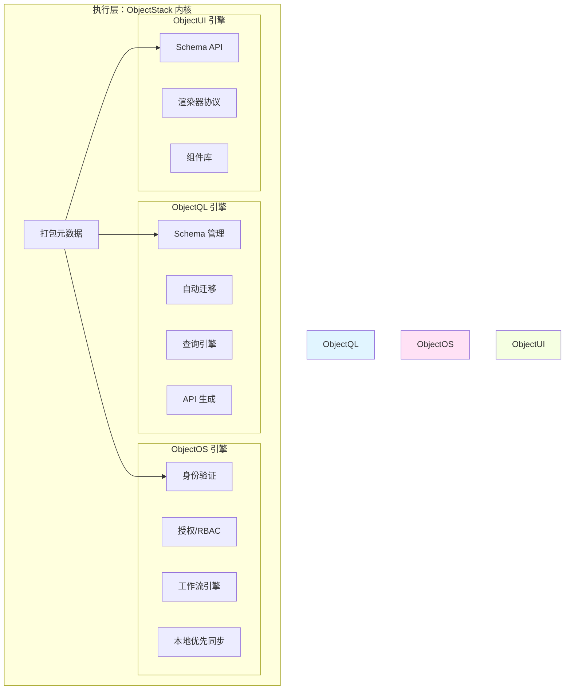
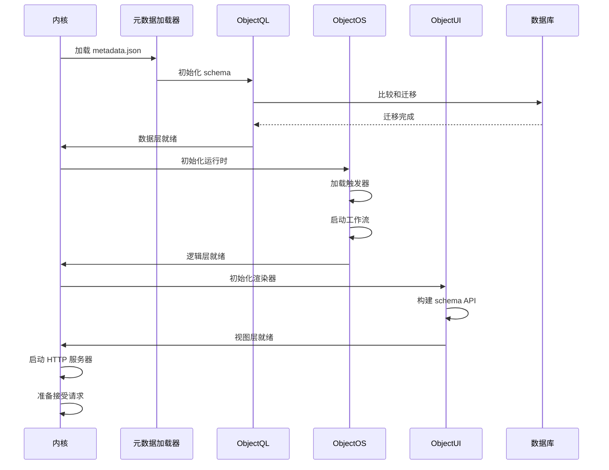
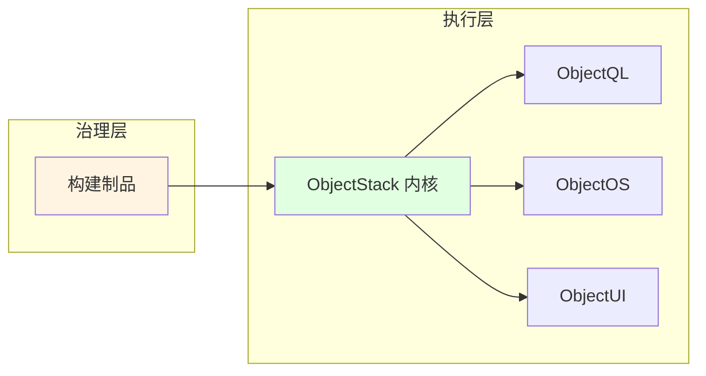

# 执行层：ObjectStack 内核

**"自带动力的单体引擎"**

执行层是交付给客户的运行时核心——一个标准的 **Docker 镜像**或 **NPM 包**,运行在他们的基础设施上。这一层包含统一的"三位一体"引擎,执行在创造层定义的元数据和业务逻辑。

## 概述

执行层是你的应用变为现实的地方。它是一个自包含的运行时:

* **读取元数据**: 加载打包的业务定义
* **管理数据**: 处理数据库操作和迁移
* **执行逻辑**: 运行触发器、工作流和自动化
* **渲染 UI**: 向前端客户端提供界面

## 核心理念

> "自带动力的单体引擎。应用运行所需的一切都包含在内核中。"

这一层体现了**自给自足**原则:
* 不需要外部配置服务
* 启动时自动数据库同步
* 内置身份验证和授权
* 原生支持本地优先架构

## 三位一体架构

内核集成了三个专业引擎,它们无缝协作:



## 1. ObjectQL：数据引擎

**自动数据库管理**

当应用启动时,ObjectQL:

### 自动迁移
* 比较元数据 Schema 与数据库状态
* 生成并执行 `ALTER TABLE` 语句
* 处理列添加、修改和索引
* 确保零停机 Schema 演化

**示例:**
```javascript
// 元数据定义新字段
{
  name: 'contract',
  fields: {
    // ... 现有字段 ...
    vat_amount: { type: 'currency', precision: 18, scale: 2 }
  }
}

// ObjectQL 自动执行:
// ALTER TABLE contract ADD COLUMN vat_amount DECIMAL(18,2);
```

### 自动生成 API
* 创建 GraphQL 和 REST 端点
* 挂载像 `/api/data/contract` 这样的路由
* 实现 CRUD 操作
* 应用权限过滤

**示例端点:**
```
POST   /api/data/contract/create
GET    /api/data/contract/list
GET    /api/data/contract/:id
PATCH  /api/data/contract/:id/update
DELETE /api/data/contract/:id/delete
```

### 数据库无关
ObjectQL 将相同的元数据编译为:
* **PostgreSQL**: 完整 ACID 与 JSONB 支持
* **MySQL**: 与企业部署兼容
* **SQLite**: 用于嵌入式和本地优先应用
* **MongoDB**: 用于以文档为中心的工作负载(通过适配器)

**了解更多:** **[ObjectQL 规范](./objectql)**

## 2. ObjectOS：运行时操作系统

**业务逻辑编排**

ObjectOS 管理你的业务逻辑执行环境:

### 逻辑沙箱
* 加载并执行开发者编写的触发器
* 提供隔离的执行上下文
* 处理错误和日志
* 管理事务边界

**示例:**
```typescript
// 开发者编写此触发器:
triggers: {
  afterUpdate: async ({ doc, oldDoc }) => {
    if (doc.status === 'signed' && oldDoc.status !== 'signed') {
      await sendNotification(doc.sales_rep, '合同已签署!');
    }
  }
}

// ObjectOS 确保:
// - 触发器在事务内运行
// - 错误回滚更新
// - 日志被捕获和存储
```

### 身份验证与授权
* **RBAC**(基于角色的访问控制)
* **ACL**(访问控制列表)
* **行级安全**
* **字段级权限**

### 工作流引擎
* 有限状态机(FSM)
* 审批流程
* 定时自动化
* 事件驱动触发器

### 本地优先同步
* 冲突解决算法
* 离线能力
* 增量同步协议
* 多设备协调

**了解更多:** **[ObjectOS 规范](./objectos)**

## 3. ObjectUI：视图引擎

**服务端驱动界面**

ObjectUI 向前端客户端提供 Schema 和渲染指令:

### Schema API
向客户端提供 `schema.json`:

```json
{
  "objects": {
    "contract": {
      "fields": {
        "title": { "type": "string", "label": "标题" },
        "amount": { "type": "currency", "label": "金额" }
      },
      "views": {
        "form": { "layout": "two-column", "fields": ["title", "amount"] },
        "list": { "columns": ["title", "amount", "status"] }
      }
    }
  }
}
```

### 渲染器集成
* **Amis**: 直接 JSON 到 UI 渲染
* **React**: 组件 props 生成
* **Vue**: 模板数据绑定
* **Flutter**: Widget 树构建

### 声明式布局
* 响应式网格系统
* 条件可见性
* 动态验证
* 自定义组件插槽

**了解更多:** **[ObjectUI 规范](./objectui)**

## 部署模型

### Docker 容器

```bash
# 拉取官方镜像
docker pull objectstack/kernel:latest

# 使用你的元数据运行
docker run -d \
  -p 3000:3000 \
  -v ./metadata:/app/metadata \
  -e DATABASE_URL=postgres://... \
  objectstack/kernel:latest
```

### NPM 包

```bash
# 安装内核
npm install @objectstack/kernel

# 以编程方式运行
node server.js
```

```javascript
// server.js
const { ObjectStackKernel } = require('@objectstack/kernel');

const kernel = new ObjectStackKernel({
  metadata: require('./metadata.json'),
  database: process.env.DATABASE_URL
});

kernel.start(3000);
```

### Kubernetes 部署

```yaml
apiVersion: apps/v1
kind: Deployment
metadata:
  name: objectstack-app
spec:
  replicas: 3
  template:
    spec:
      containers:
      - name: kernel
        image: my-app:v1.0.0
        env:
        - name: DATABASE_URL
          valueFrom:
            secretKeyRef:
              name: db-credentials
              key: url
```

## 启动序列

当内核启动时,它遵循此序列:



## 集成点

执行层从治理层接收制品:



## 此层中的引擎

* **[ObjectQL](./objectql)**: 数据引擎规范
* **[ObjectOS](./objectos)**: 运行时和编排规范
* **[ObjectUI](./objectui)**: 视图引擎规范

## 运维特性

### 性能
* 亚毫秒级查询规划
* 数据库连接池
* 通过副本水平扩展
* 多级缓存

### 可靠性
* 瞬态故障自动重试
* 外部服务熔断器
* 优雅降级
* 健康检查端点

### 可观测性
* 结构化日志(JSON)
* 指标导出(Prometheus)
* 分布式追踪(OpenTelemetry)
* 实时调试端点

### 安全性
* 所有连接使用 TLS/SSL
* 秘密管理集成
* SQL 注入防护
* XSS 清理

---

**上一步:** **[治理层](../governance-layer)** - 代码如何构建  
**另请参阅:** **[企业框架](../concepts/enterprise-framework)** - 完整架构概览
