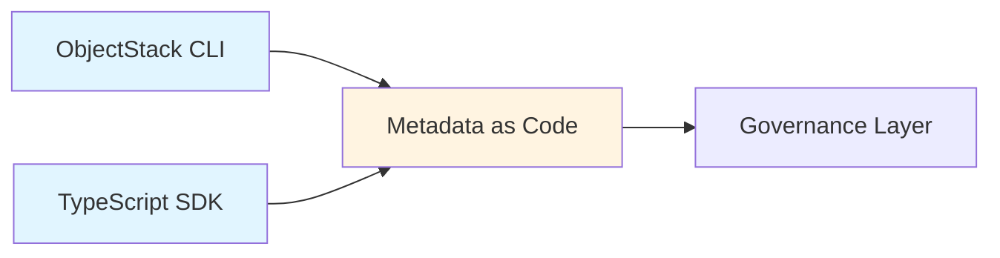

# Creator Layer: ObjectStack SDK

**"Define the World in Your IDE"**

The Creator Layer is where developers work—writing code, defining metadata, and building business logic without leaving their familiar IDE environment. This layer eliminates the need for web-based admin consoles by bringing all configuration and development into TypeScript code.

## Overview

In the ObjectStack Enterprise Framework, the Creator Layer represents the developer's primary workspace. Instead of clicking through configuration screens, developers use:

* **ObjectStack CLI**: Command-line tools for rapid scaffolding and project management
* **TypeScript SDK**: Type-safe APIs for defining objects, logic, and interfaces
* **Metadata as Code**: Everything from schemas to UI layouts exists as version-controlled code

## Core Philosophy

> "No Black Boxes. All business definitions exist in local code, based on TypeScript, clear and transparent."

This layer embodies the principle of **transparency**:
* All metadata is readable TypeScript code
* All changes are tracked in Git
* All business logic is testable and refactorable with standard IDE tools

## The Developer Experience

### 1. Project Initialization

```bash
ostack init my-enterprise-app
cd my-enterprise-app
```

This generates a standard project structure with:
- Pre-configured TypeScript setup
- ObjectStack SDK dependencies
- Example objects and workflows
- Testing infrastructure

### 2. Object Definition

Define business entities using the SDK:

```typescript
import { defineObject, Field } from '@objectstack/sdk';

export const Contract = defineObject({
  name: 'contract',
  label: 'Sales Contract',
  fields: {
    title: Field.String({ 
      label: 'Title', 
      required: true 
    }),
    amount: Field.Currency({ 
      label: 'Amount',
      precision: 18,
      scale: 2
    }),
    status: Field.Select({ 
      options: ['draft', 'signed', 'cancelled'],
      defaultValue: 'draft'
    })
  }
});
```

### 3. Logic & Triggers

Write business logic as TypeScript functions:

```typescript
export const Contract = defineObject({
  // ... fields ...
  
  triggers: {
    beforeInsert: async ({ doc }) => {
      if (doc.amount < 0) {
        throw new Error("Amount cannot be negative");
      }
    },
    
    afterUpdate: async ({ doc, oldDoc }) => {
      if (doc.status === 'signed' && oldDoc.status !== 'signed') {
        doc.signedAt = new Date();
      }
    }
  }
});
```

### 4. Local Development

```bash
ostack dev
```

This starts a hot-reloading development server where you can:
* Test changes instantly
* Debug with Chrome DevTools
* Iterate rapidly without deploying

## Architecture Integration

The Creator Layer outputs **Metadata as Code** which flows into the **Governance Layer** (CI/CD Pipeline) for compilation and deployment.



## Value Propositions

### Type Safety
* Full IntelliSense support in VS Code
* Compile-time error detection
* Refactoring with confidence

### Git-Native Workflow
* All changes are commits
* Code reviews via Pull Requests
* Rollback is just `git revert`

### No Vendor Lock-in
* Your code lives in your repository
* Can be read and modified without special tools
* Portable across environments

## Tools in This Layer

* **[SDK Reference](./sdk)**: Detailed API documentation for `@objectstack/sdk`
* **[CLI Guide](./cli)**: Command reference and usage examples

---

**Next:** **[Governance Layer](../governance-layer)** - Learn how your code gets built and deployed
