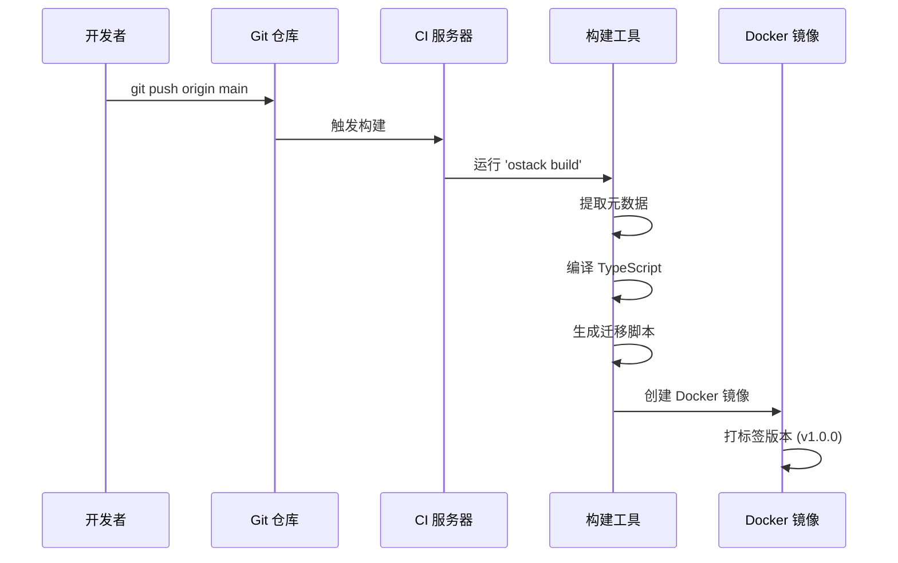
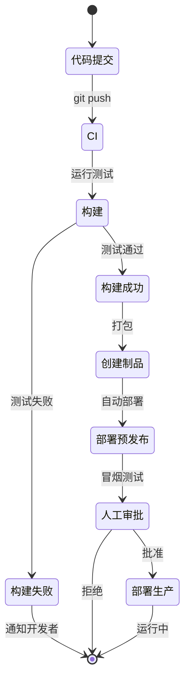
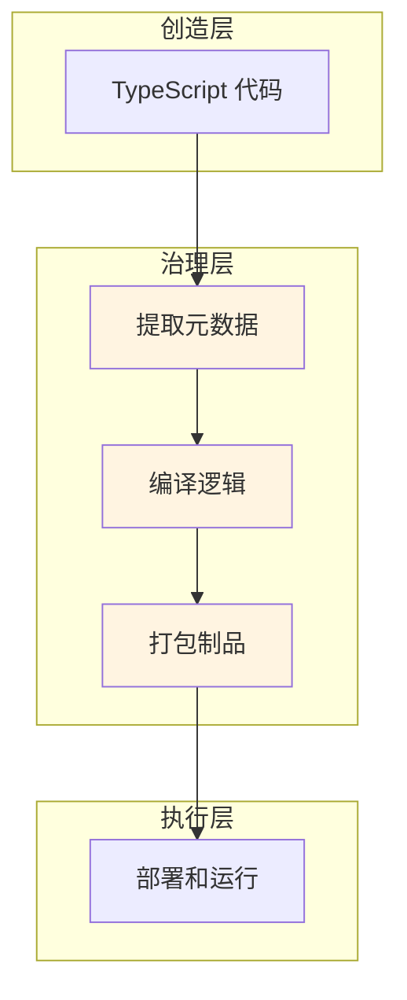

# 治理层：CI/CD 流水线

**"Git 仓库即控制台"**

治理层是你的代码转换为可部署制品的地方。没有单独的"Hub"或配置门户——**你的 Git 仓库就是 Hub**。这一层处理 ObjectStack 应用的构建、编译和版本管理。

## 概述

在传统的低代码平台中,你通过网页后台界面配置应用。ObjectStack 颠覆了这一模式:

* **版本控制**: Git 提交成为权威记录
* **构建时编排**: 元数据提取和编译发生在 CI/CD 中
* **不可变制品**: 每次构建产生一个版本化的可部署包

## 核心理念

> "Git 仓库即控制台。没有 Hub——Git 仓库就是 Hub。"

这一层体现了**透明性和可追溯性**原则:
* 每次更改都是带有作者和时间戳的 Git 提交
* Pull Request 在部署前实现团队审查
* Git Tag 管理语义化版本

## 构建流水线

当代码推送到仓库时,治理层编排多阶段构建:



## 构建阶段

### 1. 提取元数据

构建工具扫描项目中的所有 `.ts` 文件:

```bash
ostack build --extract
```

此过程:
* 发现所有 `defineObject()` 调用
* 提取 Schema 定义
* 收集 UI 布局配置
* 验证元数据完整性

**输出**: 包含所有业务定义的 `metadata.json`

### 2. 编译逻辑

TypeScript 业务逻辑编译为优化的 JavaScript:

```bash
ostack build --compile
```

此过程:
* 将 TypeScript 转译为 JavaScript
* 打包触发器和工作流函数
* Tree-shake 未使用的代码
* 压缩以用于生产

**输出**: `business-logic.bundle.js`

### 3. 生成迁移

检测数据库 Schema 变更并生成迁移脚本:

```bash
ostack build --migrate
```

此过程:
* 比较当前 Schema 与先前版本
* 生成 `ALTER TABLE` 语句
* 创建回滚脚本
* 确保幂等迁移

**输出**: 包含版本化 SQL 文件的 `migrations/` 目录

### 4. 打包制品

所有组件打包为可部署制品:

```bash
ostack build --bundle
```

此过程:
* 结合内核(ObjectQL/OS/UI)运行时
* 包含提取的元数据
* 嵌入编译的业务逻辑
* 打包数据库迁移

**输出**: Docker 镜像或 NPM 包

## 版本管理

### 使用 Git Tag 发布

使用语义化版本的 Git Tag:

```bash
git tag -a v1.0.0 -m "初始生产发布"
git push origin v1.0.0
```

每个标签触发:
* CI/CD 中的自动构建
* 制品中的版本标记
* 发布说明生成

### 分支策略

推荐的 Git 工作流:

| 分支 | 目的 | 部署 |
|------|------|------|
| `main` | 生产就绪代码 | 自动部署到生产环境 |
| `develop` | 集成分支 | 自动部署到预发布环境 |
| `feature/*` | 功能开发 | 手动部署到开发环境 |
| `hotfix/*` | 紧急 bug 修复 | 快速通道到生产环境 |

### Pull Request 工作流

1. 开发者创建功能分支
2. 提交更改并打开 PR
3. CI 运行自动化测试和构建
4. 团队审查代码更改
5. PR 合并触发部署

## 持续部署

### 自动化部署流水线



### CI/CD 配置

GitHub Actions 工作流示例:

```yaml
name: 构建和部署

on:
  push:
    branches: [main, develop]
    tags: ['v*']

jobs:
  build:
    runs-on: ubuntu-latest
    steps:
      - uses: actions/checkout@v3
      - name: 安装依赖
        run: npm install
      - name: 构建 ObjectStack 应用
        run: ostack build
      - name: 运行测试
        run: npm test
      - name: 构建 Docker 镜像
        run: docker build -t my-app:${{ github.sha }} .
      - name: 推送到镜像仓库
        run: docker push my-app:${{ github.sha }}
```

## 与其他层的集成

治理层位于创造层和执行层之间:



## 此层中的工具

* **[部署模式](./deployment)**: Docker、Kubernetes 和云部署策略

## 最佳实践

### 1. 不可变构建
* 构建后永不修改制品
* 任何更改都从源代码重新构建
* 使用校验和验证完整性

### 2. 环境一致性
* 相同的构建运行在开发、预发布和生产环境
* 使用环境变量进行配置
* 在生产前在预发布环境测试迁移

### 3. 回滚策略
* 保留前 3 个版本已部署
* 使用蓝绿或金丝雀部署
* 维护回滚脚本

### 4. 安全扫描
* 扫描依赖项的漏洞
* 检查秘密不会泄漏到构建中
* 使用 GPG 签名制品

---

**上一步:** **[创造层](../creator-layer)** - 代码编写的地方  
**下一步:** **[执行层](../execution-layer)** - 应用运行的地方
