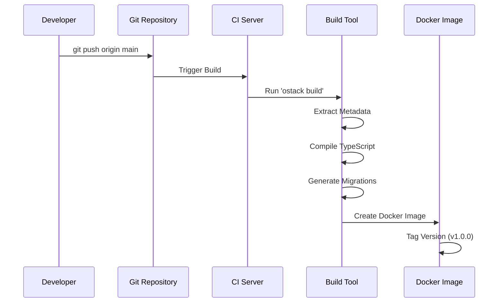
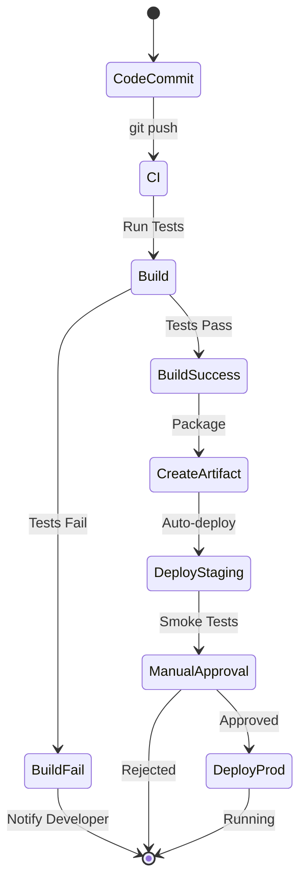
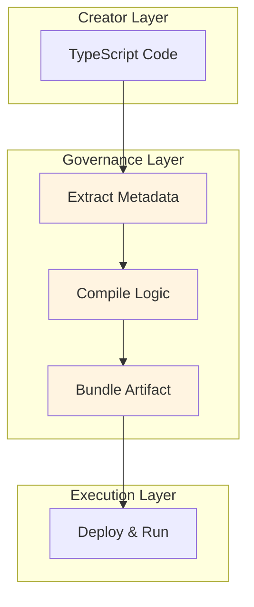

# Governance Layer: CI/CD Pipeline

**"Git Repository as Console"**

The Governance Layer is where your code transforms into deployable artifacts. There is no separate "Hub" or configuration portal—**Your Git Repository IS the Hub**. This layer handles the build, compilation, and version management of your ObjectStack applications.

## Overview

In traditional low-code platforms, you configure applications through a web-based admin interface. ObjectStack flips this model:

* **Version Control**: Git commits become the authoritative record
* **Build-Time Composition**: Metadata extraction and compilation happen in CI/CD
* **Immutable Artifacts**: Each build produces a versioned, deployable package

## Core Philosophy

> "Git Repository as Console. There is no Hub—Git Repository IS the Hub."

This layer embodies the principle of **transparency and traceability**:
* Every change is a Git commit with author and timestamp
* Pull Requests enable team review before deployment
* Git Tags manage semantic versioning

## The Build Pipeline

When code is pushed to the repository, the Governance Layer orchestrates a multi-stage build:



## Build Stages

### 1. Extract Metadata

The build tool scans all `.ts` files in your project:

```bash
ostack build --extract
```

This process:
* Discovers all `defineObject()` calls
* Extracts schema definitions
* Collects UI layout configurations
* Validates metadata integrity

**Output**: `metadata.json` containing all business definitions

### 2. Compile Logic

TypeScript business logic is compiled into optimized JavaScript:

```bash
ostack build --compile
```

This process:
* Transpiles TypeScript to JavaScript
* Bundles triggers and workflow functions
* Tree-shakes unused code
* Minifies for production

**Output**: `business-logic.bundle.js`

### 3. Generate Migrations

Database schema changes are detected and migration scripts generated:

```bash
ostack build --migrate
```

This process:
* Compares current schema with previous version
* Generates `ALTER TABLE` statements
* Creates rollback scripts
* Ensures idempotent migrations

**Output**: `migrations/` directory with versioned SQL files

### 4. Bundle Artifact

All components are packaged into a deployable artifact:

```bash
ostack build --bundle
```

This process:
* Combines Kernel (ObjectQL/OS/UI) runtime
* Includes extracted metadata
* Embeds compiled business logic
* Packages database migrations

**Output**: Docker image or NPM package

## Version Management

### Git Tags for Releases

Use semantic versioning with Git tags:

```bash
git tag -a v1.0.0 -m "Initial production release"
git push origin v1.0.0
```

Each tag triggers:
* Automated build in CI/CD
* Version stamping in artifacts
* Release notes generation

### Branch Strategy

Recommended Git workflow:

| Branch | Purpose | Deployment |
|--------|---------|------------|
| `main` | Production-ready code | Auto-deploy to production |
| `develop` | Integration branch | Auto-deploy to staging |
| `feature/*` | Feature development | Manual deploy to dev |
| `hotfix/*` | Critical bug fixes | Fast-track to production |

### Pull Request Workflow

1. Developer creates feature branch
2. Commits changes and opens PR
3. CI runs automated tests and builds
4. Team reviews code changes
5. PR merged triggers deployment

## Continuous Deployment

### Automated Deployment Pipeline



### CI/CD Configuration

Example GitHub Actions workflow:

```yaml
name: Build and Deploy

on:
  push:
    branches: [main, develop]
    tags: ['v*']

jobs:
  build:
    runs-on: ubuntu-latest
    steps:
      - uses: actions/checkout@v3
      - name: Install dependencies
        run: npm install
      - name: Build ObjectStack app
        run: ostack build
      - name: Run tests
        run: npm test
      - name: Build Docker image
        run: docker build -t my-app:${{ github.sha }} .
      - name: Push to registry
        run: docker push my-app:${{ github.sha }}
```

## Integration with Other Layers

The Governance Layer sits between Creator and Execution layers:



## Tools in This Layer

* **[Deployment Patterns](./deployment)**: Docker, Kubernetes, and cloud deployment strategies

## Best Practices

### 1. Immutable Builds
* Never modify artifacts post-build
* Rebuild from source for any changes
* Use checksums to verify integrity

### 2. Environment Parity
* Same build runs in dev, staging, and production
* Use environment variables for configuration
* Test migrations in staging before production

### 3. Rollback Strategy
* Keep previous 3 versions deployed
* Use blue-green or canary deployments
* Maintain rollback scripts

### 4. Security Scanning
* Scan dependencies for vulnerabilities
* Check secrets don't leak into builds
* Sign artifacts with GPG

---

**Previous:** **[Creator Layer](../creator-layer)** - Where code is written  
**Next:** **[Execution Layer](../execution-layer)** - Where applications run
