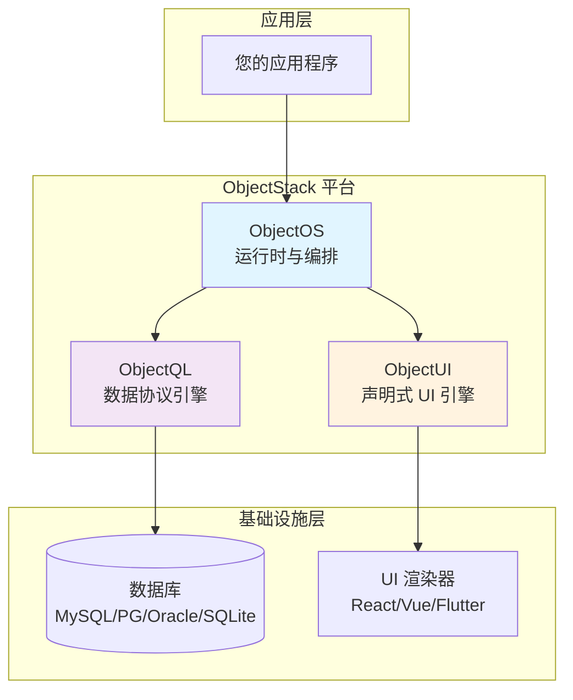

# ObjectStack 平台规范

**ObjectStack** 是一个协议驱动的全栈开发平台，通过标准化的 JSON 协议将业务逻辑与技术实现分离。它使开发者能够构建可移植的、数据库无关的应用程序，并实现完全的数据主权。

## 核心架构原则

ObjectStack 建立在三个不可动摇的支柱之上：

### 1. 协议驱动架构
逻辑存在于**声明式协议**（JSON）中，而非命令式代码中。业务定义是数据，而非函数。这使得：
- **可移植性**：协议与语言和框架无关
- **可组合性**：从简单的声明式块构建复杂系统
- **AI 生成**：从协议规范生成 80% 的应用代码
- **版本控制**：将业务逻辑作为结构化数据进行版本管理

### 2. 本地优先设计
应用程序**默认离线工作**。云连接是可选的，而非强制的。这确保了：
- **数据主权**：用户拥有数据，而非平台
- **零供应商锁定**：数据可导出为标准格式（.oos、.json）
- **默认隐私**：无需遥测或云依赖
- **弹性**：应用程序在无网络连接时也能运行

### 3. 数据库无关
一次编写，在**任何数据库**上运行。ObjectQL 完全抽象了数据层：
- **跨数据库协议**：MySQL、PostgreSQL、Oracle、SQLite、SQL Server 使用统一查询语法
- **零迁移成本**：切换数据库无需更改应用代码
- **方言抽象**：引擎处理特定数据库的 SQL 生成
- **统一驱动接口**：无论底层存储如何，API 都保持一致

---

## 平台组件

ObjectStack 由三个解耦的引擎组成，它们通过标准化的 JSON 协议进行通信：



### ObjectQL：数据协议引擎

**角色**：数据库无关的查询引擎和模式编译器

ObjectQL 定义了一种基于 JSON 的通用查询语言，可编译为任何支持数据库的原生 SQL。它通过完全抽象数据层来消除供应商锁定。

**核心能力**：
- **模式定义**：将数据模型声明为 JSON 规范
- **查询协议**：所有 CRUD 操作的统一 JSON 语法
- **AST 编译**：将协议转译为特定数据库的 SQL
- **虚拟城市**：多租户数据隔离机制
- **驱动抽象**：可插拔数据库驱动（MySQL、PostgreSQL、Oracle、SQLite、SQL Server）

[→ ObjectQL 规范](/docs/objectql)

### ObjectUI：声明式 UI 引擎

**角色**：基于协议的界面渲染器

ObjectUI 将 UI 开发从命令式代码转变为声明式 JSON 规范。界面是数据，而非函数。

**核心能力**：
- **组件协议**：表单、表格、网格、仪表板的 JSON 定义
- **数据绑定**：与 ObjectQL 数据层自动同步
- **动作协议**：声明式事件处理（API 调用、导航、对话框）
- **渲染器无关**：React 实现可用，Vue/Flutter 已规划
- **主题系统**：可自定义样式而不改变结构

[→ ObjectUI 规范](/docs/objectui)

### ObjectOS：运行时平台

**角色**：应用编排和平台服务

ObjectOS 将 ObjectQL 和 ObjectUI 绑定到一个连贯的运行时环境中，提供身份管理、访问控制和部署能力。

**核心能力**：
- **QL-UI 绑定**：数据层和界面层的自动连接
- **身份系统**：内置带 RBAC 的用户管理
- **字段级安全**：细粒度数据访问控制
- **插件架构**：可扩展的业务逻辑层
- **部署模式**：独立（.oos 文件）、服务器（Docker）、多租户 SaaS

[→ ObjectOS 规范](/docs/objectos)

---

## 为什么选择 ObjectStack？

### 对于个人开发者
构建本地优先应用程序，**无需服务器基础设施**：
- 个人工具（笔记、CRM、项目管理）
- 使用 SQLite 的离线应用程序
- 零部署复杂性——只需一个 .oos 文件
- 完全的隐私和数据所有权

### 对于企业 IT
通过标准协议层**统一异构遗留系统**：
- 连接多个数据库（Oracle、SQL Server、MySQL）
- 在所有系统上提供统一的 ObjectQL API
- 使用一致的查询接口消除数据孤岛
- 将集成复杂性降低 10 倍

### 对于 SaaS 初创公司
专注于**核心业务逻辑**，而非基础设施：
- 跳过数月的 CRUD/认证/权限样板代码
- 在协议级别内置多租户
- 数据库无关允许客户选择
- 从 SQLite 扩展到 PostgreSQL 无需更改代码

### 对于低代码平台供应商
提供**真正的可移植性**，无供应商锁定：
- 客户选择自己的数据库
- 将应用程序导出/导入为标准 .oos 文件
- 基于协议的设计支持可视化编辑工具
- 对 AI 友好的规范用于代码生成

---

## 设计理念

ObjectStack 遵循**[宣言](/docs/concepts/manifesto)**中概述的原则：

1. **协议中立性**：规范先于实现。协议层中没有数据库、语言或框架依赖。

2. **机制优于策略**：协议定义接口（机制），而非实现（策略）。用户系统和业务逻辑属于 ObjectOS，而非 ObjectQL/UI 规范。

3. **数据主权**：强制本地优先。所有核心功能必须离线工作。数据必须可导出为标准格式。

4. **稳定性承诺**：破坏性更改需要 2 个主要版本的迁移窗口。基础设施必须稳定。

这些原则是**不可动摇且不可协商的**。违反这些原则的功能不能添加到 ObjectStack。

---

## 快速开始

根据您的角色选择学习路径：

### 快速开始（5 分钟）
立即运行一个可工作的应用程序：
- **[快速开始指南](/docs/concepts/quickstart)**：构建您的第一个 ObjectStack 应用

### 概念基础（30 分钟）
了解理念和架构：
- **[欢迎使用 ObjectStack](/docs/concepts/welcome)**：平台概述和价值主张
- **[宣言](/docs/concepts/manifesto)**：核心原则和设计决策
- **[架构指南](/docs/concepts/architecture)**：技术设计和组件关系

### 组件规范（每个 2-3 小时）
深入了解每个引擎的协议规范：
- **[ObjectQL 规范](/docs/objectql)**：模式定义、查询 DSL、聚合
- **[ObjectUI 规范](/docs/objectui)**：组件协议、动作、渲染
- **[ObjectOS 规范](/docs/objectos)**：身份管理、RBAC、部署

### AI 辅助开发
了解如何利用 LLM 进行快速开发：
- **[AI 法典](/docs/concepts/ai-codex)**：使用 AI 从协议规范生成 80% 的应用程序

---

## 示例：协议中的待办事项应用

一个完整的应用程序定义为声明式 JSON：

**数据层（ObjectQL 模式）**：
```json
{
  "objects": {
    "todos": {
      "fields": {
        "title": { "type": "text", "required": true },
        "completed": { "type": "boolean", "defaultValue": false },
        "priority": { "type": "select", "options": ["high", "medium", "low"] },
        "owner": { "type": "lookup", "reference_to": "_users" }
      },
      "permission_set": {
        "user": {
          "allowRead": true,
          "allowCreate": true,
          "allowEdit": "owner eq $user.id",
          "allowDelete": "owner eq $user.id"
        }
      }
    }
  }
}
```

**界面层（ObjectUI 协议）**：
```json
{
  "type": "page",
  "title": "我的任务",
  "body": {
    "type": "table",
    "object": "todos",
    "filters": [["completed", "=", false]],
    "columns": [
      { "field": "title", "label": "任务" },
      { "field": "priority", "label": "优先级" },
      { "field": "completed", "label": "完成", "type": "boolean" }
    ],
    "actions": [
      { "label": "标记完成", "type": "update", "data": { "completed": true } },
      { "label": "删除", "type": "delete", "confirm": true }
    ]
  }
}
```

**结果**：一个功能齐全、数据库无关、权限控制的任务管理应用程序——完全定义为数据。

---

## 社区和生态系统

- **GitHub**：[github.com/objectstack-ai](https://github.com/objectstack-ai)
- **协议规范**：本文档站点（objectstack.org）
- **参考实现**：开源引擎（MIT/Apache 2.0）
- **社区插件**：通过 ObjectOS 插件架构可扩展

---

## 下一步

1. **理解理念**：阅读**[宣言](/docs/concepts/manifesto)**以了解 ObjectStack 的核心原则
2. **构建您的第一个应用**：按照**[快速开始指南](/docs/concepts/quickstart)**部署一个可工作的应用程序
3. **学习协议**：研究**[ObjectQL](/docs/objectql)**、**[ObjectUI](/docs/objectui)** 和 **[ObjectOS](/docs/objectos)** 规范
4. **探索用例**：查看**[架构](/docs/concepts/architecture)**以了解企业模式

欢迎加入 ObjectStack 生态系统。让我们一起构建协议驱动开发的未来。
