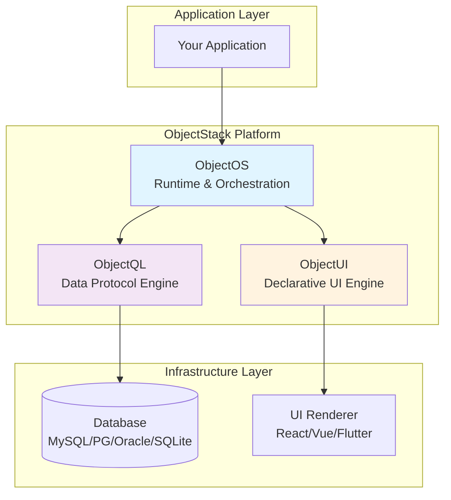

# ObjectStack Platform Specification

**ObjectStack** is a protocol-driven full-stack development platform that separates business logic from technical implementation through standardized JSON protocols. It enables developers to build portable, database-agnostic applications with complete data sovereignty.

## Core Architecture Principles

ObjectStack is built on three unshakable pillars:

### 1. Protocol-Driven Architecture
Logic resides in **declarative protocols** (JSON), not in imperative code. Business definitions are data, not functions. This enables:
- **Portability**: Protocols are language and framework agnostic
- **Composability**: Complex systems built from simple, declarative blocks
- **AI-Generation**: 80% of application code generated from protocol specifications
- **Version Control**: Business logic versioned as structured data

### 2. Local-First by Design
Applications work **offline by default**. Cloud connectivity is optional, not mandatory. This ensures:
- **Data Sovereignty**: Users own their data, not platforms
- **Zero Vendor Lock-in**: Data exportable in standard formats (.oos, .json)
- **Privacy by Default**: No telemetry or cloud dependencies required
- **Resilience**: Applications function without network connectivity

### 3. Database Agnostic
Write once, run on **any database**. ObjectQL abstracts the data layer completely:
- **Cross-Database Protocol**: Single query syntax for MySQL, PostgreSQL, Oracle, SQLite, SQL Server
- **Zero Migration Cost**: Switch databases without changing application code
- **Dialect Abstraction**: Engine handles database-specific SQL generation
- **Unified Driver Interface**: Consistent API regardless of underlying storage

---

## Platform Components

ObjectStack consists of three decoupled engines that communicate via standardized JSON protocols:



### ObjectQL: The Data Protocol Engine

**Role**: Database-agnostic query engine and schema compiler

ObjectQL defines a universal JSON-based query language that compiles to native SQL for any supported database. It eliminates vendor lock-in by abstracting the data layer completely.

**Key Capabilities**:
- **Schema Definition**: Declare data models as JSON specifications
- **Query Protocol**: Unified JSON syntax for all CRUD operations
- **AST Compilation**: Transpiles protocols to database-specific SQL
- **Virtual City**: Multi-tenant data isolation mechanism
- **Driver Abstraction**: Pluggable database drivers (MySQL, PostgreSQL, Oracle, SQLite, SQL Server)

[→ ObjectQL Specification](/docs/objectql)

### ObjectUI: The Declarative UI Engine

**Role**: Protocol-based interface renderer

ObjectUI transforms UI development from imperative code to declarative JSON specifications. Interfaces are data, not functions.

**Key Capabilities**:
- **Component Protocol**: JSON definitions for forms, tables, grids, dashboards
- **Data Binding**: Automatic synchronization with ObjectQL data layer
- **Action Protocol**: Declarative event handling (API calls, navigation, dialogs)
- **Renderer Agnostic**: React implementation available, Vue/Flutter planned
- **Theme System**: Customizable styling without changing structure

[→ ObjectUI Specification](/docs/objectui)

### ObjectOS: The Runtime Platform

**Role**: Application orchestration and platform services

ObjectOS binds ObjectQL and ObjectUI into a cohesive runtime environment, providing identity management, access control, and deployment capabilities.

**Key Capabilities**:
- **QL-UI Binding**: Automatic connection between data and interface layers
- **Identity System**: Built-in user management with RBAC
- **Field-Level Security**: Fine-grained data access control
- **Plugin Architecture**: Extensible business logic layer
- **Deployment Modes**: Standalone (.oos files), Server (Docker), Multi-tenant SaaS

[→ ObjectOS Specification](/docs/objectos)

---

## Why ObjectStack?

### For Individual Developers
Build local-first applications **without server infrastructure**:
- Personal tools (notes, CRM, project management)
- Offline-capable applications with SQLite
- Zero deployment complexity—just a single .oos file
- Complete privacy and data ownership

### For Enterprise IT
Unify **heterogeneous legacy systems** through a standard protocol layer:
- Connect multiple databases (Oracle, SQL Server, MySQL)
- Provide unified ObjectQL API across all systems
- Eliminate data silos with consistent query interface
- Reduce integration complexity by 10x

### For SaaS Startups
Focus on **core business logic**, not infrastructure:
- Skip months of CRUD/auth/permissions boilerplate
- Multi-tenancy built-in at protocol level
- Database-agnostic allows customer choice
- Scale from SQLite to PostgreSQL without code changes

### For Low-Code Platform Vendors
Offer **true portability** without vendor lock-in:
- Customers choose their own database
- Export/import applications as standard .oos files
- Protocol-based design enables visual editing tools
- AI-friendly specifications for code generation

---

## Design Philosophy

ObjectStack follows the principles outlined in **[The Manifesto](/docs/framework/manifesto)**:

1. **Protocol Neutrality**: Specifications before implementations. No database, language, or framework dependencies in the protocol layer.

2. **Mechanism over Policy**: Protocols define interfaces (mechanisms), not implementations (policies). User systems and business logic belong in ObjectOS, not in ObjectQL/UI specs.

3. **Data Sovereignty**: Local-first by mandate. All core functionality must work offline. Data must be exportable in standard formats.

4. **Stability Pledge**: Breaking changes require 2 major version migration windows. Infrastructure must be stable.

These principles are **unshakable and non-negotiable**. Features that violate them cannot be added to ObjectStack.

---

## Getting Started

Choose your learning path based on your role:

### Quick Start (5 minutes)
Get a working application running immediately:
- **[Quick Start Guide](/docs/framework/quickstart)**: Build your first ObjectStack app

### Conceptual Foundation (30 minutes)
Understand the philosophy and architecture:
- **[Welcome to ObjectStack](/docs/framework/welcome)**: Platform overview and value proposition
- **[The Manifesto](/docs/framework/manifesto)**: Core principles and design decisions
- **[Architecture Guide](/docs/framework/architecture)**: Technical design and component relationships

### Component Specifications (2-3 hours each)
Deep dive into each engine's protocol specifications:
- **[ObjectQL Spec](/docs/objectql)**: Schema definition, query DSL, aggregations
- **[ObjectUI Spec](/docs/objectui)**: Component protocols, actions, rendering
- **[ObjectOS Spec](/docs/objectos)**: Identity management, RBAC, deployment

### AI-Assisted Development
Learn how to leverage LLMs for rapid development:
- **[The AI Codex](/docs/framework/ai-codex)**: Using AI to generate 80% of your application from protocol specs

---

## Example: Todo Application in Protocols

A complete application defined as declarative JSON:

**Data Layer (ObjectQL Schema)**:
```json
{
  "objects": {
    "todos": {
      "fields": {
        "title": { "type": "text", "required": true },
        "completed": { "type": "boolean", "defaultValue": false },
        "priority": { "type": "select", "options": ["high", "medium", "low"] },
        "owner": { "type": "lookup", "reference_to": "_users" }
      },
      "permission_set": {
        "user": {
          "allowRead": true,
          "allowCreate": true,
          "allowEdit": "owner eq $user.id",
          "allowDelete": "owner eq $user.id"
        }
      }
    }
  }
}
```

**Interface Layer (ObjectUI Protocol)**:
```json
{
  "type": "page",
  "title": "My Tasks",
  "body": {
    "type": "table",
    "object": "todos",
    "filters": [["completed", "=", false]],
    "columns": [
      { "field": "title", "label": "Task" },
      { "field": "priority", "label": "Priority" },
      { "field": "completed", "label": "Done", "type": "boolean" }
    ],
    "actions": [
      { "label": "Mark Complete", "type": "update", "data": { "completed": true } },
      { "label": "Delete", "type": "delete", "confirm": true }
    ]
  }
}
```

**Result**: A fully functional, database-agnostic, permission-controlled task management application—defined entirely as data.

---

## Community and Ecosystem

- **GitHub**: [github.com/objectstack-ai](https://github.com/objectstack-ai)
- **Protocol Specifications**: This documentation site (objectstack.org)
- **Reference Implementations**: Open-source engines (MIT/Apache 2.0)
- **Community Plugins**: Extensible through ObjectOS plugin architecture

---

## Next Steps

1. **Understand the Philosophy**: Read **[The Manifesto](/docs/framework/manifesto)** to understand ObjectStack's core principles
2. **Build Your First App**: Follow the **[Quick Start Guide](/docs/framework/quickstart)** to deploy a working application
3. **Learn the Protocols**: Study **[ObjectQL](/docs/objectql)**, **[ObjectUI](/docs/objectui)**, and **[ObjectOS](/docs/objectos)** specifications
4. **Explore Use Cases**: Review **[Architecture](/docs/framework/architecture)** for enterprise patterns

Welcome to the ObjectStack ecosystem. Let's build the future of protocol-driven development.

