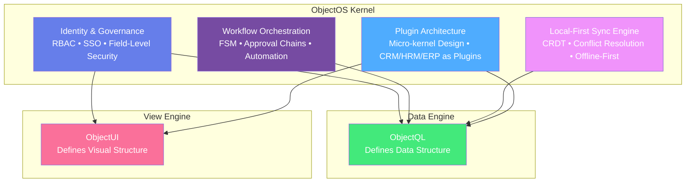
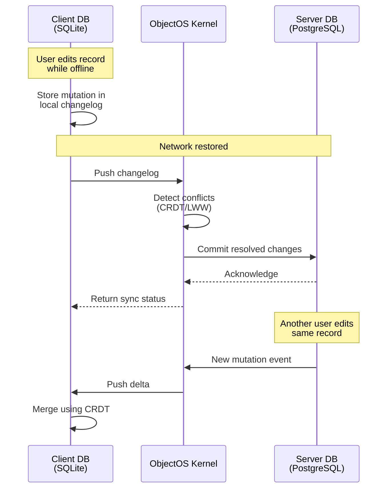
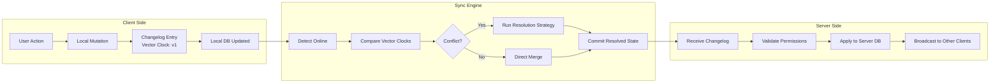
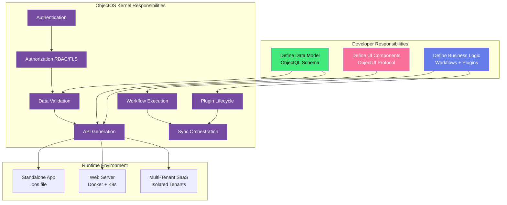

# ObjectOS: The Business Operating System

**You don't build an app by writing your own process scheduler and file system. You use an OS (Linux/Windows). So why are you writing your own Auth, Workflow engine, and Sync logic for every business app?**

ObjectOS is the **Kernel for your Enterprise**. It orchestrates Identity, Data Sync, and Business Processes in a unified runtime—eliminating microservices sprawl and spaghetti monoliths.

---

## The Command Center: ObjectOS Architecture

ObjectOS acts as the central **CPU** of the ObjectStack ecosystem, connecting ObjectQL (Memory/Data) and ObjectUI (Display/IO) into a cohesive, production-grade system.



**ObjectQL** defines the **Data Structure**. **ObjectUI** defines the **Visual Structure**. **ObjectOS** breathes life into them.

---

## The Four Pillars of the Kernel

ObjectOS provides four foundational capabilities that eliminate the need for custom infrastructure code:

### 1. Identity & Governance

**Not just a login library, but a governance engine.**

ObjectOS provides built-in **Role-Based Access Control (RBAC)**, **Single Sign-On (SSO)** via OIDC/SAML, and **Field-Level Security (FLS)** that operates at the protocol layer—not at the application layer.

**Key Capabilities:**
- **Multi-Tenant Identity**: Isolated user spaces with tenant-level governance
- **Attribute-Based Access Control (ABAC)**: Define permissions using expressions (`$user.department === 'sales'`)
- **Audit Logging**: Every data mutation tracked with user context and timestamp
- **Zero Trust Architecture**: No implicit trust; every request validated against permission sets

**Example: Field-Level Security**
```typescript
interface Employee {
  name: string          // Readable by all
  email: string         // Readable by all
  salary: number        // Readable only by HR or Admin
  ssn: string           // Readable only by Admin
}

// FLS Configuration
{
  "fields": {
    "salary": {
      "read": "$user.role === 'hr' || $user.role === 'admin'",
      "edit": "$user.role === 'hr'"
    },
    "ssn": {
      "read": "$user.role === 'admin'",
      "edit": false
    }
  }
}
```

When a regular user queries employee data, `salary` and `ssn` are **automatically filtered** by the kernel—no application-level filtering required.

---

### 2. Workflow Orchestration

**Finite State Machines (FSM) as code. No more nested if/else statements.**

ObjectOS provides a **declarative workflow engine** where approval chains, automation rules, and business processes are defined in **YAML or TypeScript**, not imperative spaghetti code.

**Key Capabilities:**
- **State Machine Definition**: Define states, transitions, and guards declaratively
- **Approval Chains**: Multi-step approval with escalation rules
- **Event-Driven Triggers**: Automatic execution on data mutations or schedules
- **Parallel Execution**: Run multiple workflow steps concurrently
- **Compensation Logic**: Automatic rollback on failure (Saga pattern)

**Example: Purchase Order Approval Workflow**
```yaml
workflow:
  name: purchase_order_approval
  trigger:
    object: purchase_orders
    event: insert
    condition: amount > 10000
  
  states:
    - name: pending_manager_approval
      on_enter:
        - action: notify
          recipients: ["{{record.manager.email}}"]
          template: manager_approval_request
      
      transitions:
        - event: manager_approved
          target: pending_finance_approval
          guard: "$user.id === record.manager.id"
        - event: manager_rejected
          target: rejected
    
    - name: pending_finance_approval
      on_enter:
        - action: notify
          recipients: ["finance@company.com"]
          template: finance_approval_request
      
      transitions:
        - event: finance_approved
          target: approved
          guard: "$user.department === 'finance'"
        - event: finance_rejected
          target: rejected
    
    - name: approved
      on_enter:
        - action: update
          object: purchase_orders
          data:
            status: approved
            approved_at: "{{now()}}"
        - action: notify
          recipients: ["{{record.created_by.email}}"]
          template: purchase_order_approved
    
    - name: rejected
      on_enter:
        - action: notify
          recipients: ["{{record.created_by.email}}"]
          template: purchase_order_rejected
```

**Result**: Business logic is **configuration, not code**. The kernel handles execution, state persistence, and error recovery.

---

### 3. Local-First Sync Engine

**The Killer Feature: Offline-first apps with automatic conflict resolution.**

Building offline-first applications is notoriously difficult. ObjectOS acts as the **Replication Master**, managing the diffs between the Server DB (PostgreSQL/MySQL) and Client DB (SQLite/RxDB) using **Conflict-Free Replicated Data Types (CRDT)** and **Last-Write-Wins (LWW)** strategies.

**Key Capabilities:**
- **Automatic Sync Protocol**: Bi-directional replication with delta compression
- **Conflict Resolution**: CRDT-based merges or customizable resolution strategies
- **Offline Queue**: Mutations queued locally and replayed when connection restored
- **Selective Sync**: Only sync data relevant to the user's context (RBAC-aware)
- **Encryption at Rest**: Client-side encryption for sensitive data

**Sync Architecture:**



**Example: Conflict Resolution Configuration**
```typescript
{
  sync: {
    enabled: true,
    remote: 'https://api.example.com',
    strategy: 'crdt',  // or 'last-write-wins', 'manual'
    
    conflictResolution: {
      // Field-level resolution strategies
      fields: {
        title: 'last-write-wins',
        description: 'crdt-text',  // Operational Transform for text
        priority: 'max',            // Take highest value
        assignee: 'manual'          // Require user intervention
      }
    },
    
    // Only sync data the user is authorized to see
    filter: '$user.accessible_records',
    
    // Encrypt before transmission
    encryption: {
      enabled: true,
      algorithm: 'AES-256-GCM'
    }
  }
}
```

**Result**: Your application works **offline by default**. Sync is an implementation detail, not a feature.

---

### 4. Plugin Architecture

**The Micro-kernel Design: Everything is a plugin.**

ObjectOS follows a **micro-kernel architecture** where the core provides only primitive operations (auth, data access, workflow execution). All business logic—CRM, HRM, ERP—is loaded as **plugins** via a **Manifest**.

**Key Capabilities:**
- **Declarative Manifest**: Define plugin dependencies, permissions, and lifecycle hooks
- **Sandboxed Execution**: Plugins run in isolated contexts with explicit permissions
- **Hot Reload**: Update plugins without restarting the kernel
- **Version Management**: Side-by-side plugin versions with semantic versioning
- **Marketplace Ready**: Distribute plugins as npm packages or Docker images

**Example: CRM Plugin Manifest**
```typescript
// crm-plugin.manifest.ts
export const CRMPlugin: PluginManifest = {
  name: '@company/crm',
  version: '2.1.0',
  
  // Dependencies
  requires: {
    objectos: '^3.0.0',
    plugins: {
      '@company/email-service': '^1.0.0'
    }
  },
  
  // Permissions required
  permissions: {
    objects: ['contacts', 'companies', 'opportunities'],
    actions: ['read', 'create', 'update', 'delete'],
    apis: ['/api/crm/*']
  },
  
  // Schema extensions
  schema: {
    objects: {
      contacts: {
        fields: {
          name: { type: 'text', required: true },
          email: { type: 'email', unique: true },
          company: { type: 'lookup', reference_to: 'companies' },
          lead_score: { type: 'number', formula: 'calculate_lead_score()' }
        }
      },
      companies: {
        fields: {
          name: { type: 'text', required: true },
          industry: { type: 'select', options: ['tech', 'finance', 'retail'] },
          annual_revenue: { type: 'currency' }
        }
      }
    }
  },
  
  // Workflow definitions
  workflows: {
    lead_nurturing: {
      trigger: { object: 'contacts', event: 'insert' },
      steps: [
        { action: 'wait', duration: '1 day' },
        { action: 'send_email', template: 'welcome' },
        { action: 'wait', duration: '3 days' },
        { action: 'send_email', template: 'follow_up', condition: 'lead_score < 50' }
      ]
    }
  },
  
  // UI extensions
  ui: {
    pages: {
      contacts: { type: 'list', object: 'contacts' },
      contact_detail: { type: 'detail', object: 'contacts' }
    },
    dashboard_widgets: [
      { type: 'chart', title: 'Leads by Source', query: 'aggregate_leads_by_source()' }
    ]
  },
  
  // Lifecycle hooks
  lifecycle: {
    async onInstall() {
      // Seed initial data
      await this.seed('data/initial_industries.json')
    },
    async onStart() {
      // Register custom routes
      this.router.post('/api/crm/import', importContactsHandler)
    }
  }
}
```

**Result**: Business logic is **declarative configuration**. The kernel handles instantiation, dependency injection, and lifecycle management.

---

## The Replication Protocol: Local-First Deep Dive

**The Problem**: Building offline-first apps requires managing complex state synchronization, conflict resolution, and network partition handling. Most teams underestimate this complexity and end up with fragile, bug-prone implementations.

**The Solution**: ObjectOS provides a **Replication Protocol** that handles the entire synchronization lifecycle—from offline mutations to conflict detection to merge strategies.

### How It Works

ObjectOS implements a **Log-Structured Replication** system:

1. **Every mutation creates a changelog entry** (client and server)
2. **Sync compares vector clocks** to detect divergence
3. **Conflicts are resolved using configurable strategies** (CRDT, LWW, Manual)
4. **Resolved state is committed** to both client and server



### Conflict Resolution Strategies

ObjectOS supports multiple resolution strategies per field:

| Strategy | Description | Use Case | Example |
|----------|-------------|----------|---------|
| **Last-Write-Wins (LWW)** | Latest timestamp wins | Simple fields (status, category) | `priority: 'last-write-wins'` |
| **CRDT (Operational Transform)** | Merge concurrent edits | Collaborative text editing | `description: 'crdt-text'` |
| **Max/Min** | Take highest/lowest value | Counters, ratings | `view_count: 'max'` |
| **Union** | Combine all values | Tags, multi-select | `tags: 'union'` |
| **Manual** | Require user resolution | Critical fields | `assignee: 'manual'` |

### Replication Master Architecture

```typescript
// ObjectOS acts as the Replication Master
interface ReplicationMaster {
  // Track client states
  clients: Map<ClientID, VectorClock>
  
  // Changelog storage
  serverLog: ChangelogEntry[]
  
  // Conflict detector
  detectConflicts(
    clientLog: ChangelogEntry[],
    serverLog: ChangelogEntry[]
  ): Conflict[]
  
  // Resolver
  resolveConflicts(
    conflicts: Conflict[],
    strategy: ResolutionStrategy
  ): ResolvedState
  
  // Broadcaster
  broadcastToClients(
    changes: ChangelogEntry[],
    excludeClient?: ClientID
  ): void
}
```

**Example: Configuring Sync Behavior**
```typescript
const app = new ObjectOS({
  mode: 'hybrid',  // Local-first + optional sync
  
  storage: {
    local: './app.db',  // SQLite
    remote: 'postgres://server/db'
  },
  
  sync: {
    enabled: true,
    
    // Sync interval (0 = manual only)
    interval: 60000,  // 60 seconds
    
    // Conflict resolution per object
    objects: {
      tasks: {
        title: 'last-write-wins',
        description: 'crdt-text',     // Operational Transform
        assignee: 'manual',            // User must resolve
        completed_at: 'last-write-wins'
      },
      
      analytics: {
        view_count: 'max',             // Take highest
        tags: 'union'                  // Merge all tags
      }
    },
    
    // Selective sync (RBAC-aware)
    filter: {
      tasks: '$user.team.id === record.team_id',
      analytics: 'record.public === true'
    },
    
    // Encryption
    encryption: {
      enabled: true,
      algorithm: 'AES-256-GCM',
      key: process.env.SYNC_ENCRYPTION_KEY
    },
    
    // Batching for performance
    batch: {
      maxSize: 100,        // Max 100 changes per sync
      maxWait: 5000        // Wait max 5s before forcing sync
    }
  }
})
```

### Offline Queue Management

When offline, ObjectOS queues mutations locally:

```typescript
// User edits while offline
await db.update('tasks', taskId, { status: 'completed' })

// Mutation queued locally
// Queue: [
//   { 
//     object: 'tasks', 
//     action: 'update', 
//     id: taskId, 
//     changes: { status: 'completed' },
//     timestamp: '2024-01-17T10:30:00Z',
//     vectorClock: { client: 'abc123', version: 42 }
//   }
// ]

// When online, queue is automatically replayed
// ObjectOS handles:
// ✅ Permission re-validation (in case RBAC changed)
// ✅ Conflict detection
// ✅ Merge strategies
// ✅ Error recovery (retry with exponential backoff)
```

**Result**: Developers define **what** to sync and **how** to resolve conflicts. ObjectOS handles the **when** and **where**.

---

## Ecosystem Integration: The Trinity

ObjectOS completes the ObjectStack trinity by binding **data structure** (ObjectQL) and **visual structure** (ObjectUI) into a **living system**.



### The Division of Responsibilities

| Component | Defines | Output | Example |
|-----------|---------|--------|---------|
| **ObjectQL** | Data Structure | JSON Schema + Validation Rules | `{ object: 'users', fields: { email: { type: 'email', unique: true } } }` |
| **ObjectUI** | Visual Structure | Component Protocol | `{ type: 'form', object: 'users', fields: ['name', 'email'] }` |
| **ObjectOS** | Runtime Behavior | Executable Application | Authentication + Sync + Workflows |

### Example: End-to-End Integration

**Step 1: Define Data (ObjectQL)**
```typescript
const schema = {
  objects: {
    invoices: {
      fields: {
        invoice_number: { type: 'autonumber', prefix: 'INV-' },
        customer: { type: 'lookup', reference_to: 'customers' },
        total: { type: 'currency', formula: 'SUM(line_items.amount)' },
        status: { 
          type: 'select', 
          options: ['draft', 'sent', 'paid', 'overdue'],
          default: 'draft'
        },
        due_date: { type: 'date' }
      }
    }
  }
}
```

**Step 2: Define UI (ObjectUI)**
```typescript
const pages = {
  invoices: {
    type: 'list',
    object: 'invoices',
    filters: [{ field: 'status', operator: 'ne', value: 'paid' }],
    columns: ['invoice_number', 'customer', 'total', 'status', 'due_date'],
    actions: [
      {
        label: 'Send Invoice',
        trigger: 'workflow:send_invoice',
        condition: 'status === "draft"'
      }
    ]
  }
}
```

**Step 3: Define Workflow (ObjectOS)**
```yaml
workflows:
  send_invoice:
    trigger:
      manual: true
      object: invoices
      condition: status === 'draft'
    
    steps:
      - action: update
        object: invoices
        data:
          status: sent
          sent_at: "{{now()}}"
      
      - action: send_email
        to: "{{record.customer.email}}"
        subject: "Invoice {{record.invoice_number}}"
        template: invoice_email
        attachments:
          - type: pdf
            template: invoice_pdf
      
      - action: schedule
        delay: "{{record.due_date}}"
        workflow: check_overdue
```

**Step 4: ObjectOS Orchestrates Everything**
```typescript
const app = new ObjectOS({
  schema,      // From ObjectQL
  pages,       // From ObjectUI
  workflows,   // Business logic
  
  // ObjectOS handles:
  identity: { authentication: { providers: ['email'] } },
  sync: { enabled: true, strategy: 'crdt' },
  deployment: { mode: 'server', port: 3000 }
})

await app.start()
// ✅ RESTful API auto-generated
// ✅ Web UI auto-rendered
// ✅ Authentication enabled
// ✅ Workflows active
// ✅ Sync configured
```

**Result**: You define **WHAT** (data, UI, logic). ObjectOS handles **HOW** (auth, sync, deployment).

---

## Why ObjectOS Matters

### For CTOs and Enterprise Architects

**The Problem You're Solving:**
- **Microservices Sprawl**: 47 services doing auth, each slightly differently
- **Spaghetti Monoliths**: Business logic buried in controllers, impossible to test
- **Vendor Lock-In**: Tightly coupled to Firebase/Supabase/AWS Amplify
- **Compliance Nightmares**: No audit trail, inconsistent RBAC

**What ObjectOS Provides:**
- **Unified Control Plane**: One governance model for all apps
- **Declarative Everything**: Logic as configuration, not code
- **Database Agnostic**: MySQL today, PostgreSQL tomorrow, Oracle for legacy
- **Compliance Ready**: Built-in audit logs, RBAC, FLS

### For Backend Leads

**The Problem You're Solving:**
- **Boilerplate Hell**: Same auth code in every microservice
- **Sync Complexity**: CRDTs are hard; you're doing LWW wrong
- **Testing Difficulties**: Business logic mixed with framework code

**What ObjectOS Provides:**
- **Protocol-Driven**: Test workflows as YAML, not runtime behavior
- **Proven Sync**: Battle-tested CRDT implementation
- **Hot Reload**: Change workflows without deployment

---

## Next Steps

Explore the ObjectOS platform capabilities:

1. **[Platform Architecture](/docs/objectos/platform-architecture)** - Deep dive into QL-UI binding and runtime
2. **[Identity & Access](/docs/objectos/identity-access)** - RBAC, SSO, Field-Level Security
3. **[Deployment](/docs/objectos/deployment)** - Standalone, Server, and Multi-Tenant modes

For implementation examples:
- **[Plugin Development Guide](/docs/objectos/plugins)** - Build your first plugin
- **[Workflow Patterns](/docs/objectos/workflows)** - Common automation scenarios
- **[Sync Configuration](/docs/objectos/sync)** - Configure Local-First replication

---

## Design Philosophy

ObjectOS follows three core principles:

1. **Mechanism, Not Policy**: We provide RBAC interfaces, not hardcoded user systems. You define policies.
2. **Local-First by Default**: Applications run offline. Sync is optional, not required.
3. **Protocol-Driven**: Business logic lives in data (JSON/YAML), not in code (if/else).

**ObjectOS is not a framework. It's an operating system for business applications.**
