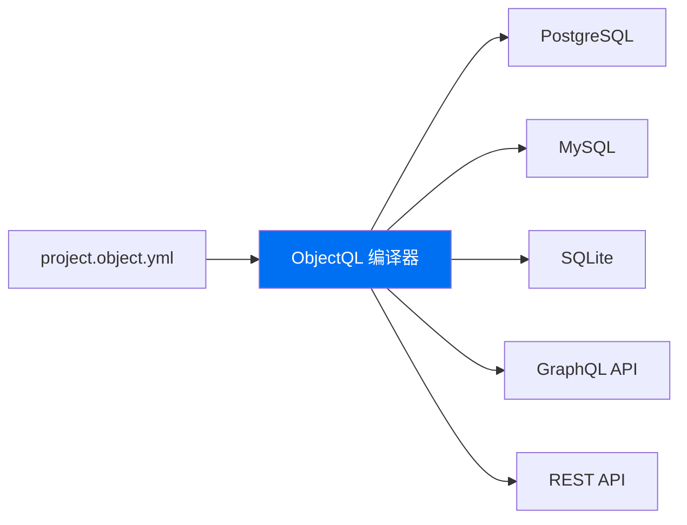

# ObjectQL：通用数据编译器

**停止编写胶水代码，开始编译你的数据层。**

ObjectQL 不是又一个 ORM——它是一个**数据库编译器**，将高级模式定义转换为优化的原生 SQL。用 JSON/YAML 编写一次数据模型，ObjectQL 将其编译为在任何数据库上运行：SQLite、PostgreSQL、MySQL、Oracle 或 SQL Server。

## 价值主张

**编写一次模式** → **在任何数据库上运行** → **自动生成 API**

传统的 ORM 在运行时包装数据库，增加了开销和复杂性。ObjectQL 在协议层编译，将安全规则和虚拟列直接注入 SQL——没有运行时性能损失。

<div style={{ display: 'flex', gap: '1rem', marginTop: '2rem' }}>
  <a href="/docs/objectql/core-concepts" style={{ padding: '0.75rem 1.5rem', background: '#0070f3', color: 'white', borderRadius: '0.5rem', textDecoration: 'none', fontWeight: 600 }}>开始使用</a>
  <a href="https://github.com/objectstack-ai/objectql" style={{ padding: '0.75rem 1.5rem', border: '2px solid #0070f3', color: '#0070f3', borderRadius: '0.5rem', textDecoration: 'none', fontWeight: 600 }}>在 GitHub 查看</a>
</div>

### 架构可视化

ObjectQL 作为通用编译器，将您的模式转换为多个输出目标：



---

## 展示代码：模式编译为优化的 SQL

**您定义意图，我们编译优化的 SQL。**

### 输入：高级模式

```yaml
# project.object.yml
objects:
  projects:
    label: 项目
    fields:
      name:
        type: text
        required: true
      owner:
        type: lookup
        reference_to: users
        required: true
      status:
        type: select
        options: [planning, active, completed, archived]
      
      # 虚拟列 - 在数据库层计算
      task_count:
        type: formula
        formula: "COUNT(tasks.id WHERE tasks.project_id = projects.id)"
        return_type: number
```

### 输出：编译的 SQL（PostgreSQL）

```sql
-- 带约束的表创建
CREATE TABLE projects (
  id SERIAL PRIMARY KEY,
  name VARCHAR(255) NOT NULL,
  owner_id INTEGER NOT NULL REFERENCES users(id),
  status VARCHAR(20) CHECK (status IN ('planning', 'active', 'completed', 'archived')),
  created_at TIMESTAMP DEFAULT CURRENT_TIMESTAMP,
  updated_at TIMESTAMP DEFAULT CURRENT_TIMESTAMP
);

-- 虚拟列编译为索引视图以提升性能
CREATE INDEX idx_projects_task_count ON projects(id);

-- 带虚拟列的查询自动进行连接和聚合
SELECT 
  p.id,
  p.name,
  u.name as owner_name,
  p.status,
  COUNT(t.id) as task_count
FROM projects p
LEFT JOIN users u ON p.owner_id = u.id
LEFT JOIN tasks t ON t.project_id = p.id
WHERE p.owner_id = $1  -- 自动注入安全过滤器
GROUP BY p.id, p.name, u.name, p.status;
```

**关键洞察**：模式描述*您想要什么*。ObjectQL 将其编译为*优化的原生 SQL*，自动进行 JOIN 优化、索引提示和安全过滤。

---

## 为什么选择 ObjectQL？面向架构师的三大支柱

### 1. 零开销安全

**安全性被编译到 SQL 中，而不是在内存中检查。**

传统 ORM 首先获取数据，然后在应用程序内存中根据用户权限进行过滤。这会产生两个问题：
- **性能**：必须先加载大型数据集才能过滤
- **风险**：开发人员可能忘记权限检查，导致数据泄露

ObjectQL 在编译时将 RBAC/ACL 规则直接注入 SQL 的 `WHERE` 子句：

```typescript
// 开发人员编写此查询
await db.query({
  object: 'projects',
  fields: ['name', 'status']
})

// ObjectQL 编译为带自动安全过滤器的 SQL
// SELECT name, status FROM projects 
// WHERE owner_id = $current_user_id 
//   OR id IN (SELECT project_id FROM project_members WHERE user_id = $current_user_id)
```

**结果**：数据库引擎强制执行安全性——无法绕过，零性能开销。

### 2. 设计上的数据库无关性

**切换数据库无需更改一行代码。**

使用 SQLite 在本地开发，部署到生产环境的 PostgreSQL，扩展到 TiDB 分布式数据库——都使用完全相同的模式和查询代码：

```typescript
// 开发环境：本地 SQLite
const devDB = new ObjectQL({
  driver: new SQLiteDriver({ database: './dev.db' })
})

// 生产环境：带读副本的 PostgreSQL
const prodDB = new ObjectQL({
  driver: new PostgreSQLDriver({ 
    url: process.env.DATABASE_URL,
    pool: { max: 20 }
  })
})

// 两个环境的代码完全相同
await devDB.query('projects', { filters: { status: 'active' }})
await prodDB.query('projects', { filters: { status: 'active' }})
```

ObjectQL 的编译器自动为每个数据库的独特功能生成方言特定的 SQL（PostgreSQL 中的 JSONB、MySQL 中的 JSON 函数等）。

### 3. 虚拟列：高性能的计算字段

**在模式中定义复杂聚合——编译为高效的数据库表达式。**

不需要在每个 API 端点编写 N+1 查询或复杂的 JOIN，在模式中定义一次计算字段：

```json
{
  "fields": {
    "revenue_ytd": {
      "type": "formula",
      "formula": "SUM(orders.total WHERE orders.created_at >= YEAR_START())",
      "return_type": "currency"
    },
    "overdue_tasks": {
      "type": "formula", 
      "formula": "COUNT(tasks WHERE tasks.due_date < TODAY() AND tasks.status != 'completed')",
      "return_type": "number"
    }
  }
}
```

ObjectQL 将这些编译为：
- **PostgreSQL**：带物化视图的 `GENERATED` 列
- **MySQL**：带索引支持的虚拟列
- **SQLite**：查询时计算的计算列

**性能**：数据库执行计算——没有 N+1 查询，没有应用程序逻辑。

---

## 编译器 vs ORM：技术对比

| 方面 | ObjectQL（编译器） | 传统 ORM（Prisma、TypeORM） |
|------|-------------------|---------------------------|
| **运行时开销** | 接近零（编译为原生 SQL） | 高（运行时查询构建、结果映射） |
| **安全模型** | 引擎强制执行（SQL WHERE 子句注入） | 应用程序逻辑（如果忘记可能被绕过） |
| **数据库可移植性** | 基于协议（JSON AST → 任何 SQL 方言） | 基于代码（迁移绑定到特定 ORM 语法） |
| **查询优化** | 编译时分析 + 数据库规划器 | 运行时查询构建器（更难优化） |
| **虚拟列** | 编译为数据库原生计算列 | 在应用程序内存中计算（N+1 查询） |
| **类型安全** | 协议验证（JSON 模式） | TypeScript 类型（仅编译时） |
| **多租户** | 协议级隔离（虚拟城市） | 查询中的手动实现 |
| **调试** | 直接检查编译的 SQL | 不透明的查询构建器内部 |

### 为什么编译很重要

**传统 ORM 流程**：
```
代码 → 查询构建器 → SQL 字符串 → 数据库
       ↑ 运行时开销，难以调试
```

**ObjectQL 编译器流程**：
```
模式 → AST → 优化的 SQL → 数据库
         ↑ 编译时验证，可检查
```

编译器方法意味着：
- **可预测的性能**：SQL 生成一次并缓存，而不是在每个请求上构建
- **更好的优化**：数据库查询规划器看到真实的 SQL，而不是抽象的查询
- **安全保证**：不可能意外跳过权限检查

---

## 支持的驱动：数据库生态系统

ObjectQL 为主要数据库引擎维护官方驱动，每个都针对平台特定功能进行了优化：

### PostgreSQL - JSONB 优化
```bash
npm install @objectql/driver-postgres
```

**技术优势**：
- 使用 GIN/GiST 索引的原生 JSONB 索引
- 用于复杂虚拟列的物化视图
- 使用 `tsvector` 编译的全文搜索
- 用于分析的高级窗口函数
- **用例**：SaaS 平台、数据分析、AI/ML 工作负载

### MySQL 8.0+ - JSON 函数
```bash
npm install @objectql/driver-mysql
```

**技术优势**：
- 用于文档查询的 JSON 函数（`JSON_EXTRACT`、`JSON_TABLE`）
- 支持虚拟字段索引的生成列
- 用于高可用性的 InnoDB 集群支持
- 兼容 MariaDB、TiDB、PlanetScale
- **用例**：Web 应用、云部署、可扩展的 OLTP 系统

### SQLite - 本地优先就绪
```bash
npm install @objectql/driver-sqlite
```

**技术优势**：
- 零配置嵌入式数据库
- 用于自定义数据源的虚拟表机制
- FTS5 全文搜索引擎
- 用于文档存储的 JSON1 扩展
- **用例**：移动应用、桌面软件、边缘计算、无服务器函数

### SQL Server - 企业集成
```bash
npm install @objectql/driver-sqlserver
```

**技术优势**：
- 带 `PERSISTED` 优化的计算列
- 与 Azure Active Directory 集成
- 用于合规工作负载的 Always Encrypted
- 用于审计跟踪的时态表
- **用例**：.NET 企业应用、Microsoft 技术栈集成

### Oracle Database - 关键任务系统
```bash
npm install @objectql/driver-oracle
```

**技术优势**：
- 带基于函数索引的虚拟列
- 用于 PB 级数据的分区策略
- Real Application Clusters (RAC) 支持
- 高级安全性（VPD、数据脱敏）
- **用例**：银行、电信、政府系统

### 驱动架构

所有驱动都实现标准化的 `ObjectQLDriver` 接口：

```typescript
interface ObjectQLDriver {
  compileAST(ast: ASTNode): string  // 方言特定的 SQL 生成
  query(protocol: QueryProtocol): Promise<QueryResult>
  transaction(callback: (tx: Transaction) => Promise<void>): Promise<void>
}
```

这保证了跨数据库的**一致行为**，同时允许**方言特定的优化**。

---

## 快速开始：看看 ObjectQL 的实际应用

以下是如何开始使用 ObjectQL：

```typescript
import { ObjectQL } from '@objectql/core'
import { SQLiteDriver } from '@objectql/driver-sqlite'

// 1. 使用任何支持的驱动初始化
const db = new ObjectQL({
  driver: new SQLiteDriver({ database: './myapp.db' })
})

// 2. 定义您的模式（也可以从 YAML 加载）
await db.registerSchema({
  objects: {
    tasks: {
      fields: {
        title: { type: 'text', required: true },
        completed: { type: 'boolean', defaultValue: false },
        priority: { type: 'select', options: ['high', 'medium', 'low'] },
        due_date: { type: 'date' }
      }
    }
  }
})

// 3. 使用编译的 API
await db.insert('tasks', { 
  title: '学习 ObjectQL', 
  priority: 'high',
  due_date: '2024-12-31'
})

const urgentTasks = await db.query('tasks', {
  filters: {
    and: [
      { field: 'completed', operator: 'eq', value: false },
      { field: 'priority', operator: 'eq', value: 'high' }
    ]
  },
  sort: 'due_date asc'
})

// 4. 切换到生产数据库（零代码更改）
const prodDB = new ObjectQL({
  driver: new PostgreSQLDriver({ 
    url: process.env.DATABASE_URL 
  })
})

// 相同的模式，相同的查询——不同的数据库
await prodDB.registerSchema(schema)
const sameTasks = await prodDB.query('tasks', queryProtocol)
```

---

## 设计哲学：为什么要编译器？

### 运行时包装器的问题

传统 ORM 在运行时操作：
1. 应用程序代码调用 ORM 方法
2. ORM 动态构建 SQL 字符串
3. SQL 发送到数据库
4. 结果映射回对象

**问题**：
- 每个请求的运行时开销
- 必须手动将安全逻辑添加到查询中
- 难以调试生成的 SQL
- 数据库特定的优化困难

### 编译器的优势

ObjectQL 在协议层编译：
1. 模式定义一次（JSON/YAML）
2. 编译器生成注入安全性的优化 SQL
3. SQL 被缓存和重用
4. 数据库接收原生、优化的查询

**优势**：
- **接近零的运行时开销**：SQL 是预编译的
- **保证安全性**：不可能忘记权限检查
- **可检查的输出**：确切地看到运行什么 SQL
- **数据库原生性能**：查询规划器看到真实的 SQL

### 协议驱动的架构

ObjectQL 定义 JSON 协议，而不是代码 API：

```typescript
// 这不是 API——这是一个协议包装器
await db.query({ 
  object: 'projects', 
  filters: { status: 'active' } 
})

// 真正的 API 是这个 JSON 协议：
{
  "object": "projects",
  "filters": { "field": "status", "operator": "eq", "value": "active" }
}
```

**为什么是协议？**
- 语言无关（在 Python、Go、Rust 中实现）
- 网络透明（通过 HTTP、WebSockets、gRPC 发送）
- 可版本化（结构化数据，易于差异比较）
- AI 友好（LLM 可以生成有效的协议）

---

## 接下来做什么？

探索完整的 ObjectQL 生态系统：

- **[核心概念](/docs/objectql/core-concepts)** - 深入了解模式、关系和虚拟城市架构
- **[协议规范](/docs/objectql/protocol-spec)** - 查询、变更和聚合的完整 JSON 模式参考
- **[核心功能](/docs/objectql/core-features)** - 虚拟列、公式字段、多租户和高级功能
- **[服务端 SDK](/docs/objectql/server-sdk)** - JavaScript/Node.js 的参考实现 API

### 真实世界的用例

ObjectQL 为生产系统提供支持：
- **本地优先应用**：支持离线的移动和桌面应用
- **企业集成**：异构遗留数据库上的统一 API
- **多租户 SaaS**：B2B 平台的协议级租户隔离
- **边缘计算**：基于 SQLite 的边缘数据处理
- **分析系统**：带计算列的基于 PostgreSQL 的数据仓库

---

## 加入 ObjectQL 社区

- **GitHub**：[objectstack-ai/objectql](https://github.com/objectstack-ai/objectql)
- **NPM**：[@objectql/core](https://www.npmjs.com/package/@objectql/core)
- **Discord**：[加入我们的社区](https://discord.gg/objectstack)
- **Twitter**：[@objectstack](https://twitter.com/objectstack)

由 ObjectStack 团队用 ❤️ 构建。MIT 许可。
