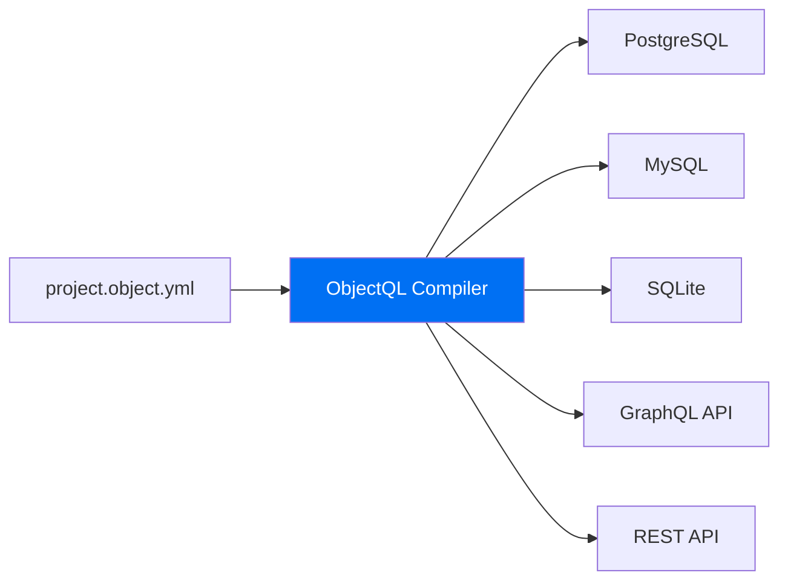

# ObjectQL: The Universal Data Compiler

**Stop writing glue code. Start compiling your data layer.**

ObjectQL is not another ORM—it's a **database compiler** that transforms high-level schema definitions into optimized, native SQL. Write your data model once in JSON/YAML, and ObjectQL compiles it to run on any database: SQLite, PostgreSQL, MySQL, Oracle, or SQL Server.

## The Value Proposition

**Write Schema Once** → **Run on Any Database** → **Auto-Generated APIs**

Traditional ORMs wrap databases at runtime, adding overhead and complexity. ObjectQL compiles at the protocol level, injecting security rules and virtual columns directly into SQL—no runtime performance penalty.

<div style={{ display: 'flex', gap: '1rem', marginTop: '2rem' }}>
  <a href="/docs/objectql/core-concepts" style={{ padding: '0.75rem 1.5rem', background: '#0070f3', color: 'white', borderRadius: '0.5rem', textDecoration: 'none', fontWeight: 600 }}>Get Started</a>
  <a href="https://github.com/objectstack-ai/objectql" style={{ padding: '0.75rem 1.5rem', border: '2px solid #0070f3', color: '#0070f3', borderRadius: '0.5rem', textDecoration: 'none', fontWeight: 600 }}>View on GitHub</a>
</div>

### Architecture Visualization

ObjectQL acts as a universal compiler, transforming your schema into multiple output targets:



---

## Show Code: Schema Compiles to Optimized SQL

**You define the intent. We compile the optimized SQL.**

### Input: High-Level Schema

```yaml
# project.object.yml
objects:
  projects:
    label: Projects
    fields:
      name:
        type: text
        required: true
      owner:
        type: lookup
        reference_to: users
        required: true
      status:
        type: select
        options: [planning, active, completed, archived]
      
      # Virtual column - computed at database level
      task_count:
        type: formula
        formula: "COUNT(tasks.id WHERE tasks.project_id = projects.id)"
        return_type: number
```

### Output: Compiled SQL (PostgreSQL)

```sql
-- Table creation with constraints
CREATE TABLE projects (
  id SERIAL PRIMARY KEY,
  name VARCHAR(255) NOT NULL,
  owner_id INTEGER NOT NULL REFERENCES users(id),
  status VARCHAR(20) CHECK (status IN ('planning', 'active', 'completed', 'archived')),
  created_at TIMESTAMP DEFAULT CURRENT_TIMESTAMP,
  updated_at TIMESTAMP DEFAULT CURRENT_TIMESTAMP
);

-- Virtual column compiled to indexed view for performance
CREATE INDEX idx_projects_task_count ON projects(id);

-- Query with virtual column automatically joins and aggregates
SELECT 
  p.id,
  p.name,
  u.name as owner_name,
  p.status,
  COUNT(t.id) as task_count
FROM projects p
LEFT JOIN users u ON p.owner_id = u.id
LEFT JOIN tasks t ON t.project_id = p.id
WHERE p.owner_id = $1  -- Security filter injected automatically
GROUP BY p.id, p.name, u.name, p.status;
```

**Key Insight**: The schema describes *what you want*. ObjectQL compiles it into *optimized native SQL* with automatic JOIN optimization, index hints, and security filters.

---

## Why ObjectQL? The 3 Pillars for Architects

### 1. Zero-Overhead Security

**Security is compiled into SQL, not checked in memory.**

Traditional ORMs fetch data first, then filter based on user permissions in application memory. This creates two problems:
- **Performance**: Large datasets must be loaded before filtering
- **Risk**: Developers can forget permission checks, leading to data leaks

ObjectQL injects RBAC/ACL rules directly into the SQL `WHERE` clause at compile time:

```typescript
// Developer writes this query
await db.query({
  object: 'projects',
  fields: ['name', 'status']
})

// ObjectQL compiles to SQL with automatic security filter
// SELECT name, status FROM projects 
// WHERE owner_id = $current_user_id 
//   OR id IN (SELECT project_id FROM project_members WHERE user_id = $current_user_id)
```

**Result**: Database engine enforces security—impossible to bypass, zero performance overhead.

### 2. Database Agnostic by Design

**Switch databases without changing a single line of code.**

Develop locally with SQLite, deploy to production PostgreSQL, scale to TiDB distributed database—all using the exact same schema and query code:

```typescript
// Development: Local SQLite
const devDB = new ObjectQL({
  driver: new SQLiteDriver({ database: './dev.db' })
})

// Production: PostgreSQL with read replicas
const prodDB = new ObjectQL({
  driver: new PostgreSQLDriver({ 
    url: process.env.DATABASE_URL,
    pool: { max: 20 }
  })
})

// Identical code for both environments
await devDB.query('projects', { filters: { status: 'active' }})
await prodDB.query('projects', { filters: { status: 'active' }})
```

ObjectQL's compiler automatically generates dialect-specific SQL for each database's unique features (JSONB in PostgreSQL, JSON functions in MySQL, etc.).

### 3. Virtual Columns: Computed Fields That Perform

**Define complex aggregations in schema—compiled to efficient database expressions.**

Instead of writing N+1 queries or complex JOINs in every API endpoint, define computed fields once in your schema:

```json
{
  "fields": {
    "revenue_ytd": {
      "type": "formula",
      "formula": "SUM(orders.total WHERE orders.created_at >= YEAR_START())",
      "return_type": "currency"
    },
    "overdue_tasks": {
      "type": "formula", 
      "formula": "COUNT(tasks WHERE tasks.due_date < TODAY() AND tasks.status != 'completed')",
      "return_type": "number"
    }
  }
}
```

ObjectQL compiles these to:
- **PostgreSQL**: `GENERATED` columns with materialized views
- **MySQL**: Virtual columns with index support  
- **SQLite**: Computed columns evaluated at query time

**Performance**: Database executes calculations—no N+1 queries, no application logic.

---

## Compiler vs ORM: Technical Comparison

| Aspect | ObjectQL (Compiler) | Traditional ORMs (Prisma, TypeORM) |
|--------|---------------------|-------------------------------------|
| **Runtime Overhead** | Near-zero (compiles to native SQL) | High (runtime query building, result mapping) |
| **Security Model** | Engine-enforced (SQL WHERE clause injection) | Application logic (can be bypassed if forgotten) |
| **Database Portability** | Protocol-based (JSON AST → any SQL dialect) | Code-based (migrations tied to specific ORM syntax) |
| **Query Optimization** | Compile-time analysis + database planner | Runtime query builder (harder to optimize) |
| **Virtual Columns** | Compiled to DB-native computed columns | Calculated in application memory (N+1 queries) |
| **Type Safety** | Protocol validation (JSON schema) | TypeScript types (compile-time only) |
| **Multi-Tenancy** | Protocol-level isolation (Virtual City) | Manual implementation in queries |
| **Debugging** | Inspect compiled SQL directly | Opaque query builder internals |

### Why Compilation Matters

**Traditional ORM Flow**:
```
Code → Query Builder → SQL String → Database
       ↑ Runtime overhead, hard to debug
```

**ObjectQL Compiler Flow**:
```
Schema → AST → Optimized SQL → Database
         ↑ Compile-time validation, inspectable
```

The compiler approach means:
- **Predictable Performance**: SQL is generated once and cached, not built on every request
- **Better Optimization**: Database query planner sees real SQL, not abstracted queries
- **Security Guarantees**: Impossible to accidentally skip permission checks

---

## Supported Drivers: Database Ecosystem

ObjectQL maintains official drivers for major database engines, each optimized for platform-specific features:

### PostgreSQL - JSONB Optimized
```bash
npm install @objectql/driver-postgres
```

**Technical Edge**:
- Native JSONB indexing with GIN/GiST indexes
- Materialized views for complex virtual columns
- Full-text search with `tsvector` compilation
- Advanced window functions for analytics
- **Use Case**: SaaS platforms, data analytics, AI/ML workloads

### MySQL 8.0+ - JSON Functions
```bash
npm install @objectql/driver-mysql
```

**Technical Edge**:
- JSON functions (`JSON_EXTRACT`, `JSON_TABLE`) for document queries
- Generated columns with index support for virtual fields
- InnoDB cluster support for high availability
- Compatible with MariaDB, TiDB, PlanetScale
- **Use Case**: Web applications, cloud deployments, scalable OLTP systems

### SQLite - Local-First Ready
```bash
npm install @objectql/driver-sqlite
```

**Technical Edge**:
- Zero-configuration embedded database
- Virtual table mechanism for custom data sources
- FTS5 full-text search engine
- JSON1 extension for document storage
- **Use Case**: Mobile apps, desktop software, edge computing, serverless functions

### SQL Server - Enterprise Integration
```bash
npm install @objectql/driver-sqlserver
```

**Technical Edge**:
- Computed columns with `PERSISTED` optimization
- Integration with Azure Active Directory
- Always Encrypted for compliance workloads
- Temporal tables for audit trails
- **Use Case**: .NET enterprise applications, Microsoft stack integration

### Oracle Database - Mission-Critical Systems
```bash
npm install @objectql/driver-oracle
```

**Technical Edge**:
- Virtual columns with function-based indexes
- Partitioning strategies for petabyte-scale data
- Real Application Clusters (RAC) support
- Advanced security (VPD, Data Redaction)
- **Use Case**: Banking, telecom, government systems

### Driver Architecture

All drivers implement the standardized `ObjectQLDriver` interface:

```typescript
interface ObjectQLDriver {
  compileAST(ast: ASTNode): string  // Dialect-specific SQL generation
  query(protocol: QueryProtocol): Promise<QueryResult>
  transaction(callback: (tx: Transaction) => Promise<void>): Promise<void>
}
```

This guarantees **consistent behavior** across databases while allowing **dialect-specific optimizations**.

---

## Quick Start: See ObjectQL in Action

Here's how you get started with ObjectQL:

```typescript
import { ObjectQL } from '@objectql/core'
import { SQLiteDriver } from '@objectql/driver-sqlite'

// 1. Initialize with any supported driver
const db = new ObjectQL({
  driver: new SQLiteDriver({ database: './myapp.db' })
})

// 2. Define your schema (can also load from YAML)
await db.registerSchema({
  objects: {
    tasks: {
      fields: {
        title: { type: 'text', required: true },
        completed: { type: 'boolean', defaultValue: false },
        priority: { type: 'select', options: ['high', 'medium', 'low'] },
        due_date: { type: 'date' }
      }
    }
  }
})

// 3. Use the compiled API
await db.insert('tasks', { 
  title: 'Learn ObjectQL', 
  priority: 'high',
  due_date: '2024-12-31'
})

const urgentTasks = await db.query('tasks', {
  filters: {
    and: [
      { field: 'completed', operator: 'eq', value: false },
      { field: 'priority', operator: 'eq', value: 'high' }
    ]
  },
  sort: 'due_date asc'
})

// 4. Switch to production database (zero code changes)
const prodDB = new ObjectQL({
  driver: new PostgreSQLDriver({ 
    url: process.env.DATABASE_URL 
  })
})

// Same schema, same queries—different database
await prodDB.registerSchema(schema)
const sameTasks = await prodDB.query('tasks', queryProtocol)
```

---

## Design Philosophy: Why a Compiler?

### The Problem with Runtime Wrappers

Traditional ORMs operate at runtime:
1. Application code calls ORM methods
2. ORM builds SQL string dynamically
3. SQL sent to database
4. Results mapped back to objects

**Issues**:
- Runtime overhead on every request
- Security logic must be manually added to queries
- Hard to debug generated SQL
- Database-specific optimizations difficult

### The Compiler Advantage

ObjectQL compiles at the protocol level:
1. Schema defined once (JSON/YAML)
2. Compiler generates optimized SQL with security injected
3. SQL cached and reused
4. Database receives native, optimized queries

**Benefits**:
- **Near-zero runtime overhead**: SQL is pre-compiled
- **Guaranteed security**: Impossible to forget permission checks
- **Inspectable output**: See exactly what SQL runs
- **Database-native performance**: Query planner sees real SQL

### Protocol-Driven Architecture

ObjectQL defines JSON protocols, not code APIs:

```typescript
// This is not the API—it's a protocol wrapper
await db.query({ 
  object: 'projects', 
  filters: { status: 'active' } 
})

// The real API is this JSON protocol:
{
  "object": "projects",
  "filters": { "field": "status", "operator": "eq", "value": "active" }
}
```

**Why protocols?**
- Language-agnostic (implement in Python, Go, Rust)
- Network-transparent (send over HTTP, WebSockets, gRPC)
- Versionable (structured data, easy to diff)
- AI-friendly (LLMs can generate valid protocols)

---

## What's Next?

Explore the complete ObjectQL ecosystem:

- **[Core Concepts](/docs/objectql/core-concepts)** - Deep dive into schemas, relationships, and Virtual City architecture
- **[Protocol Specification](/docs/objectql/protocol-spec)** - Complete JSON schema reference for queries, mutations, and aggregations
- **[Core Features](/docs/objectql/core-features)** - Virtual columns, formula fields, multi-tenancy, and advanced capabilities
- **[Server SDK](/docs/objectql/server-sdk)** - Reference implementation API for JavaScript/Node.js

### Real-World Use Cases

ObjectQL powers production systems across:
- **Local-First Apps**: Offline-capable mobile and desktop applications
- **Enterprise Integration**: Unified APIs over heterogeneous legacy databases  
- **Multi-Tenant SaaS**: Protocol-level tenant isolation for B2B platforms
- **Edge Computing**: SQLite-based data processing at the edge
- **Analytical Systems**: PostgreSQL-backed data warehouses with computed columns

---

## Join the ObjectQL Community

- **GitHub**: [objectstack-ai/objectql](https://github.com/objectstack-ai/objectql)
- **NPM**: [@objectql/core](https://www.npmjs.com/package/@objectql/core)
- **Discord**: [Join our community](https://discord.gg/objectstack)
- **Twitter**: [@objectstack](https://twitter.com/objectstack)

Built with ❤️ by the ObjectStack team. Licensed under MIT.
