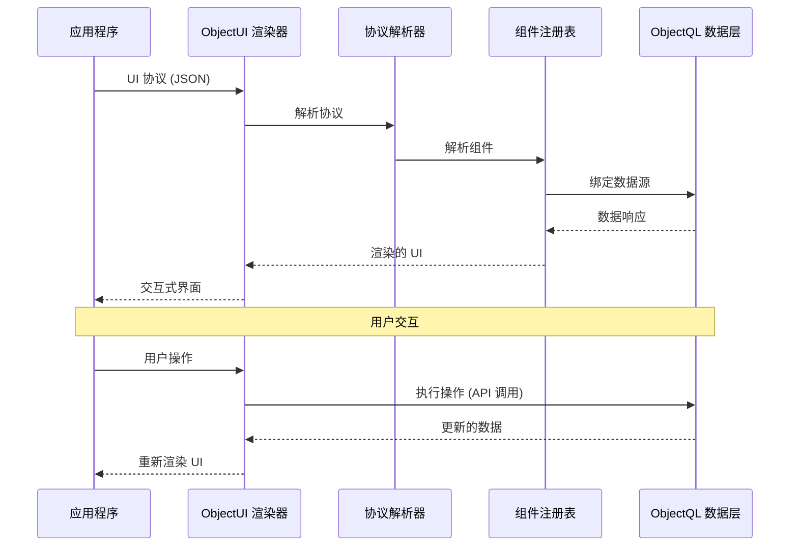

# ObjectUI: 声明式界面引擎

ObjectUI 是 ObjectStack 的**表现层协议**。它定义了一套基于 JSON 的规范,用于声明式地描述用户界面,将 UI 作为数据而非代码。

## 规范概述

ObjectUI **不是一个组件库**——它是一个**协议规范**及其渲染器实现。该协议定义了:

1. **组件协议**: UI 元素的 JSON 模式 (表单、表格、网格、页面)
2. **操作协议**: 声明式事件处理器 (API 调用、导航、对话框)
3. **数据绑定协议**: 与 ObjectQL 数据层的自动同步
4. **渲染器接口**: 框架实现的标准化契约

### 核心设计原则

**协议中立性**: ObjectUI 规范与渲染器无关。同一协议可以被以下渲染器渲染:
- React 渲染器 (参考实现)
- Vue 渲染器 (计划中)
- Flutter 渲染器 (计划中)
- 原生移动端渲染器 (计划中)

**声明式而非命令式**: ObjectUI 描述*要渲染什么*,而非*如何渲染*。协议中没有 `onClick` 回调或 `useState` 钩子——只有数据结构。

**数据驱动**: UI 组件绑定到 ObjectQL 数据源。状态管理、验证和更新由渲染器自动处理。

**框架无关**: 协议从不假设 React、Vue 或任何特定框架。渲染器将协议转换为框架特定的实现。
---

## 协议架构



### 协议流程

1. **协议输入**: 应用程序提供 JSON UI 协议
2. **协议解析**: 渲染器解析并验证协议结构
3. **组件解析**: 将协议类型映射到框架组件
4. **数据绑定**: 将组件连接到 ObjectQL 数据源
5. **渲染**: 渲染框架特定的组件
6. **操作处理**: 用户交互触发协议定义的操作
7. **状态更新**: 数据变化触发自动重新渲染

这种架构确保了**完全的框架独立性**——从 React 切换到 Vue 无需任何协议更改。

---

## 核心协议组件

### 1. 组件协议

将 UI 元素定义为声明式 JSON 规范:

```typescript
interface ComponentProtocol {
  type: ComponentType              // 组件标识符
  id?: string                      // 唯一组件 ID
  name?: string                    // 字段名称 (用于表单输入)
  label?: string                   // 显示标签
  visible?: boolean | Expression   // 条件可见性
  disabled?: boolean | Expression  // 条件禁用状态
  style?: StyleProperties          // 自定义样式
  children?: ComponentProtocol[]   // 嵌套组件
}

type ComponentType =
  // 容器组件
  | 'page' | 'card' | 'grid' | 'form' | 'table' | 'list'
  // 输入组件
  | 'input' | 'textarea' | 'select' | 'multiselect' | 'checkbox' | 'switch'
  | 'datepicker' | 'timepicker' | 'datetimepicker'
  | 'number' | 'currency' | 'percent'
  // 显示组件
  | 'text' | 'heading' | 'image' | 'icon' | 'badge' | 'avatar'
  // 操作组件
  | 'button' | 'link' | 'dropdown'
```

**示例: 页面组件**:
```json
{
  "type": "page",
  "title": "客户管理",
  "description": "管理客户记录",
  "body": {
    "type": "grid",
    "columns": 2,
    "gap": 4,
    "items": [
      {
        "type": "card",
        "title": "客户列表",
        "body": {
          "type": "table",
          "object": "customers",
          "columns": [
            { "field": "name", "label": "姓名", "sortable": true },
            { "field": "email", "label": "邮箱" },
            { "field": "status", "label": "状态", "type": "badge" }
          ]
        }
      },
      {
        "type": "card",
        "title": "添加客户",
        "body": {
          "type": "form",
          "object": "customers",
          "action": "insert",
          "fields": [
            { "name": "name", "type": "input", "required": true },
            { "name": "email", "type": "input", "inputType": "email" },
            { "name": "status", "type": "select", "options": ["active", "inactive"] }
          ]
        }
      }
    ]
  }
}
```

### 2. 表单协议

具有验证和数据绑定的丰富表单定义:

```typescript
interface FormProtocol extends ComponentProtocol {
  type: 'form'
  object?: string                  // ObjectQL 对象名称
  api?: string                     // 自定义 API 端点
  method?: 'GET' | 'POST' | 'PUT' | 'PATCH' | 'DELETE'
  action?: 'insert' | 'update' | 'delete'  // ObjectQL 操作
  fields: FieldProtocol[]          // 表单字段
  initialValues?: Record<string, any>      // 默认值
  submitText?: string              // 提交按钮标签
  resetText?: string               // 重置按钮标签
  onSuccess?: ActionProtocol       // 成功处理器
  onError?: ActionProtocol         // 错误处理器
}

interface FieldProtocol extends ComponentProtocol {
  name: string                     // 字段标识符
  type: ComponentType              // 输入类型
  label?: string                   // 显示标签
  placeholder?: string             // 占位符文本
  required?: boolean               // 验证规则
  validation?: ValidationRule[]    // 自定义验证
  dependsOn?: string               // 依赖字段
  visible?: Expression             // 条件可见性
  disabled?: Expression            // 条件禁用状态
}

interface ValidationRule {
  type: 'required' | 'email' | 'url' | 'min' | 'max' | 'pattern' | 'custom'
  value?: any                      // 规则参数
  message: string                  // 错误消息
}
```

**示例: 复杂表单**:
```json
{
  "type": "form",
  "object": "orders",
  "action": "insert",
  "fields": [
    {
      "name": "customer",
      "type": "select",
      "label": "客户",
      "required": true,
      "api": "/api/customers",
      "displayField": "name",
      "valueField": "id"
    },
    {
      "name": "order_date",
      "type": "datepicker",
      "label": "订单日期",
      "defaultValue": "{{$now}}",
      "required": true
    },
    {
      "name": "items",
      "type": "table",
      "label": "订单项",
      "columns": [
        { 
          "field": "product", 
          "type": "select", 
          "api": "/api/products",
          "required": true 
        },
        { "field": "quantity", "type": "number", "min": 1 },
        { 
          "field": "unit_price", 
          "type": "currency", 
          "disabled": true,
          "formula": "{{product.price}}"
        },
        { 
          "field": "total", 
          "type": "currency", 
          "disabled": true,
          "formula": "{{quantity * unit_price}}"
        }
      ]
    },
    {
      "name": "grand_total",
      "type": "currency",
      "label": "总计",
      "disabled": true,
      "formula": "{{SUM(items, 'total')}}"
    }
  ],
  "submitText": "创建订单",
  "onSuccess": {
    "type": "navigate",
    "path": "/orders/{{response.id}}"
  }
}
```

### 3. 表格协议

具有排序、过滤、分页的数据网格:

```typescript
interface TableProtocol extends ComponentProtocol {
  type: 'table'
  object?: string                  // ObjectQL 对象名称
  api?: string                     // 自定义 API 端点
  columns: ColumnProtocol[]        // 列定义
  filters?: FilterProtocol[]       // 预定义过滤器
  searchable?: boolean             // 启用搜索栏
  sortable?: boolean               // 启用列排序
  paginated?: boolean              // 启用分页
  pageSize?: number                // 每页行数
  selectable?: boolean             // 启用行选择
  actions?: ActionProtocol[]       // 行操作
  bulkActions?: ActionProtocol[]   // 批量操作
}

interface ColumnProtocol {
  field: string                    // 数据字段名称
  label: string                    // 列标题
  type?: 'text' | 'number' | 'date' | 'boolean' | 'badge' | 'avatar' | 'custom'
  sortable?: boolean               // 启用排序
  filterable?: boolean             // 启用过滤
  width?: string                   // 列宽度
  align?: 'left' | 'center' | 'right'
  formatter?: Expression           // 自定义格式化
  visible?: boolean | Expression   // 条件可见性
}
```

**示例: 高级表格**:
```json
{
  "type": "table",
  "object": "products",
  "columns": [
    { 
      "field": "image", 
      "label": "图片", 
      "type": "avatar",
      "width": "60px"
    },
    { 
      "field": "name", 
      "label": "产品名称", 
      "sortable": true,
      "filterable": true
    },
    { 
      "field": "category", 
      "label": "类别", 
      "type": "badge",
      "sortable": true
    },
    { 
      "field": "price", 
      "label": "价格", 
      "type": "currency",
      "sortable": true,
      "align": "right"
    },
    { 
      "field": "stock", 
      "label": "库存", 
      "type": "number",
      "sortable": true,
      "align": "right",
      "formatter": "{{value > 10 ? '有货' : '库存不足'}}"
    },
    {
      "field": "status",
      "label": "状态",
      "type": "badge",
      "filterable": true
    }
  ],
  "filters": [
    { "field": "status", "operator": "eq", "value": "active" }
  ],
  "searchable": true,
  "sortable": true,
  "paginated": true,
  "pageSize": 50,
  "selectable": true,
  "actions": [
    {
      "label": "编辑",
      "type": "navigate",
      "path": "/products/{{row.id}}/edit"
    },
    {
      "label": "删除",
      "type": "api_request",
      "api": "/api/products/{{row.id}}",
      "method": "DELETE",
      "confirm": {
        "title": "删除产品",
        "message": "确定要删除 {{row.name}} 吗?"
      }
    }
  ],
  "bulkActions": [
    {
      "label": "激活",
      "type": "api_request",
      "api": "/api/products/bulk-update",
      "method": "PATCH",
      "data": { "status": "active" }
    },
    {
      "label": "停用",
      "type": "api_request",
      "api": "/api/products/bulk-update",
      "method": "PATCH",
      "data": { "status": "inactive" }
    }
  ]
}
```

### 4. 操作协议

无需命令式代码的声明式事件处理:

```typescript
interface ActionProtocol {
  type: ActionType
  label?: string                   // 按钮/链接文本
  icon?: string                    // 图标名称
  confirm?: ConfirmDialog          // 确认对话框
  condition?: Expression           // 条件执行
}

type ActionType =
  | APIRequestAction
  | NavigateAction
  | DialogAction
  | ToastAction
  | RefreshAction
  | CustomAction

interface APIRequestAction extends ActionProtocol {
  type: 'api_request'
  api: string                      // API 端点
  method?: 'GET' | 'POST' | 'PUT' | 'PATCH' | 'DELETE'
  data?: Record<string, any>       // 请求主体
  params?: Record<string, any>     // 查询参数
  onSuccess?: ActionProtocol       // 成功处理器
  onError?: ActionProtocol         // 错误处理器
}

interface NavigateAction extends ActionProtocol {
  type: 'navigate'
  path: string                     // 导航路径
  target?: '_self' | '_blank'      // 目标窗口
}

interface DialogAction extends ActionProtocol {
  type: 'dialog'
  title: string                    // 对话框标题
  content: ComponentProtocol       // 对话框主体
  width?: string                   // 对话框宽度
  actions?: ActionProtocol[]       // 对话框操作
}

interface ToastAction extends ActionProtocol {
  type: 'toast'
  message: string                  // 提示消息
  variant?: 'success' | 'error' | 'warning' | 'info'
  duration?: number                // 显示持续时间 (ms)
}
```

**示例: 操作链**:
```json
{
  "type": "button",
  "label": "批准订单",
  "action": {
    "type": "api_request",
    "api": "/api/orders/{{order.id}}/approve",
    "method": "POST",
    "confirm": {
      "title": "批准订单",
      "message": "确定要批准订单 #{{order.order_number}} 吗?"
    },
    "onSuccess": {
      "type": "toast",
      "message": "订单已成功批准",
      "variant": "success",
      "next": {
        "type": "navigate",
        "path": "/orders"
      }
    },
    "onError": {
      "type": "toast",
      "message": "批准订单失败: {{error.message}}",
      "variant": "error"
    }
  }
}
```

### 5. 表达式语言

动态值和条件逻辑:

```typescript
type Expression = string  // 格式: {{expression}}

// 变量引用
"{{field_name}}"                   // 当前表单字段
"{{row.field_name}}"              // 表格行数据
"{{$user.id}}"                    // 当前用户
"{{$now}}"                        // 当前时间戳
"{{$env.API_URL}}"                // 环境变量

// 运算符
"{{value > 10}}"                  // 比较
"{{status === 'active'}}"         // 相等
"{{price * quantity}}"            // 算术
"{{firstname + ' ' + lastname}}"  // 连接

// 函数
"{{SUM(items, 'total')}}"         // 数组聚合
"{{FILTER(items, 'status eq active')}}"  // 数组过滤
"{{FORMAT(date, 'YYYY-MM-DD')}}"  // 格式化
"{{LOOKUP('products', product_id, 'name')}}"  // 数据查找

// 条件
"{{status === 'active' ? '活跃' : '不活跃'}}"  // 三元运算符
```

**示例: 动态表单**:
```json
{
  "type": "form",
  "fields": [
    {
      "name": "customer_type",
      "type": "select",
      "options": ["individual", "business"]
    },
    {
      "name": "first_name",
      "type": "input",
      "label": "名",
      "visible": "{{customer_type === 'individual'}}",
      "required": "{{customer_type === 'individual'}}"
    },
    {
      "name": "last_name",
      "type": "input",
      "label": "姓",
      "visible": "{{customer_type === 'individual'}}",
      "required": "{{customer_type === 'individual'}}"
    },
    {
      "name": "company_name",
      "type": "input",
      "label": "公司名称",
      "visible": "{{customer_type === 'business'}}",
      "required": "{{customer_type === 'business'}}"
    },
    {
      "name": "tax_id",
      "type": "input",
      "label": "税号",
      "visible": "{{customer_type === 'business'}}",
      "validation": [
        {
          "type": "pattern",
          "value": "^[0-9]{9}$",
          "message": "税号必须是9位数字"
        }
      ]
    }
  ]
}
```

---

## 渲染器接口

ObjectUI 定义了一个**标准化的渲染器契约**,所有框架实现都必须支持:

```typescript
interface ObjectUIRenderer {
  // 核心渲染
  render(protocol: ComponentProtocol, container: HTMLElement): RenderedComponent
  unmount(component: RenderedComponent): void
  
  // 组件注册
  registerComponent(type: ComponentType, implementation: ComponentImplementation): void
  
  // 操作处理
  registerActionHandler(type: ActionType, handler: ActionHandler): void
  
  // 数据绑定
  bindDataSource(component: RenderedComponent, source: DataSource): void
  
  // 主题管理
  setTheme(theme: ThemeConfig): void
  
  // 生命周期钩子
  onMount?(component: RenderedComponent): void
  onUpdate?(component: RenderedComponent, changes: PropertyChanges): void
  onUnmount?(component: RenderedComponent): void
}
```

### 支持的渲染器

官方参考实现:

| 渲染器 | 状态 | 框架 |
|----------|--------|-----------|
| **@objectui/react-renderer** | ✅ 稳定 | React 18+ |
| **@objectui/vue-renderer** | 🚧 计划中 | Vue 3+ |
| **@objectui/flutter-renderer** | 🚧 计划中 | Flutter |
| **@objectui/native-renderer** | 🚧 计划中 | React Native |

欢迎社区渲染器——实现 `ObjectUIRenderer` 接口并发布为 npm 包。

---

## 高级功能

### 组件组合

从简单组件构建复杂 UI:

```json
{
  "type": "page",
  "title": "仪表板",
  "body": {
    "type": "grid",
    "columns": 3,
    "items": [
      {
        "type": "card",
        "title": "总收入",
        "body": {
          "type": "text",
          "value": "{{SUM(orders, 'total_amount')}}",
          "style": { "fontSize": "2rem", "fontWeight": "bold" }
        }
      },
      {
        "type": "card",
        "title": "活跃用户",
        "body": {
          "type": "text",
          "value": "{{COUNT(users, 'status eq active')}}",
          "style": { "fontSize": "2rem", "fontWeight": "bold" }
        }
      },
      {
        "type": "card",
        "title": "待处理订单",
        "body": {
          "type": "text",
          "value": "{{COUNT(orders, 'status eq pending')}}",
          "style": { "fontSize": "2rem", "fontWeight": "bold" }
        }
      }
    ]
  }
}
```

### 响应式布局

自动适配屏幕尺寸:

```json
{
  "type": "grid",
  "columns": { "mobile": 1, "tablet": 2, "desktop": 4 },
  "gap": { "mobile": 2, "tablet": 3, "desktop": 4 },
  "items": [...]
}
```

### 自定义组件

扩展组件库:

```typescript
// 在渲染器中注册自定义组件
renderer.registerComponent('chart', ChartComponent)

// 在协议中使用
{
  "type": "chart",
  "chartType": "line",
  "data": "{{monthly_revenue}}",
  "xAxis": "month",
  "yAxis": "revenue"
}
```

### 主题系统

无需更改结构即可自定义外观:

```typescript
renderer.setTheme({
  colors: {
    primary: '#007bff',
    secondary: '#6c757d',
    success: '#28a745',
    error: '#dc3545'
  },
  fonts: {
    body: 'Inter, sans-serif',
    heading: 'Poppins, sans-serif'
  },
  spacing: {
    unit: 8  // 8px 基本单位
  }
})
```

---

## 使用场景

### 1. 管理面板和仪表板

**场景**: 无需编写 UI 代码即可构建完整的管理界面

**协议**:
```json
{
  "type": "page",
  "title": "用户管理",
  "body": {
    "type": "table",
    "object": "users",
    "columns": [
      { "field": "avatar", "type": "avatar" },
      { "field": "name", "sortable": true },
      { "field": "email", "sortable": true },
      { "field": "role", "type": "badge" },
      { "field": "created_at", "type": "date", "sortable": true }
    ],
    "actions": [
      { "label": "编辑", "type": "navigate", "path": "/users/{{row.id}}/edit" },
      { "label": "删除", "type": "api_request", "api": "/api/users/{{row.id}}", "method": "DELETE" }
    ]
  }
}
```

**优势**:
- 不需要 React/Vue 代码
- 自动 CRUD 操作
- 内置分页、排序、过滤
- 可以存储在数据库中并进行版本控制

### 2. 动态表单

**场景**: 根据配置或用户权限自适应的表单

**协议**:
```json
{
  "type": "form",
  "object": "leads",
  "fields": [
    { "name": "name", "type": "input", "required": true },
    { "name": "email", "type": "input", "inputType": "email" },
    { 
      "name": "country", 
      "type": "select", 
      "api": "/api/countries" 
    },
    { 
      "name": "state", 
      "type": "select", 
      "api": "/api/states?country={{country}}",
      "visible": "{{country !== null}}",
      "dependsOn": "country"
    },
    {
      "name": "budget",
      "type": "currency",
      "visible": "{{$user.role === 'sales' || $user.role === 'admin'}}"
    }
  ]
}
```

**优势**:
- 表单结构作为数据存储
- 无需代码部署即可轻松修改
- 基于权限的字段可见性
- 依赖字段逻辑

### 3. 低代码 / 无代码平台

**场景**: 使非开发人员能够构建界面

**实现**:
```typescript
// 在数据库中存储 UI 协议
await db.insert({
  object: 'pages',
  action: 'insert',
  data: {
    name: 'customer_dashboard',
    protocol: {
      type: 'page',
      title: '客户仪表板',
      body: { ... }
    }
  }
})

// 获取并渲染
const page = await db.query({
  object: 'pages',
  filters: [{ field: 'name', operator: 'eq', value: 'customer_dashboard' }]
})

return <ObjectUIRenderer protocol={page[0].protocol} />
```

**优势**:
- UI 定义像数据一样可版本控制
- 可以构建可视化 UI 构建器
- AI 可以生成协议
- 易于进行 A/B 测试 UI 变体

### 4. 移动应用

**场景**: 相同协议,不同渲染器

**React Native**:
```tsx
import { ObjectUIRenderer } from '@objectui/native-renderer'

function App() {
  return <ObjectUIRenderer protocol={uiProtocol} />
}
```

**Flutter**:
```dart
import 'package:objectui_flutter/objectui_flutter.dart';

Widget build(BuildContext context) {
  return ObjectUIRenderer(protocol: uiProtocol);
}
```

**优势**:
- 编写一次 UI 协议
- 在 Web、iOS、Android 上渲染
- 跨平台行为一致
- 共享业务逻辑

---

## 学习内容

本规范文档涵盖:

- ✅ **[核心概念](/cn/docs/objectui/core-concepts)** - 声明式 UI、数据绑定、组件组合
- ✅ **[组件规范](/cn/docs/objectui/component-spec)** - 所有组件的完整 JSON 模式参考
- ✅ **[操作](/cn/docs/objectui/actions)** - 操作协议规范 (API、导航、对话框)
- ✅ **[渲染器使用](/cn/docs/objectui/renderer-usage)** - 在 React/Vue/Flutter 应用中集成 ObjectUI
- ✅ **[主题](/cn/docs/objectui/theming)** - 自定义外观和样式
- ✅ **[最佳实践](/cn/docs/objectui/best-practices)** - 设计模式和优化策略

---

## 快速入门示例

这是一个完整的端到端示例:

```tsx
import { ObjectUIRenderer } from '@objectui/react-renderer'
import '@objectui/react-renderer/styles.css'

// 1. 定义 UI 协议
const todoApp = {
  type: 'page',
  title: '待办事项应用',
  body: {
    type: 'grid',
    columns: 2,
    gap: 4,
    items: [
      // 添加待办事项表单
      {
        type: 'card',
        title: '添加任务',
        body: {
          type: 'form',
          object: 'todos',
          action: 'insert',
          fields: [
            {
              name: 'title',
              type: 'input',
              label: '任务名称',
              required: true
            },
            {
              name: 'priority',
              type: 'select',
              label: '优先级',
              options: ['high', 'medium', 'low'],
              defaultValue: 'medium'
            },
            {
              name: 'due_date',
              type: 'datepicker',
              label: '截止日期'
            }
          ],
          submitText: '添加任务',
          onSuccess: {
            type: 'toast',
            message: '任务创建成功',
            variant: 'success'
          }
        }
      },
      // 待办事项列表表格
      {
        type: 'card',
        title: '我的任务',
        body: {
          type: 'table',
          object: 'todos',
          filters: [
            { field: 'completed', operator: 'eq', value: false }
          ],
          columns: [
            { field: 'title', label: '任务', sortable: true },
            { field: 'priority', label: '优先级', type: 'badge' },
            { field: 'due_date', label: '截止日期', type: 'date', sortable: true },
            { field: 'completed', label: '完成', type: 'boolean' }
          ],
          actions: [
            {
              label: '完成',
              type: 'api_request',
              api: '/api/todos/{{row.id}}',
              method: 'PATCH',
              data: { completed: true }
            },
            {
              label: '删除',
              type: 'api_request',
              api: '/api/todos/{{row.id}}',
              method: 'DELETE',
              confirm: {
                title: '删除任务',
                message: '确定吗?'
              }
            }
          ]
        }
      }
    ]
  }
}

// 2. 渲染
function App() {
  return <ObjectUIRenderer protocol={todoApp} />
}

export default App
```

这创建了一个功能齐全的待办事项应用,具有:
- 添加任务的表单
- 显示活动任务的表格
- 完成和删除操作
- 从 ObjectQL 自动获取数据
- 不需要命令式 React 代码

---

## 设计原理

### 为什么使用 JSON 协议?

**React/Vue 组件是实现细节**。真正的 UI 是 JSON 协议:

- **框架无关**: 相同协议可在 React、Vue、Flutter 中渲染
- **可版本控制**: UI 作为结构化数据存储在数据库中
- **AI 友好**: LLM 擅长生成 JSON 结构
- **可移植**: 在项目间导出/导入 UI 定义

### 为什么是声明式?

**命令式 UI 代码脆弱且冗长**。声明式协议提供:

- **可维护性**: 更改结构,而非代码
- **一致性**: 所有表单/表格遵循相同模式
- **可测试性**: 协议是数据,易于验证
- **组合性**: 从简单构建块构建复杂 UI

### 为什么是数据驱动?

**手动状态管理容易出错**。自动数据绑定提供:

- **一致性**: UI 始终反映数据状态
- **更少代码**: 无需 useState、useEffect 或状态管理库
- **性能**: 由渲染器处理智能差异和更新
- **简单性**: 开发人员专注于结构,而非同步

---

## 规范合规性

ObjectUI 渲染器必须通过 **ObjectUI 合规性测试套件**:

- ✅ 协议解析和验证
- ✅ 所有组件类型正确渲染
- ✅ 操作执行和错误处理
- ✅ 数据绑定和更新
- ✅ 表达式求值
- ✅ 条件可见性和禁用状态
- ✅ 表单验证和提交
- ✅ 表格排序、过滤、分页
- ✅ 响应式布局

参考实现:
- **React**: [@objectui/react-renderer](https://github.com/objectstack-ai/objectui) (React 18+)
- **Vue**: [@objectui/vue-renderer](https://github.com/objectstack-ai/objectui-vue) (计划中)
- **Flutter**: [objectui_flutter](https://github.com/objectstack-ai/objectui-flutter) (计划中)

---

## 下一步

1. **理解核心概念**: 阅读[核心概念](/cn/docs/objectui/core-concepts)以学习声明式 UI 原则
2. **学习组件协议**: 查看[组件规范](/cn/docs/objectui/component-spec)获取完整参考
3. **使用渲染器构建**: 使用[渲染器使用](/cn/docs/objectui/renderer-usage)在应用中集成 ObjectUI
4. **自定义外观**: 探索[主题](/cn/docs/objectui/theming)了解样式和自定义

有关理念背景,请参阅:
- **[宣言](/cn/docs/concepts/manifesto)** - 为什么 ObjectUI 是协议驱动和框架无关的
- **[架构](/cn/docs/concepts/architecture)** - ObjectUI 如何融入 ObjectStack 生态系统
