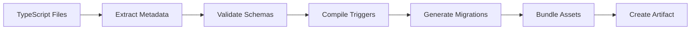

# ObjectStack CLI Specification

The ObjectStack CLI (`@objectstack/cli`) is a command-line tool that streamlines enterprise application development using the ObjectStack framework. It provides scaffolding, build, development server, and deployment utilities.

## Installation

### Global Installation

```bash
npm install -g @objectstack/cli
# or
pnpm add -g @objectstack/cli
```

### Project Scaffolding

Create a new ObjectStack application:

```bash
npm create objectstack-app my-erp
# or
pnpm create objectstack-app my-erp
```

---

## Command Reference

### ostack init

Initialize a new ObjectStack project in the current directory.

#### Usage

```bash
ostack init [options]
```

#### Options

| Option | Description | Default |
|--------|-------------|---------|
| `--name <name>` | Project name | Current directory name |
| `--template <template>` | Project template | `standard` |
| `--database <db>` | Database adapter | `postgresql` |
| `--ui <framework>` | UI framework | `react` |
| `--git` | Initialize Git repository | `true` |

#### Templates

* `standard` - Full-featured enterprise template
* `minimal` - Minimal setup with basic structure
* `crm` - Pre-configured CRM template
* `erp` - Pre-configured ERP template

#### Example

```bash
ostack init --name my-company-erp --template erp --database postgresql
```

#### Generated Structure

```
my-company-erp/
├── src/
│   ├── objects/
│   │   └── .gitkeep
│   ├── workflows/
│   │   └── .gitkeep
│   ├── permissions/
│   │   └── .gitkeep
│   └── ui/
│       └── .gitkeep
├── tests/
│   └── .gitkeep
├── objectstack.config.ts
├── package.json
├── tsconfig.json
├── .gitignore
└── README.md
```

---

### ostack generate (g)

Generate boilerplate code for objects, workflows, and other components.

#### Usage

```bash
ostack generate <type> <name> [options]
# Alias
ostack g <type> <name> [options]
```

#### Types

##### Object

Generate a new business object:

```bash
ostack g object contract
# or
ostack g resource contract
```

**Generated Files:**

```
src/
└── objects/
    ├── contract.ts
    └── contract.test.ts
```

**Options:**

| Option | Description |
|--------|-------------|
| `--fields <fields>` | Comma-separated field definitions |
| `--with-triggers` | Include trigger template |
| `--with-permissions` | Include permission template |

**Example:**

```bash
ostack g object invoice --fields "number:string,amount:currency,date:datetime" --with-triggers
```

##### Workflow

Generate a workflow state machine:

```bash
ostack g workflow order-approval
```

**Generated Files:**

```
src/
└── workflows/
    ├── order-approval.ts
    └── order-approval.test.ts
```

##### Permission

Generate a permission role definition:

```bash
ostack g permission sales-manager
```

##### UI Layout

Generate a UI layout definition:

```bash
ostack g layout contract-form
```

**Generated Files:**

```
src/
└── ui/
    └── contract-form.json
```

##### Migration

Generate a database migration file:

```bash
ostack g migration add-tax-field-to-invoice
```

**Generated Files:**

```
migrations/
└── 20260122_add_tax_field_to_invoice.ts
```

---

### ostack dev

Start the development server with hot reload.

#### Usage

```bash
ostack dev [options]
```

#### Options

| Option | Description | Default |
|--------|-------------|---------|
| `--port <port>` | Server port | `3000` |
| `--host <host>` | Server host | `localhost` |
| `--open` | Open browser automatically | `false` |
| `--database <url>` | Database connection URL | From config |
| `--watch` | Watch for file changes | `true` |

#### Example

```bash
ostack dev --port 8080 --open
```

#### Features

* **Hot Module Replacement (HMR)**: Code changes reflect immediately
* **Auto-Rebuild**: Recompiles metadata on file save
* **Live Database Sync**: Schema changes auto-migrate during development
* **Error Overlay**: Displays compilation errors in the UI

---

### ostack build

Build the application for production deployment.

#### Usage

```bash
ostack build [options]
```

#### Options

| Option | Description | Default |
|--------|-------------|---------|
| `--output <dir>` | Output directory | `build/` |
| `--target <target>` | Build target | `docker` |
| `--minify` | Minify output | `true` |
| `--sourcemap` | Generate source maps | `false` |

#### Targets

* `docker` - Docker image with embedded runtime
* `npm` - NPM package for Node.js deployment
* `static` - Static files for serverless deployment

#### Example

```bash
ostack build --target docker --output ./dist
```

#### Build Process



#### Output Structure

```
build/
├── metadata/
│   ├── objects/
│   │   ├── contract.json
│   │   └── customer.json
│   └── workflows/
│       └── order-approval.json
├── triggers/
│   ├── contract.js
│   └── customer.js
├── migrations/
│   └── 001_initial_schema.sql
├── kernel/
│   └── objectstack-runtime.js
├── Dockerfile
└── manifest.json
```

---

### ostack migrate

Run database migrations.

#### Usage

```bash
ostack migrate [command] [options]
```

#### Commands

##### up

Apply pending migrations:

```bash
ostack migrate up
```

**Options:**

| Option | Description |
|--------|-------------|
| `--steps <n>` | Apply only N migrations |
| `--to <version>` | Migrate to specific version |

##### down

Rollback migrations:

```bash
ostack migrate down [--steps 1]
```

##### status

Check migration status:

```bash
ostack migrate status
```

**Output:**

```
┌─────────────────────────────────┬──────────┐
│ Migration                       │ Status   │
├─────────────────────────────────┼──────────┤
│ 001_initial_schema              │ Applied  │
│ 002_add_customer_fields         │ Applied  │
│ 003_create_order_table          │ Pending  │
└─────────────────────────────────┴──────────┘
```

##### create

Create a new migration:

```bash
ostack migrate create add_tax_calculation
```

---

### ostack test

Run unit and integration tests.

#### Usage

```bash
ostack test [pattern] [options]
```

#### Options

| Option | Description | Default |
|--------|-------------|---------|
| `--watch` | Watch mode | `false` |
| `--coverage` | Generate coverage report | `false` |
| `--verbose` | Verbose output | `false` |

#### Example

```bash
ostack test src/objects/contract.test.ts --coverage
```

---

### ostack lint

Lint TypeScript code and metadata definitions.

#### Usage

```bash
ostack lint [options]
```

#### Options

| Option | Description | Default |
|--------|-------------|---------|
| `--fix` | Auto-fix issues | `false` |
| `--strict` | Strict mode | `false` |

#### Checks

* TypeScript compilation errors
* ESLint violations
* Metadata schema validation
* Naming convention compliance
* Security vulnerabilities in triggers

---

### ostack deploy

Deploy the application to various targets.

#### Usage

```bash
ostack deploy [target] [options]
```

#### Targets

##### Docker

```bash
ostack deploy docker --registry ghcr.io/myorg/my-erp --tag v1.0.0
```

**Options:**

| Option | Description |
|--------|-------------|
| `--registry <url>` | Container registry URL |
| `--tag <tag>` | Image tag |
| `--push` | Push to registry |

##### Kubernetes

```bash
ostack deploy k8s --namespace production --replicas 3
```

**Options:**

| Option | Description |
|--------|-------------|
| `--namespace <ns>` | Kubernetes namespace |
| `--replicas <n>` | Number of replicas |
| `--config <file>` | Kubernetes config file |

##### Cloud

```bash
ostack deploy cloud --provider aws --region us-east-1
```

**Providers:**

* `aws` - AWS ECS/Fargate
* `gcp` - Google Cloud Run
* `azure` - Azure Container Instances

---

### ostack db

Database management utilities.

#### Usage

```bash
ostack db <command> [options]
```

#### Commands

##### seed

Seed the database with sample data:

```bash
ostack db seed [--file seeds/demo-data.json]
```

##### reset

Reset the database (drop all tables):

```bash
ostack db reset [--force]
```

##### export

Export database schema and data:

```bash
ostack db export --output backup.sql
```

##### import

Import database from file:

```bash
ostack db import --file backup.sql
```

---

### ostack doctor

Diagnose common issues and verify setup.

#### Usage

```bash
ostack doctor
```

#### Checks

* Node.js version compatibility
* Database connectivity
* Required dependencies installed
* TypeScript configuration
* File permissions
* Port availability

#### Example Output

```
ObjectStack Doctor v1.0.0

✓ Node.js version (20.10.0)
✓ TypeScript installed (5.3.3)
✓ Database connection (postgresql://localhost:5432/mydb)
✓ Port 3000 available
✗ Missing dependency: @objectstack/core
  Run: npm install @objectstack/core

1 issue found. Run suggested commands to fix.
```

---

## Configuration File

### objectstack.config.ts

```typescript
import { defineConfig } from '@objectstack/cli';

export default defineConfig({
  // Project metadata
  name: 'my-erp',
  version: '1.0.0',
  
  // Database configuration
  database: {
    adapter: 'postgresql',
    url: process.env.DATABASE_URL || 'postgresql://localhost:5432/mydb',
    pool: {
      min: 2,
      max: 10
    },
    migrations: {
      directory: './migrations',
      tableName: '_migrations'
    }
  },
  
  // Build configuration
  build: {
    outDir: './build',
    sourcemap: true,
    minify: true,
    target: 'docker'
  },
  
  // Development server
  dev: {
    port: 3000,
    host: 'localhost',
    open: false,
    hotReload: true
  },
  
  // Runtime configuration
  runtime: {
    logLevel: 'info',
    maxUploadSize: '10mb',
    cors: {
      enabled: true,
      origins: ['http://localhost:3000']
    }
  },
  
  // Plugin system
  plugins: [
    // Add custom plugins
  ]
});
```

---

## Environment Variables

| Variable | Description | Default |
|----------|-------------|---------|
| `DATABASE_URL` | Database connection string | - |
| `NODE_ENV` | Environment (development/production) | `development` |
| `PORT` | Server port | `3000` |
| `LOG_LEVEL` | Logging level | `info` |
| `SECRET_KEY` | Encryption key for secrets | - |

---

## CI/CD Integration

### GitHub Actions

```yaml
name: Build and Deploy

on:
  push:
    branches: [main]

jobs:
  build:
    runs-on: ubuntu-latest
    steps:
      - uses: actions/checkout@v3
      
      - name: Setup Node.js
        uses: actions/setup-node@v3
        with:
          node-version: 20
      
      - name: Install dependencies
        run: npm ci
      
      - name: Run tests
        run: ostack test --coverage
      
      - name: Build
        run: ostack build --target docker
      
      - name: Deploy
        run: ostack deploy docker --push
        env:
          DOCKER_REGISTRY: ${{ secrets.DOCKER_REGISTRY }}
```

### GitLab CI

```yaml
stages:
  - build
  - test
  - deploy

build:
  stage: build
  script:
    - npm ci
    - ostack build

test:
  stage: test
  script:
    - ostack test --coverage

deploy:
  stage: deploy
  script:
    - ostack deploy docker --push
  only:
    - main
```

---

## Next Steps

* **[SDK Reference](../sdk)**: Learn the ObjectStack SDK API
* **[Deployment Guide](../deployment)**: Deploy to production
* **[Best Practices](../../guides/best-practices)**: Development guidelines

:::tip Pro Tip
Use `ostack doctor` regularly to catch configuration issues early. Add it to your pre-commit hooks for automated checks.
:::
