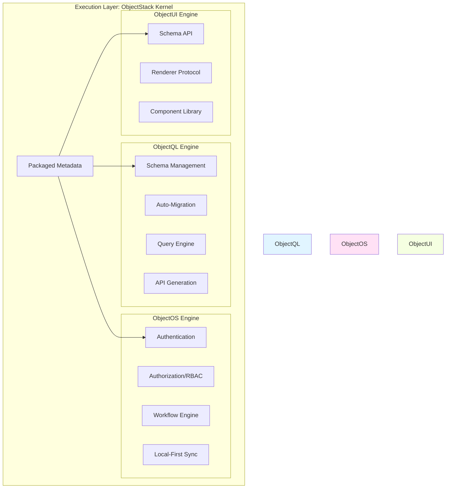
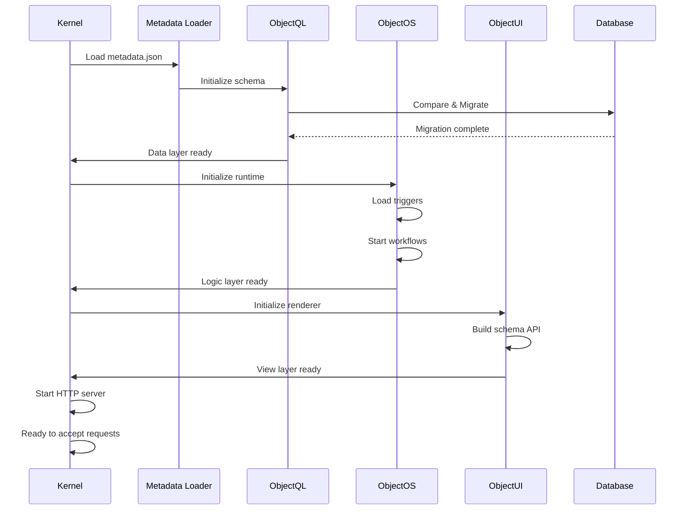
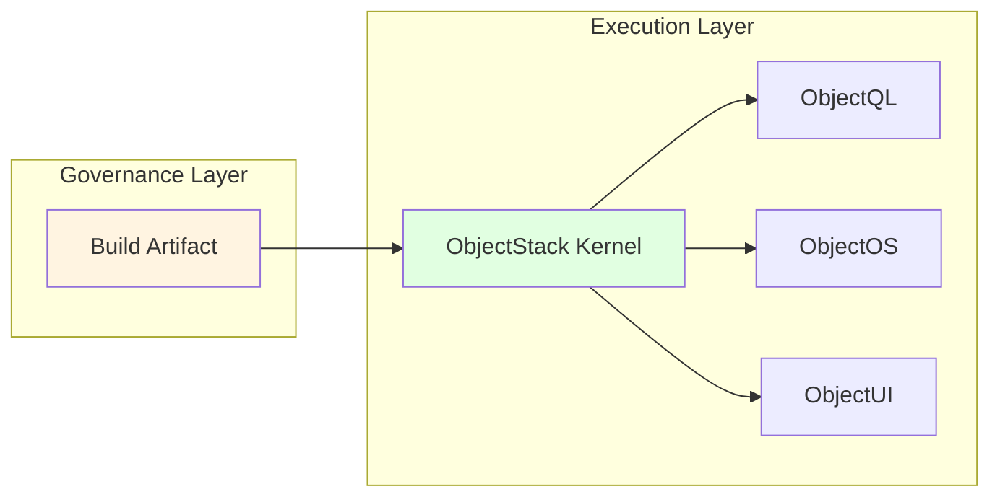

# Execution Layer: ObjectStack Kernel

**"Self-Powered Monolithic Engine"**

The Execution Layer is the runtime core delivered to customers—a standard **Docker Image** or **NPM Package** that runs on their infrastructure. This layer contains the unified "Trinity" engine that executes the metadata and business logic defined in the Creator Layer.

## Overview

The Execution Layer is where your application comes to life. It's a self-contained runtime that:

* **Reads Metadata**: Loads the packaged business definitions
* **Manages Data**: Handles database operations and migrations
* **Executes Logic**: Runs triggers, workflows, and automation
* **Renders UI**: Serves interfaces to frontend clients

## Core Philosophy

> "Self-Powered Monolithic Engine. Everything the application needs to run is contained in the Kernel."

This layer embodies the principle of **self-sufficiency**:
* No external configuration services required
* Automatic database synchronization on startup
* Built-in authentication and authorization
* Native support for local-first architecture

## The Trinity Architecture

The Kernel integrates three specialized engines that work together seamlessly:



## 1. ObjectQL: The Data Engine

**Automatic Database Management**

When the application starts, ObjectQL:

### Auto-Migration
* Compares metadata schema with database state
* Generates and executes `ALTER TABLE` statements
* Handles column additions, modifications, and indexes
* Ensures zero-downtime schema evolution

**Example:**
```javascript
// Metadata defines new field
{
  name: 'contract',
  fields: {
    // ... existing fields ...
    vat_amount: { type: 'currency', precision: 18, scale: 2 }
  }
}

// ObjectQL automatically executes:
// ALTER TABLE contract ADD COLUMN vat_amount DECIMAL(18,2);
```

### Auto-Generate APIs
* Creates GraphQL and REST endpoints
* Mounts routes like `/api/data/contract`
* Implements CRUD operations
* Applies permission filters

**Example Endpoints:**
```
POST   /api/data/contract/create
GET    /api/data/contract/list
GET    /api/data/contract/:id
PATCH  /api/data/contract/:id/update
DELETE /api/data/contract/:id/delete
```

### Database Agnostic
ObjectQL compiles the same metadata to:
* **PostgreSQL**: Full ACID with JSONB support
* **MySQL**: Compatible with enterprise deployments
* **SQLite**: For embedded and local-first apps
* **MongoDB**: For document-centric workloads (via adapter)

**Learn More:** **[ObjectQL Specifications](./objectql)**

## 2. ObjectOS: The Runtime Operating System

**Business Logic Orchestration**

ObjectOS manages the execution environment for your business logic:

### Logic Sandbox
* Loads and executes developer-written triggers
* Provides isolated execution contexts
* Handles errors and logging
* Manages transaction boundaries

**Example:**
```typescript
// Developer writes this trigger:
triggers: {
  afterUpdate: async ({ doc, oldDoc }) => {
    if (doc.status === 'signed' && oldDoc.status !== 'signed') {
      await sendNotification(doc.sales_rep, 'Contract signed!');
    }
  }
}

// ObjectOS ensures:
// - Trigger runs within transaction
// - Errors rollback the update
// - Logs are captured and stored
```

### Authentication & Authorization
* **RBAC** (Role-Based Access Control)
* **ACL** (Access Control Lists)
* **Row-Level Security**
* **Field-Level Permissions**

### Workflow Engine
* Finite State Machines (FSM)
* Approval processes
* Scheduled automation
* Event-driven triggers

### Local-First Synchronization
* Conflict resolution algorithms
* Offline capability
* Delta sync protocols
* Multi-device coordination

**Learn More:** **[ObjectOS Specifications](./objectos)**

## 3. ObjectUI: The View Engine

**Server-Driven Interface**

ObjectUI provides the schema and rendering instructions to frontend clients:

### Schema API
Serves `schema.json` to clients:

```json
{
  "objects": {
    "contract": {
      "fields": {
        "title": { "type": "string", "label": "Title" },
        "amount": { "type": "currency", "label": "Amount" }
      },
      "views": {
        "form": { "layout": "two-column", "fields": ["title", "amount"] },
        "list": { "columns": ["title", "amount", "status"] }
      }
    }
  }
}
```

### Renderer Integration
* **Amis**: Direct JSON-to-UI rendering
* **React**: Component props generation
* **Vue**: Template data binding
* **Flutter**: Widget tree construction

### Declarative Layouts
* Responsive grid systems
* Conditional visibility
* Dynamic validation
* Custom component slots

**Learn More:** **[ObjectUI Specifications](./objectui)**

## Deployment Models

### Docker Container

```bash
# Pull the official image
docker pull objectstack/kernel:latest

# Run with your metadata
docker run -d \
  -p 3000:3000 \
  -v ./metadata:/app/metadata \
  -e DATABASE_URL=postgres://... \
  objectstack/kernel:latest
```

### NPM Package

```bash
# Install the kernel
npm install @objectstack/kernel

# Run programmatically
node server.js
```

```javascript
// server.js
const { ObjectStackKernel } = require('@objectstack/kernel');

const kernel = new ObjectStackKernel({
  metadata: require('./metadata.json'),
  database: process.env.DATABASE_URL
});

kernel.start(3000);
```

### Kubernetes Deployment

```yaml
apiVersion: apps/v1
kind: Deployment
metadata:
  name: objectstack-app
spec:
  replicas: 3
  template:
    spec:
      containers:
      - name: kernel
        image: my-app:v1.0.0
        env:
        - name: DATABASE_URL
          valueFrom:
            secretKeyRef:
              name: db-credentials
              key: url
```

## Startup Sequence

When the Kernel starts, it follows this sequence:



## Integration Points

The Execution Layer receives artifacts from the Governance Layer:



## Engines in This Layer

* **[ObjectQL](./objectql)**: Data engine specifications
* **[ObjectOS](./objectos)**: Runtime and orchestration specifications
* **[ObjectUI](./objectui)**: View engine specifications

## Operational Characteristics

### Performance
* Sub-millisecond query planning
* Connection pooling for databases
* Horizontal scaling via replicas
* Caching at multiple levels

### Reliability
* Automatic retry on transient failures
* Circuit breakers for external services
* Graceful degradation
* Health check endpoints

### Observability
* Structured logging (JSON)
* Metrics export (Prometheus)
* Distributed tracing (OpenTelemetry)
* Real-time debugging endpoints

### Security
* TLS/SSL for all connections
* Secret management integration
* SQL injection prevention
* XSS sanitization

---

**Previous:** **[Governance Layer](../governance-layer)** - How code gets built  
**See Also:** **[Enterprise Framework](../concepts/enterprise-framework)** - Complete architecture overview
