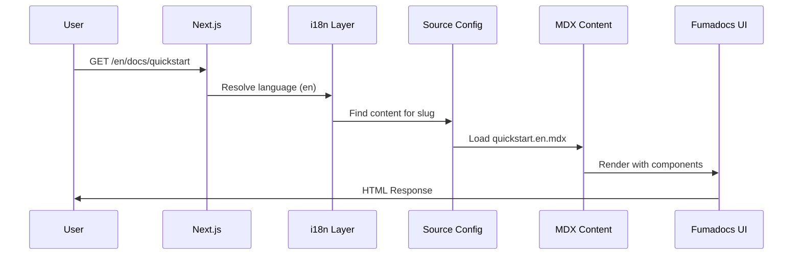
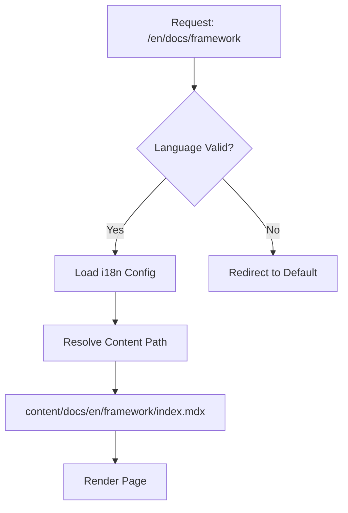
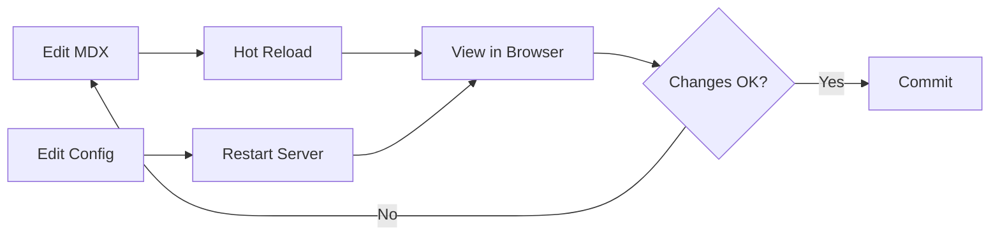

# @objectdocs/site

**Protocol-Driven Documentation Engine** — The Next.js Application Foundation for ObjectStack Documentation

---

## 1. Overview

`@objectdocs/site` is the **View Layer** of the ObjectStack Documentation Platform. It is a Next.js 16 application (App Router) that implements a **protocol-driven, configuration-first architecture** for rendering multi-language, enterprise-grade technical documentation.

This package is designed to be **framework-agnostic at the content level** — it consumes structured MDX files and JSON configurations, and renders them through a standardized UI protocol defined by [Fumadocs](https://fumadocs.vercel.app).

### Core Design Principles

1. **Protocol-Driven**: All site behavior is controlled via `objectdocs.json` configuration protocol
2. **Decoupled Runtime**: The site is orchestrated by `@objectdocs/cli`, not run directly
3. **i18n-First**: Multi-language support is built into the routing and content resolution layer
4. **Static-First**: Optimized for static site generation (SSG) with optional server components

---

## 2. Architecture

### 2.1 System Context

```mermaid
graph LR
    CLI[@objectdocs/cli<br/>Orchestrator]
    SITE[@objectdocs/site<br/>View Engine]
    CONTENT[content/docs<br/>MDX Files]
    CONFIG[objectdocs.json<br/>Configuration Protocol]
    
    CLI -->|Orchestrates| SITE
    CONTENT -->|Consumed by| SITE
    CONFIG -->|Configures| SITE
    SITE -->|Generates| OUT[out/<br/>Static Assets]
```

### 2.2 Internal Architecture

```mermaid
graph TB
    subgraph "Next.js App Router"
        LAYOUT[app/layout.tsx<br/>Root Layout]
        LANG[app/[lang]/<br/>i18n Router]
        DOCS[app/[lang]/docs/<br/>Docs Layout]
        PAGE[app/[lang]/docs/[[...slug]]/<br/>Dynamic Page]
    end
    
    subgraph "Configuration Layer"
        OBJCONFIG[objectdocs.json]
        SITECONFIG[lib/site-config.ts]
        I18N[lib/i18n.ts]
    end
    
    subgraph "Content Layer"
        SOURCE[source.config.ts]
        MDX[content/docs/**/*.mdx]
        META[meta.json files]
    end
    
    OBJCONFIG -->|Parsed by| SITECONFIG
    SITECONFIG -->|Provides Config| LAYOUT
    I18N -->|Routing Logic| LANG
    SOURCE -->|Discovers Content| PAGE
    MDX -->|Rendered in| PAGE
    META -->|Navigation Structure| DOCS
```

### 2.3 Request Flow



---

## 3. Configuration Protocol

The site is entirely configured through `objectdocs.json` at the root of the project. This JSON file defines a **declarative protocol** for site behavior.

### 3.1 Configuration Schema

```typescript
interface ObjectDocsConfig {
  meta: {
    title: string;           // Site title
    description: string;     // SEO description
    url: string;            // Canonical URL
    favicon: string;        // Path to favicon
  };
  
  i18n: {
    enabled: boolean;           // Enable multi-language
    defaultLanguage: string;    // Default language code
    languages: string[];        // Supported languages
  };
  
  branding: {
    logo: {
      text?: string;      // Logo text
      light?: string;     // Light mode logo path
      dark?: string;      // Dark mode logo path
    };
    theme: {
      accentColor: string;  // Primary color
      radius: string;       // Border radius
    };
  };
  
  layout: {
    navbar: NavbarConfig;
    sidebar: SidebarConfig;
    toc: TOCConfig;
    footer: FooterConfig;
  };
  
  page: {
    showLastUpdate: boolean;
    showEditLink: boolean;
    repoBaseUrl: string;
  };
  
  content: {
    math: boolean;
    imageZoom: boolean;
    codeBlock: {
      theme: string;
      showLineNumbers: boolean;
    };
  };
}
```

**Example:**

```json
{
  "meta": {
    "title": "ObjectStack Docs",
    "url": "https://docs.objectstack.ai"
  },
  "i18n": {
    "enabled": true,
    "defaultLanguage": "en",
    "languages": ["en", "cn"]
  }
}
```

### 3.2 Configuration Resolution

The configuration system uses a **deep merge strategy**:

1. Default configuration is defined in `lib/site-config.ts`
2. User configuration from `objectdocs.json` overrides defaults
3. Final configuration is exported as `siteConfig`

```typescript
// lib/site-config.ts
export const siteConfig = deepMerge(defaultConfig, objectDocsConfig);
```

---

## 4. Internationalization (i18n)

### 4.1 i18n Architecture

The site implements a **directory-based i18n system** using Fumadocs Core:

```
content/docs/
├── en/              # English content
│   ├── framework/
│   │   ├── index.mdx
│   │   └── meta.json
│   └── objectql/
└── cn/              # Chinese content
    ├── framework/
    └── objectql/
```

### 4.2 Language Resolution



### 4.3 Configuration

```typescript
// lib/i18n.ts
export const i18n = defineI18n({
  defaultLanguage: 'en',
  languages: ['en', 'cn'],
  parser: 'dir',  // Directory-based content organization
});
```

**Key Points:**
- Language is part of the URL: `/en/docs/...`, `/cn/docs/...`
- Content files use language suffixes: `file.en.mdx`, `file.cn.mdx`
- Metadata files are language-specific: `meta.en.json`, `meta.cn.json`

---

## 5. Content Resolution

### 5.1 Source Configuration

The `source.config.ts` file defines how content is discovered and loaded:

```typescript
export const { docs, meta } = defineDocs({
  dir: resolveContentDir('content/docs'),
});
```

### 5.2 Content Directory Resolution

The resolver follows this priority:

1. **Environment Variable**: `process.env.DOCS_DIR` (for custom content locations)
2. **Local Directory**: `content/docs` (root deployment)
3. **Parent Directory**: `../../content/docs` (monorepo deployment)

This allows the same package to work in:
- Monorepo structure (development)
- Standalone deployment (production)
- Custom content directories (CI/CD)

### 5.3 File Naming Conventions

| File Type | Pattern | Example |
|-----------|---------|---------|
| Content | `{name}.{lang}.mdx` | `quickstart.en.mdx` |
| Metadata | `meta.{lang}.json` | `meta.en.json` |
| Images | `{name}.{ext}` | `diagram.png` |

---

## 6. File Structure

```
packages/site/
├── app/                          # Next.js App Router
│   ├── [lang]/                   # i18n routing
│   │   ├── docs/                 # Documentation pages
│   │   │   ├── [[...slug]]/      # Catch-all route
│   │   │   │   └── page.tsx      # Dynamic page renderer
│   │   │   └── layout.tsx        # Docs layout
│   │   ├── layout.tsx            # Language layout
│   │   └── page.tsx              # Home page redirect
│   ├── api/                      # API routes
│   │   └── search/               # Search endpoint
│   ├── layout.config.tsx         # Layout configuration
│   └── layout.tsx                # Root layout
│
├── lib/                          # Core utilities
│   ├── deep-merge.ts             # Configuration merging
│   ├── i18n.ts                   # i18n setup
│   ├── i18n-ui.ts                # i18n UI helpers
│   ├── site-config.ts            # Configuration loader
│   └── source.ts                 # Content source utilities
│
├── public/                       # Static assets
│   ├── logo.svg                  # Site logo
│   └── favicon.ico               # Favicon
│
├── mdx-components.tsx            # Custom MDX components
├── next.config.mjs               # Next.js configuration
├── objectdocs.json               # Site configuration protocol
├── package.json                  # Package manifest
├── proxy.ts                      # API proxy utilities
├── source.config.ts              # Content source configuration
└── tsconfig.json                 # TypeScript configuration
```

---

## 7. Development

### 7.1 Development Modes

**Recommended (via CLI):**

```bash
# From repository root
pnpm dev

# or explicitly
pnpm objectdocs dev
```

**Direct Mode (for theme development):**

```bash
cd packages/site
pnpm dev
```

### 7.2 Development Workflow



### 7.3 Environment Variables

| Variable | Purpose | Default |
|----------|---------|---------|
| `DOCS_DIR` | Override content directory | `content/docs` |
| `NODE_ENV` | Build mode | `development` |

---

## 8. Build & Deployment

### 8.1 Build Process

```bash
# Build via CLI (recommended)
pnpm objectdocs build

# Build directly
cd packages/site
pnpm build
```

### 8.2 Build Output

The site generates **static HTML** in the `out/` directory:

```
out/
├── en/
│   ├── docs/
│   │   ├── framework.html
│   │   └── quickstart.html
│   └── index.html
├── cn/
│   └── docs/
├── _next/                # Next.js assets
└── assets/               # Static assets
```

### 8.3 Deployment Targets

| Platform | Configuration | Notes |
|----------|--------------|-------|
| **Vercel** | Auto-detected | Zero config |
| **Netlify** | `out/` directory | Set publish directory |
| **GitHub Pages** | `out/` directory | Requires base path |
| **S3/CDN** | `out/` directory | Static hosting |

---

## 9. Tech Stack

| Layer | Technology | Version | Purpose |
|-------|-----------|---------|---------|
| **Framework** | Next.js | 16.1+ | React framework with App Router |
| **Documentation** | Fumadocs | 16.4+ | Documentation UI framework |
| **Styling** | Tailwind CSS | 4.1+ | Utility-first CSS |
| **Content** | MDX | 2.0+ | Markdown with JSX |
| **Type Safety** | TypeScript | 5.9+ | Static typing |
| **i18n** | Fumadocs Core i18n | - | Multi-language routing |

---

## 10. Integration Points

### 10.1 CLI Integration

The site is designed to be controlled by `@objectdocs/cli`:

```typescript
// CLI spawns Next.js process
spawn('next', ['dev'], {
  cwd: path.join(__dirname, '../site'),
  env: { DOCS_DIR: userContentDir }
});
```

### 10.2 Content Integration

Content is loaded dynamically from `content/docs`:

```typescript
// source.config.ts
export const { docs, meta } = defineDocs({
  dir: resolveContentDir('content/docs'),
});
```

### 10.3 Search Integration

Search is handled via API route:

```
GET /api/search?query=objectql
```

---

## 11. Extending the Site

### 11.1 Adding Custom Components

Create components in `mdx-components.tsx`:

```typescript
export function useMDXComponents(components: MDXComponents): MDXComponents {
  return {
    ...components,
    CustomComponent: MyComponent,
  };
}
```

### 11.2 Adding New Routes

Add files in `app/[lang]/`:

```
app/[lang]/custom-page/
└── page.tsx
```

### 11.3 Modifying Layout

Edit `app/layout.config.tsx` to customize navigation, footer, etc.

---

## 12. Troubleshooting

### Common Issues

**Issue**: Content not loading

```bash
# Check content directory resolution
ls -la content/docs
echo $DOCS_DIR
```

**Issue**: i18n not working

```bash
# Verify language configuration
cat objectdocs.json | jq '.i18n'
```

**Issue**: Build fails

```bash
# Clear cache and rebuild
rm -rf .next out
pnpm build
```

---

## 13. Performance Considerations

- **Static Generation**: All pages pre-rendered at build time
- **Code Splitting**: Automatic by Next.js App Router
- **Image Optimization**: Disabled for static export (`unoptimized: true`)
- **Bundle Size**: ~200KB compressed for typical doc page

---

## 14. Security

- **No Server Runtime**: Pure static site (no server-side code execution)
- **Content Security**: MDX compiled at build time (no runtime eval)
- **XSS Protection**: React's built-in escaping

---

## 15. License & Contributing

This is an internal package for the ObjectStack documentation platform. For contribution guidelines, see the main repository README.

---

**Last Updated**: 2026-01-17  
**Maintained By**: ObjectStack Documentation Team  
**Documentation Standard**: ObjectStack Specification v1.0
